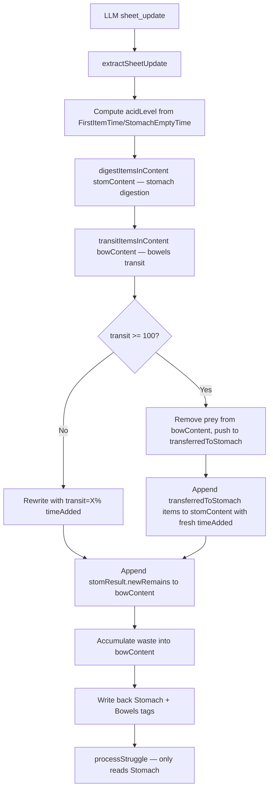

# Bowels → Stomach Transit System — Architectural Design

## Objective

Prey placed **directly into the bowels** (full-tour / reverse scenarios) should **not digest there**. Instead they "travel" (transit) through the bowels, and upon reaching **100% transit**, the prey is removed from `<Bowels>` and moved into `<Stomach>`, where normal digestion begins with a fresh `timeAdded`.

This is the reverse of the existing stomach→bowels remains flow (engine.ts lines 596-604, interceptor.ts lines 312-317).

---

## Current Architecture

### Digestion Tick Flow (interceptor.ts `runDigestionTick`, lines 53-352)

```
LLM sheet_update
  ↓
extractSheetUpdate → updatedXml
  ↓
acidLevel computed from <FirstItemTime> / <StomachEmptyTime>
  ↓
digestItemsInContent(stomContent, {...})   ← line 282-290
digestItemsInContent(bowContent, {...})     ← line 292-300  ← THIS IS THE PROBLEM: bowels prey get digested
  ↓
stomResult.newRemains → appended to bowContent  (line 312-313)  ← skeleton transfer (stomach→bowels)
bowResult.newRemains → appended to bowContent  (line 315-316)
waste accumulation → bowContent              (line 319-333)
  ↓
write back <Stomach> and <Bowels> tags       (line 338-350)
```

### `digestItemsInContent` (engine.ts lines 494-644)

- Called **twice**: once for stomach, once for bowels (identical logic).
- Each `<Item>` gets `timeAdded` resolved from `oldTimeAddedMap` → LLM attr → back-calculated → `currentClock` fallback.
- `digestNum = min(100, baseDigRate * speedMult * acidMult * clockDelta(now, timeAdded))`.
- At `digestNum >= 100`: prey → `Skeleton of ${name}` pushed to `newRemains` + waste; food → waste volume; both return `''` (removed from content).
- Below 100%: item rewritten with `digestion="X%"` + `timeAdded="HH:MM"`.

### Struggle Engine (struggle.ts)

- Only reads `<Stomach>` tag (line 16). **Bowels prey are never processed** — this aligns with the feature (no struggle during transit).

### `buildSheetPrompt` (engine.ts lines 646-879)

- Line 677: "Add `<Item>` entries to `<Stomach>` or `<Bowels>` when the character eats or is eaten."
- Line 710: "Items can be inside `<Stomach>` or `<Bowels>` (for full-tour scenarios)."
- Line 728: "If prey is fully digested (reaches 100%), the extension will AUTOMATICALLY move their remains to the Bowels section."

---

## Key Design Decisions

### Decision 1: New `transit` attribute on bowels prey

**Problem:** Bowels currently contains two kinds of `<Item>`:
1. **Waste / remains** — `Skeleton of X`, `Digestive Waste` — these should NOT transit or digest.
2. **Live transit prey** — `type="Prey"`, placed directly by the LLM for full-tour — these should transit.

**Solution:** Only `type="Prey"` items in `<Bowels>` get transit logic. Food/Liquid items and `<Remains>` are left alone (waste/food in bowels is already fully processed and inert). The transit meter reuses the existing `digestion` attribute name **semantically** but is labeled `transit="X%"` in the output XML so the LLM/UI can distinguish it from stomach digestion.

**Rationale:** Reusing `timeAdded` + absolute calculation (same model as digestion) keeps the self-healing, midnight-wraparound-safe, rollback-proof architecture. A new `transit="X%"` attribute is written instead of `digestion` for bowels prey so the frontend can render it as a transit bar rather than a digestion bar.

### Decision 2: Transit rate vs digestion rate

Transit is **always exactly 2× the `baseDigRate`** (double digestion speed). Transit is **not** affected by `acidMultiplier` (bowels have no acid). Prey willingness still affects speed (`willing` 1.25×, `fighting` 0.5×) to keep behavioral consistency. Each prey transits **independently** — each reaches 100% on its own timeline based on its own `timeAdded`.

### Decision 3: Transfer mechanics at 100% transit

When `transitNum >= 100`:
- The prey `<Item>` is **removed** from `bowContent` (returns `''`).
- The prey is pushed to a new `transferredToStomach: string[]` array.
- In `runDigestionTick`, transferred items are appended to `stomContent` with a **fresh `timeAdded`** = `currentClock` (so stomach digestion starts at 0%).
- A toast/struggle event notification is emitted for narration.

### Decision 4: No acid, no waste, no remains during transit

Transit does not produce `Skeleton`/waste — the prey arrives intact at the stomach. `totalDigestedVol`, `wasteCount`, `accumulatedWasteVol` are **not** incremented for transit. The only byproduct is the transfer itself.

---

## Mermaid — Tick Flow with Transit



---

## Proposed Changes by File

### 1. `src/backend/engine.ts` — New `transitItemsInContent` function

Add a new exported function (mirrors `digestItemsInContent` shape) at ~line 644 (after `digestItemsInContent`):

```typescript
export function transitItemsInContent(
  content: string,
  ctx: {
    baseTransitRate: number
    currentClock: number
    oldClock: number
    oldTransitMap: Map<string, number>
    oldTimeAddedMap: Map<string, number>
  },
): {
  content: string
  transferredToStomach: string[]
  transitCount: number
} {
  const transferredToStomach: string[] = []
  let transitCount = 0

  const transitItem = (attrs: string, inner: string | null, isSelfClosing: boolean): string => {
    const type = getAttrFromString(attrs, 'type') || 'Food'
    // Only live Prey transit. Food/Liquid/Remains stay inert in bowels.
    if (type !== 'Prey') return isSelfClosing ? `<Item ${attrs} />` : `<Item ${attrs}>${inner}</Item>`

    const name = getAttrFromString(attrs, 'name')
    const vol = getAttrFromString(attrs, 'volume_L')
    transitCount++

    let speedMult = 1
    const willingness = (getAttrFromString(attrs, 'willingness') || 'reluctant').toLowerCase()
    if (willingness === 'willing') speedMult *= 1.25
    else if (willingness === 'fighting') speedMult *= 0.5

    // Absolute transit — same timestamp model as digestion
    let timeAdded = ctx.oldTimeAddedMap.get(name) ?? NaN
    let oldTransitNum = ctx.oldTransitMap.get(name) ?? 0

    if (isNaN(timeAdded) || timeAdded <= 0) {
      timeAdded = clockToDecimal(getAttrFromString(attrs, 'timeAdded'))
    }
    if (isNaN(timeAdded) || timeAdded <= 0) {
      if (oldTransitNum > 0) {
        timeAdded = ctx.currentClock - oldTransitNum / (ctx.baseTransitRate * speedMult)
        if (timeAdded < 0) timeAdded += 24
      } else if (ctx.oldTransitMap.has(name)) {
        timeAdded = ctx.oldClock
      } else {
        timeAdded = ctx.currentClock
      }
    }

    let transitNum = Math.min(100, ctx.baseTransitRate * speedMult * clockDelta(ctx.currentClock, timeAdded))
    transitNum = Math.max(transitNum, oldTransitNum)

    if (transitNum >= 100) {
      // Transfer to stomach — build fresh item with new timeAdded
      const rawWillingness = (getAttrFromString(attrs, 'willingness') || 'reluctant').toLowerCase()
      const willingnessClamped = ['willing', 'reluctant', 'fighting'].includes(rawWillingness) ? rawWillingness : 'reluctant'
      const stamina = getAttrFromString(attrs, 'stamina') || '100'
      const freshTimeAdded = decimalToClock(ctx.currentClock)
      // Preserve inner (Appearance/Description/BoundGear) across the transfer
      const innerStr = inner ?? ''
      const item = `<Item type="Prey" name="${name}" volume_L="${vol}" digestion="0%" timeAdded="${freshTimeAdded}" willingness="${willingnessClamped}" stamina="${stamina}">${innerStr}</Item>`
      transferredToStomach.push(item)
      return '' // removed from bowels
    }

    // Still transiting
    let preyAttrs = ` willingness="${willingness === 'willing' || willingness === 'fighting' ? willingness : 'reluctant'}" stamina="${getAttrFromString(attrs, 'stamina') || '100'}"`
    const tsAttr = ` timeAdded="${decimalToClock(timeAdded)}"`
    const transitAttr = ` transit="${transitNum.toFixed(2)}%"`
    if (isSelfClosing) {
      return `<Item type="Prey" name="${name}" volume_L="${vol}"${transitAttr}${tsAttr}${preyAttrs} />`
    }
    return `<Item type="Prey" name="${name}" volume_L="${vol}"${transitAttr}${tsAttr}${preyAttrs}>${inner}</Item>`
  }

  content = content.replace(
    /<Item\s+([^>]*[^>\/])\s*>([\s\S]*?)<\/Item>/gi,
    (match, attrs, inner) => transitItem(attrs, inner, false),
  )
  content = content.replace(
    /<Item\s+([^>]+?)\s*\/>/gi,
    (match, attrs) => transitItem(attrs, null, true),
  )

  return { content, transferredToStomach, transitCount }
}
```

**Key points:**
- Only `type="Prey"` items transit — Food/Liquid/Remains untouched.
- No `acidMultiplier` (bowels have no acid).
- `transit="X%"` replaces `digestion="X%"` for bowels prey.
- At 100%: removed from bowels, pushed to `transferredToStomach` with fresh `timeAdded` + `digestion="0%"`.
- Inner content (`<Appearance>`, `<Description>`, `<BoundGear>`) is preserved across the transfer.

### 2. `src/backend/engine.ts` — `buildSheetPrompt` updates (lines 646-879)

**Update rule 4 (line 710) and rule 7 (line 728):**

Add a new section after the digestion rules explaining transit:

```
─── BOWELS TRANSIT SYSTEM ───
Prey placed directly into the Bowels do NOT digest there. Instead they TRANSIT through the bowels — a travel phase represented by the transit="X%" attribute. When transit reaches 100%, the extension AUTOMATICALLY moves the prey into the Stomach, where normal digestion begins (digestion starts at 0% with a fresh timeAdded).

Rules for bowels prey:
- Bowels prey use transit="X%" NOT digestion="X%". The extension computes transit automatically from timeAdded — copy it exactly.
- Food, Liquid, and Remains in the Bowels do NOT transit — they are inert waste/processed matter.
- When the extension moves a prey from Bowels to Stomach (transit hit 100%), it will appear in <Stomach> with digestion="0%" in the next sheet. Narrate the prey arriving in the stomach.
- The struggle/indigestion system does NOT affect prey while they are in the Bowels — only once they reach the Stomach.
```

**Update rule 7 (line 728):** Append — "Similarly, if prey reaches 100% transit in the Bowels, the extension will AUTOMATICALLY move them to the Stomach. You do NOT need to move them yourself."

### 3. `src/backend/interceptor.ts` — `runDigestionTick` integration (lines 282-350)

**Replace lines 292-300** (the bowels `digestItemsInContent` call) with the transit call:

```typescript
// Bowels prey TRANSIT (not digest). Only type="Prey" items transit;
// Food/Liquid/Remains stay inert. At 100% transit, prey move to stomach.
const baseTransitRate = baseDigRate * 2 // transit is always double digestion speed

// Build oldTransitMap from old bowels prey (mirror oldDigestionMap)
const oldTransitMap = new Map<string, number>()
const oldBowMatch2 = oldXml.match(/<Bowels[^>]*>([\s\S]*?)<\/Bowels>/i)
if (oldBowMatch2) {
  const oldBowRegex = /<Item\s+([^>]+?)[\s/]*>/gi
  let m: RegExpExecArray | null
  while ((m = oldBowRegex.exec(oldBowMatch2[1])) !== null) {
    const a = m[1]
    if ((getAttrFromString(a, 'type') || 'Food') === 'Prey') {
      const n = getAttrFromString(a, 'name')
      if (n) oldTransitMap.set(n, parseFloat(getAttrFromString(a, 'transit').replace('%', '')) || 0)
    }
  }
}

const bowResult = transitItemsInContent(bowContent, {
  baseTransitRate,
  currentClock: newClock,
  oldClock,
  oldTransitMap,
  oldTimeAddedMap,
})
bowContent = bowResult.content

// Transfer transit-complete prey into the stomach
if (bowResult.transferredToStomach.length > 0) {
  for (const item of bowResult.transferredToStomach) {
    stomContent += '\n      ' + item
  }
  maybeToast('digestionTicks', 'info', `🚶 ${bowResult.transferredToStomach.length} prey transited from bowels to stomach.`)
  spindle.log.info(`[runDigestionTick] TRANSIT: ${bowResult.transferredToStomach.length} prey moved bowels→stomach`)
}
```

**Remove the old bowels digestion contribution from totals (lines 307-310):** Since bowels no longer digests, `bowResult.totalDigestedVol` etc. no longer apply. Replace with `bowResult.transitCount` for logging only.

**Adjust waste/accumulation logic (lines 309-333):** `accumulatedWasteVol` now comes only from `stomResult` (stomach digestion), not `bowResult`. Update line 309 to remove `+ bowResult.accumulatedWasteVol`.

### 4. `src/backend/types.ts` — Add `transferredToStomach` to return type

Add the `transitItemsInContent` return type or a new interface:

```typescript
export interface TransitResult {
  content: string
  transferredToStomach: string[]
  transitCount: number
}
```

(Alternatively, inline the return type — see existing `digestItemsInContent` pattern.)

### 5. `src/frontend/` — UI rendering of transit bar

**`src/frontend/components.ts`** (`createStomachItem`, line 58): The frontend renders stomach items with a digestion bar. Bowels transit items use `transit="X%"` instead of `digestion="X%"`. The frontend parser should:
- Detect items in `<Bowels>` with `transit` attribute → render a "Transit" bar (different color, e.g. blue/teal) instead of a digestion bar (red/green).
- Items in `<Stomach>` continue to use `digestion`.

**`src/frontend/types.ts`**: If there is a parsed-item interface, add optional `transit?: string` field.

### 6. `src/backend/state.ts` — No changes needed

No new engine toggle is required — transit is part of the existing `digestionEngine` toggle. If the digestion engine is off, neither digestion nor transit runs (the `if (engineToggles.digestionEngine)` block at interceptor.ts line ~270 wraps both).

---

## Edge Cases & Safety

| Edge Case | Handling |
|---|---|
| Prey already in stomach (normal digestion) | Unchanged — `digestItemsInContent` still runs on stomach. Transit only touches bowels. |
| Prey moves from bowels to stomach mid-scene (LLM does it manually) | If the LLM manually moves a prey to `<Stomach>`, it gets `digestion` computed from whatever `timeAdded` it has — if none, `oldTimeAddedMap` → `oldClock` → fresh at current tick. Safe. |
| Midnight wraparound | `clockDelta` handles it (engine.ts line 26-44). Transit uses same function. |
| Rollback / skipped ticks | `transitNum = max(transitNum, oldTransitNum)` — same anti-rollback clamp as digestion (engine.ts line 590). |
| Food/Liquid in bowels | `transitItem` returns the item unchanged (only `type="Prey"` transits). |
| Remains (`<Remains>`) in bowels | Not matched by `<Item>` regex — untouched. |
| `digestItemsInContent` still called on stomach? | Yes — stomach still digests normally. Only the **bowels** call switches from `digestItemsInContent` to `transitItemsInContent`. |
| Waste accumulation | Now only from stomach digestion (`stomResult.accumulatedWasteVol`). Bowels no longer contributes waste (it was producing skeletons from transit, which was wrong). |
| **Legacy chat (old sheets with bowels prey using `digestion`)** | See "Legacy Chat Migration" section below. |

---

## Implementation Order (for Code mode)

1. **engine.ts**: Add `transitItemsInContent` function.
2. **engine.ts**: Update `buildSheetPrompt` with BOWELS TRANSIT SYSTEM section + rule 7 addendum.
3. **interceptor.ts**: Swap bowels `digestItemsInContent` → `transitItemsInContent`; add `oldTransitMap` build; append `transferredToStomach` to `stomContent`; fix waste totals.
4. **types.ts**: Add `TransitResult` interface (optional — can inline).
5. **frontend/components.ts**: Render `transit` attribute as a transit bar for bowels items.
6. **frontend/types.ts**: Add optional `transit` field to parsed item interface if present.
7. Test: place a `type="Prey"` item in `<Bowels>`, advance time, verify it transits → transfers to `<Stomach>` at 100% → stomach digestion begins at 0%.

---

## Resolved Design Decisions

1. **Transit rate**: Always exactly **2× `baseDigRate`** (double digestion speed). Not configurable — hardcoded multiplier.
2. **Willingness during transit**: `fighting` prey slow transit (0.5×), `willing` prey speed it up (1.25×) — same modifiers as digestion.
3. **Multiple transit prey**: Each prey transits **independently** — each reaches 100% on its own timeline based on its own `timeAdded`, and transfers individually when it hits 100%.

---

## Legacy Chat Migration

When the new transit system is used in an **existing/old chat**, the stored sheet may contain bowels prey with the old `digestion="X%"` attribute (from the old system where bowels prey were digested). The migration must handle this gracefully:

### Scenario: Old sheet has `<Item type="Prey" name="Alice" volume_L="65" digestion="40%" timeAdded="14:30">` in `<Bowels>`

**On the first tick with the new code:**

1. `oldTransitMap` is built by scanning the old bowels content for `transit="X%"` — but the old prey has `digestion="40%"`, NOT `transit`. So `oldTransitMap.get("Alice")` returns `0` (not found).
2. `oldTimeAddedMap` is built from both stomach AND bowels (interceptor.ts lines 249-270) — so `oldTimeAddedMap.get("Alice")` **will** return the decimal value of `14:30` (the `timeAdded` the old system already stamped).
3. `transitItemsInContent` resolves `timeAdded` from `oldTimeAddedMap` → gets `14:30` → computes `transitNum = baseTransitRate * speedMult * clockDelta(now, 14:30)`.
4. Since `baseTransitRate = baseDigRate * 2`, the transit value will be **2× what the old digestion value would have been** at the same time point. This is correct — the prey now transits at double speed.
5. The anti-rollback clamp `transitNum = max(transitNum, oldTransitNum)` uses `oldTransitNum = 0` (not found in `oldTransitMap`), so it won't clamp. The transit value is computed fresh from `timeAdded`.

**Result:** The prey's `digestion="40%"` is silently replaced with `transit="X%"` (where X is 2× the old rate applied to the same time span). The prey continues transiting and will eventually reach 100% and move to the stomach. **No data loss, no crash, no manual intervention needed.**

### Scenario: Old sheet has bowels prey with `digestion="100%"` (fully digested in old system)

In the old system, a bowels prey at 100% digestion would have been converted to `Skeleton of X` remains. So this case shouldn't exist in practice — if it does, the prey would have `digestion="100%"` but no `transit` attribute. On the first new tick:
- `oldTransitMap.get(name)` = 0 (no `transit` attr found).
- `timeAdded` resolved from `oldTimeAddedMap`.
- `transitNum` computed fresh — could be very high (≥100) since transit is 2× digestion and the prey was already at 100% digestion.
- `transitNum >= 100` → prey is immediately transferred to stomach with `digestion="0%"` and fresh `timeAdded`.

**Result:** The prey "arrives" in the stomach and starts digesting from scratch. This is the correct full-tour behavior — the prey was in the bowels long enough to transit fully.

### Scenario: Old sheet has `Skeleton of X` or `Digestive Waste` in bowels

These are `<Remains>` tags, not `<Item>` tags — they are not matched by the `<Item>` regex in `transitItemsInContent`. They remain untouched in the bowels. **No impact.**

### Migration Summary

| Old State | New Behavior on First Tick |
|---|---|
| Bowels prey with `digestion="X%"` + `timeAdded` | `digestion` silently replaced with `transit` (2× rate). Continues transiting. |
| Bowels prey with `digestion="100%"` | Immediately transferred to stomach (transit ≥ 100%). |
| Bowels prey with `digestion` but no `timeAdded` | `timeAdded` back-calculated from old `digestion` value using transit rate. Then transit computed fresh. |
| `<Remains>` in bowels | Untouched (not matched by `<Item>` regex). |
| Stomach prey | Unchanged — stomach still uses `digestItemsInContent`. |

**No migration script or one-time conversion is needed.** The timestamp-based absolute calculation model makes the transition seamless — the first tick with the new code simply computes transit from the existing `timeAdded`, and the `transit` attribute replaces `digestion` in the output. The LLM prompt update ensures the LLM stops writing `digestion` for bowels prey and starts copying `transit` instead.
