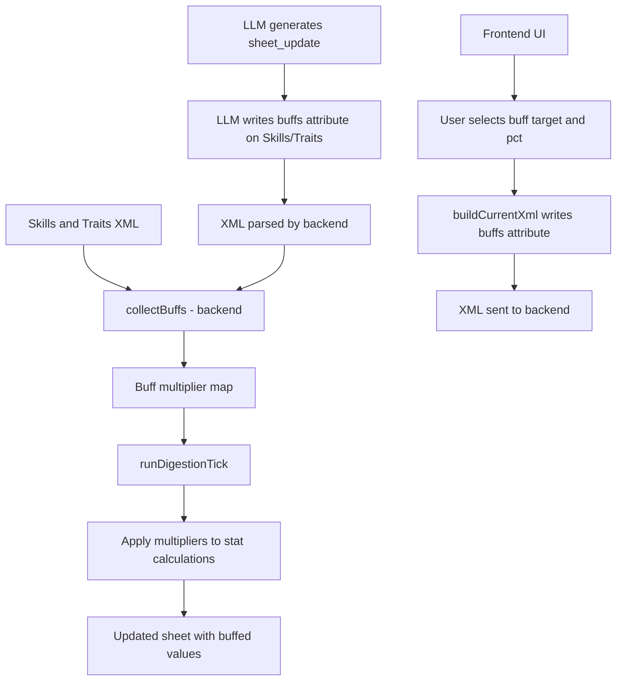

# Buff/Debuff System Design

## Overview

A system that allows **Skills** and **Traits** to apply percentage-based buffs and debuffs to various character stats. Buffs can be positive (e.g., +25% digestion rate) or negative (e.g., -15% stomach resistance). Both the user (via frontend UI) and the LLM (via character sheet XML) can assign buffs.

## Design Principles

- Follows the existing pattern: **extension handles all math, LLM/user only set values**
- Buffs are collected from the **OLD (stored) sheet** to prevent LLM gaming (same pattern as digestion rates, arousal, etc.)
- Backward compatible — existing sheets without buffs continue to work
- New engine toggle: `buffSystem` (on by default)

---

## XML Schema

### Current Format

```xml
<Skill name="Iron Stomach" level="3">Iron-lined stomach, resistant to prey.</Skill>
<Trait name="Weak Constitution">Frail and easily overwhelmed.</Trait>
```

### New Format (backward compatible)

A new optional `buffs` attribute is added to `<Skill>` and `<Trait>` tags:

```xml
<Skill name="Iron Stomach" level="3" buffs="BaseDigestionRate:+25;StomachResistance:+50">Iron-lined stomach, resistant to prey.</Skill>
<Trait name="Weak Constitution" buffs="StomachResistance:-30;BaseDigestionRate:-15">Frail and easily overwhelmed.</Trait>
```

### Encoding Format

```
buffs="StatKey:+Pct;StatKey2:-Pct2;StatKey3:+Pct3"
```

- Multiple buffs separated by `;`
- Each buff: `StatKey:+Pct` or `StatKey:-Pct`
- Positive = buff, negative = debuff
- The `buffs` attribute is entirely optional — omit it for no buffs
- Whitespace around keys/values is trimmed during parsing

### Why Attribute Approach (not child elements)

1. **Backward compatible** — old sheets without `buffs` still parse correctly
2. **No structural change** — description remains as textContent (no migration needed)
3. **Compact** — easy for LLM to write, easy to parse
4. **Consistent** — matches the existing pattern of attributes for simple values (e.g., `<Item type="..." name="..." volume_L="..." digestion="...%">`)

---

## Valid Buff Targets

### Tier 1: Stats with existing engine mechanics (can buff immediately)

| Stat Key | Description | Effect of +25% | Effect of -25% |
|---|---|---|---|
| `BaseDigestionRate` | Base digestion speed | 25% faster digestion | 25% slower digestion |
| `AcidRiseRate` | Acid accumulation speed | Acid rises 25% faster | Acid rises 25% slower |
| `StomachResistance` | Resistance to indigestion | 25% more resistant to struggle | 25% less resistant |
| `ArousalDecay` | Arousal decay rate per hour | Arousal decays 25% faster | Arousal decays 25% slower (stays aroused) |
| `ArousalGain` | Arousal gain from LLM stimuli | 25% more arousal per stimulus | 25% less arousal per stimulus |
| `NutrientAbsorption` | Body growth from digestion | 25% more body growth | 25% less body growth |
| `ClothingStress` | Clothing stress accumulation | 25% more clothing stress | 25% less clothing stress |
| `EnergyDrain` | Energy drain from struggle/suppression | 25% more energy drain | 25% less energy drain |

### Tier 2: Stats that need new mechanics (future expansion)

| Stat Key | Description | Notes |
|---|---|---|
| `StomachCapacity` | Stomach capacity multiplier | Capacity currently calculated in frontend; would need backend hook |
| `HealthRegen` | Health recovery per tick | No health regen mechanic exists yet |
| `EnergyRegen` | Energy recovery per tick | No passive energy regen exists yet |
| `ClimaxThreshold` | Arousal threshold for climax gain | Currently hardcoded at 95 |
| `ClimaxRate` | Climax meter gain/loss rate | Currently hardcoded at ±25 |

Tier 2 targets are listed for future expansion but will NOT be implemented in the initial version.

---

## Backend Changes ([`src/backend.ts`](src/backend.ts))

### 1. Engine Toggle

Add `buffSystem: true` to the `engineToggles` record (line ~22):

```typescript
let engineToggles: Record<string, boolean> = {
  digestionEngine: true, clothingStress: true, nutrientAbsorption: true, arousalClimax: true,
  struggleEngine: true, buffSystem: true,
}
```

### 2. Buff Collection Function

New function `collectBuffs()` that parses all `<Skill>` and `<Trait>` elements for the `buffs` attribute and returns a `Record<string, number>` mapping stat keys to cumulative multipliers:

```typescript
function collectBuffs(xml: string): Record<string, number> {
  const buffs: Record<string, number> = {}
  const parseBuffsAttr = (attrs: string) => {
    const buffsAttr = getAttrFromString(attrs, 'buffs')
    if (!buffsAttr) return
    buffsAttr.split(';').forEach(pair => {
      const [stat, pct] = pair.split(':')
      if (stat && pct) {
        const key = stat.trim()
        const val = (parseFloat(pct) || 0) / 100
        buffs[key] = (buffs[key] || 0) + val
      }
    })
  }
  // Parse Skills
  const skillRegex = /<Skill\s+([^>]*?)>/gi
  let m: RegExpExecArray | null
  while ((m = skillRegex.exec(xml)) !== null) parseBuffsAttr(m[1])
  // Parse Traits
  const traitRegex = /<Trait\s+([^>]*?)>/gi
  while ((m = traitRegex.exec(xml)) !== null) parseBuffsAttr(m[1])
  return buffs
}
```

Buffs from all skills and traits are **summed**. If Skill A gives `BaseDigestionRate:+25` and Trait B gives `BaseDigestionRate:+10`, the total multiplier is `+35%` = `0.35`.

### 3. Buff Application in `runDigestionTick()`

At the start of `runDigestionTick()` (after line ~922, after `let updatedXml = newXml`), collect buffs from the **old** sheet:

```typescript
const buffs = engineToggles.buffSystem ? collectBuffs(oldXml) : {}
```

Then apply buffs at each calculation point:

#### Digestion Engine (line ~932-933)
```typescript
const baseDigRate = (getStat(oldXml, 'BaseDigestionRate') || 25) * (1 + (buffs.BaseDigestionRate || 0))
const acidRiseRate = (getStat(oldXml, 'AcidRiseRate') || 10) * (1 + (buffs.AcidRiseRate || 0))
```

#### Arousal/Climax (line ~1070)
```typescript
// Arousal decay buff: negative buff = slower decay
const decayRate = 50 * (1 + (buffs.ArousalDecay || 0))
const decayedArousal = Math.max(0, oldArousal - decayRate * elapsed)

// Arousal gain buff: applies to the delta the LLM added
if (newArousal > decayedArousal) {
  const gain = newArousal - decayedArousal
  finalArousal = decayedArousal + gain * (1 + (buffs.ArousalGain || 0))
} else {
  finalArousal = decayedArousal
}
finalArousal = Math.min(100, Math.max(0, finalArousal))
```

#### Nutrient Absorption (line ~1120-1125)
```typescript
const nutrientMult = 1 + (buffs.NutrientAbsorption || 0)
const heightGrowth = totalDigestedVol * 0.035 * nutrientMult
const weightGrowth = totalDigestedVol * 0.035 * nutrientMult
const breastGrowth = totalDigestedVol * 1.0 * nutrientMult
// ... etc for all growth rates
```

#### Clothing Stress
Pass `buffs.ClothingStress` into `processClothingStress()` as a multiplier parameter. The function would multiply stress accumulation by `(1 + (buffs.ClothingStress || 0))`.

#### Struggle/Energy
Pass `buffs.StomachResistance` and `buffs.EnergyDrain` into `processStruggle()`. StomachResistance already exists as a stat; the buff would multiply it further. EnergyDrain would multiply the energy drain amount.

### 4. LLM Prompt Additions ([`buildSheetPrompt()`](src/backend.ts))

Add a new section after the Struggle & Indigestion section (around line ~1378):

```
─── BUFF/DEBUFF SYSTEM ───
Skills and Traits can apply percentage-based buffs or debuffs to character stats. This is done via the optional `buffs` attribute on <Skill> and <Trait> tags.

FORMAT:
buffs="StatKey:+Pct;StatKey2:-Pct2"

Example:
<Skill name="Iron Stomach" level="3" buffs="BaseDigestionRate:+25;StomachResistance:+50">Iron-lined stomach.</Skill>
<Trait name="Weak Constitution" buffs="StomachResistance:-30">Frail and easily overwhelmed.</Trait>

VALID BUFF TARGETS:
- BaseDigestionRate: Base digestion speed (+ = faster, - = slower)
- AcidRiseRate: Acid accumulation speed (+ = faster, - = slower)
- StomachResistance: Resistance to indigestion from struggling prey (+ = more resistant, - = less resistant)
- ArousalDecay: Arousal decay rate (+ = decays faster, - = decays slower/stays aroused)
- ArousalGain: Arousal gain from stimuli (+ = more gain, - = less gain)
- NutrientAbsorption: Body growth from digestion (+ = more growth, - = less growth)
- ClothingStress: Clothing stress accumulation (+ = more stress, - = less stress)
- EnergyDrain: Energy drain from struggle/suppression (+ = more drain, - = less drain)

RULES:
1. The `buffs` attribute is OPTIONAL. Omit it if the skill/trait has no buffs.
2. Percentages can be positive (buff) or negative (debuff).
3. Multiple buffs are separated by semicolons.
4. The extension AUTOMATICALLY applies all buffs during the digestion tick. You do NOT need to calculate the modified values yourself — just set the raw base stats as normal and the extension applies the multipliers.
5. When assigning a new Skill or Trait, consider whether it should have buffs. A "Strong Digestion" skill might have buffs="BaseDigestionRate:+25". A "Frail" trait might have buffs="StomachResistance:-30;BaseDigestionRate:-15".
6. Copy existing `buffs` attributes exactly as-is when updating the sheet. Do NOT modify or remove buffs unless the skill/trait itself changes.
```

---

## Frontend Changes ([`src/frontend.ts`](src/frontend.ts))

### 1. Buff Target Definitions

Add a constant array of valid buff targets (near line ~330, alongside `engineToggleDefs`):

```typescript
const buffTargetDefs = [
  { value: 'BaseDigestionRate', label: 'Digestion Rate' },
  { value: 'AcidRiseRate', label: 'Acid Rise Rate' },
  { value: 'StomachResistance', label: 'Stomach Resistance' },
  { value: 'ArousalDecay', label: 'Arousal Decay' },
  { value: 'ArousalGain', label: 'Arousal Gain' },
  { value: 'NutrientAbsorption', label: 'Nutrient Absorption' },
  { value: 'ClothingStress', label: 'Clothing Stress' },
  { value: 'EnergyDrain', label: 'Energy Drain' },
]
```

### 2. Engine Toggle Definition

Add to `engineToggleDefs` array (line ~344):

```typescript
{ key: 'buffSystem', label: 'Buff System', desc: 'Apply skill/trait percentage buffs to stats' },
```

### 3. Buff Entry Factory

New function `createBuffEntry()` that creates a single buff row (stat dropdown + percentage input + remove button):

```typescript
function createBuffEntry(): HTMLElement {
  const div = document.createElement('div')
  div.className = 'bt-buff-entry'
  div.style.cssText = 'display: flex; gap: 5px; margin-top: 4px; align-items: center;'
  const select = document.createElement('select')
  select.className = 'bt-input bt-buff-stat'
  select.style.cssText = 'flex: 1; padding: 4px;'
  buffTargetDefs.forEach(t => {
    const opt = document.createElement('option')
    opt.value = t.value
    opt.textContent = t.label
    select.appendChild(opt)
  })
  const input = document.createElement('input')
  input.type = 'number'
  input.className = 'bt-input bt-buff-pct'
  input.style.cssText = 'width: 70px; padding: 4px; text-align: center;'
  input.placeholder = '+25'
  const btn = document.createElement('button')
  btn.className = 'bt-remove-btn'
  btn.dataset.action = 'remove-buff'
  btn.textContent = '✖'
  btn.style.cssText = 'background: transparent; border: none; color: #ff4444; cursor: pointer; font-size: 14px;'
  div.appendChild(select)
  div.appendChild(input)
  div.appendChild(btn)
  return div
}
```

### 4. Updated `createSkillItem()` and `createTraitItem()`

Add a buffs section to each item. The skill item becomes:

```typescript
function createSkillItem(): HTMLElement {
  const div = document.createElement('div')
  div.className = 'bt-dynamic-item dyn-skill'
  div.innerHTML = `
    <button class="bt-remove-btn" data-action="remove-skill">✖</button>
    <input type="text" class="bt-input full d-name" style="width: 60%;" placeholder="Skill Name">
    <input type="number" class="bt-input d-lvl" style="width: 30%; position:absolute; top:10px; right: 40px;" placeholder="Lvl">
    <textarea class="bt-textarea d-desc" rows="2" placeholder="Description..."></textarea>
    <div class="bt-buffs-section" style="margin-top: 6px;">
      <div style="display: flex; align-items: center; gap: 5px; font-size: 12px; color: #888;">
        <span>Buffs/Debuffs</span>
        <button class="bt-add-btn bt-add-buff" data-action="add-buff" style="font-size: 11px; padding: 2px 6px;">+ Add</button>
      </div>
      <div class="bt-buffs-container"></div>
    </div>
  `
  return div
}
```

Same pattern for `createTraitItem()` (without the level input).

### 5. Buff Add/Remove Event Handling

Add event delegation in the existing panel click handler (line ~797):

```typescript
// Inside the existing panel click event listener
if ((e.target as HTMLElement).dataset.action === 'add-buff') {
  const container = (e.target as HTMLElement).closest('.bt-buffs-section')?.querySelector('.bt-buffs-container')
  container?.appendChild(createBuffEntry())
}
if ((e.target as HTMLElement).dataset.action === 'remove-buff') {
  (e.target as HTMLElement).closest('.bt-buff-entry')?.remove()
}
```

### 6. `buildCurrentXml()` Changes (line ~1052-1062)

When writing skills/traits to XML, collect buffs from the UI and add the `buffs` attribute:

```typescript
document.querySelectorAll('.dyn-skill').forEach((el) => {
  const name = (el.querySelector('.d-name') as HTMLInputElement)?.value.trim()
  const lvl = (el.querySelector('.d-lvl') as HTMLInputElement)?.value.trim() || '1'
  const desc = (el.querySelector('.d-desc') as HTMLTextAreaElement)?.value.trim()
  const buffsStr = collectBuffsFromItem(el)
  let attrs = `name="${name}" level="${lvl}"`
  if (buffsStr) attrs += ` buffs="${buffsStr}"`
  if (name) xml += `    <Skill ${attrs}>${desc}</Skill>\n`
})

document.querySelectorAll('.dyn-trait').forEach((el) => {
  const name = (el.querySelector('.d-name') as HTMLInputElement)?.value.trim()
  const desc = (el.querySelector('.d-desc') as HTMLTextAreaElement)?.value.trim()
  const buffsStr = collectBuffsFromItem(el)
  let attrs = `name="${name}"`
  if (buffsStr) attrs += ` buffs="${buffsStr}"`
  if (name) xml += `    <Trait ${attrs}>${desc}</Trait>\n`
})
```

New helper function:

```typescript
function collectBuffsFromItem(el: Element): string {
  const entries: string[] = []
  el.querySelectorAll('.bt-buff-entry').forEach((buffEl) => {
    const stat = (buffEl.querySelector('.bt-buff-stat') as HTMLSelectElement)?.value
    const pct = (buffEl.querySelector('.bt-buff-pct') as HTMLInputElement)?.value.trim()
    if (stat && pct) {
      const pctNum = parseFloat(pct) || 0
      const sign = pctNum >= 0 ? '+' : ''
      entries.push(`${stat}:${sign}${pctNum}`)
    }
  })
  return entries.join(';')
}
```

### 7. `populateFormFromXml()` Changes (line ~1464-1477)

When reading skills/traits from XML, parse the `buffs` attribute and create buff entries:

```typescript
doc.querySelectorAll('Skill').forEach((skillNode) => {
  const div = createSkillItem()
  document.getElementById('skills-container')?.appendChild(div)
  ;(div.querySelector('.d-name') as HTMLInputElement).value = skillNode.getAttribute('name') || ''
  ;(div.querySelector('.d-lvl') as HTMLInputElement).value = skillNode.getAttribute('level') || '1'
  ;(div.querySelector('.d-desc') as HTMLTextAreaElement).value = skillNode.textContent || ''
  // Parse buffs attribute
  const buffsAttr = skillNode.getAttribute('buffs')
  if (buffsAttr) {
    const container = div.querySelector('.bt-buffs-container')
    buffsAttr.split(';').forEach(pair => {
      const [stat, pct] = pair.split(':')
      if (stat && pct && container) {
        const entry = createBuffEntry()
        ;(entry.querySelector('.bt-buff-stat') as HTMLSelectElement).value = stat.trim()
        ;(entry.querySelector('.bt-buff-pct') as HTMLInputElement).value = pct.trim()
        container.appendChild(entry)
      }
    })
  }
})

// Same pattern for Trait nodes
```

---

## Data Flow



## Buff Stacking Rules

- Buffs from **all** skills and traits are **summed** together
- No cap on total buff percentage (a character with many +digestion buffs could get very fast digestion)
- Negative and positive buffs cancel out (e.g., +25 and -15 = net +10)
- The final multiplier is `1 + (sumOfPcts / 100)`
- Example: `BaseDigestionRate:+25` from Skill A + `BaseDigestionRate:+10` from Trait B = `+35%` total → multiplier `1.35`

## Edge Cases

1. **No buffs attribute** — skill/trait functions normally, no buffs applied
2. **Empty buffs attribute** (`buffs=""`) — treated as no buffs
3. **Invalid stat key** — silently ignored (no error, no effect)
4. **Invalid percentage** — treated as 0
5. **Buff system disabled** — `collectBuffs()` returns empty object, all multipliers are 0
6. **LLM removes buffs attribute** — buffs are lost; the extension does not preserve them if the LLM omits them (same behavior as any other attribute the LLM might drop)

## Testing Checklist

- [ ] Skill with single buff applies correctly
- [ ] Trait with single debuff applies correctly
- [ ] Multiple buffs on same skill stack correctly
- [ ] Buffs from different skills/traits sum correctly
- [ ] Negative + positive buffs cancel correctly
- [ ] Skill without buffs attribute works unchanged
- [ ] Buff system toggle disables all buffs when off
- [ ] Frontend add/remove buff entries work
- [ ] Frontend builds correct XML with buffs attribute
- [ ] Frontend parses buffs attribute from XML correctly
- [ ] LLM prompt explains buff system clearly
