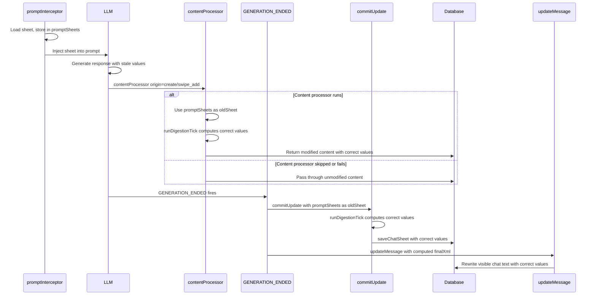

# Content Processor Fix Plan — Indigestion=0% in Visible Chat

## Problem

The `contentProcessor` (commit c76468c) is not modifying the visible chat text. Indigestion/digestion remain at 0% in the chat bubble, even though the stored sheet and frontend panel show correct values.

## Root Cause Analysis

After reading all code and docs, there are **two confirmed failure points**:

### Failure Point 1: Origin guard too restrictive (PRIMARY SUSPECT)

Current code in [`contentProcessor`](src/backend/interceptor.ts:556):
```typescript
if (ctx.origin !== 'create') return
```

Per [`message-content-processor.md`](docs/backend/message-content-processor.md:34), the origin lifecycle is:
- `create` — POST /messages (initial message creation)
- `update` — PUT /messages/:id (editing existing message)
- `swipe_add` — POST /messages/:id/swipe (new swipe variant)
- `swipe_update` — PUT /messages/:id/swipe/:idx (editing swipe slot)
- `render` — display-only, non-persisting

**The problem:** Lumiverse may save LLM responses using `origin: 'update'` (PUT /messages/:id) rather than `origin: 'create'` (POST /messages). This is common in streaming architectures where a placeholder message is created first, then updated with the LLM's response. If the origin is `update`, the content processor skips entirely.

Additionally, for swipe generations, the origin would be `swipe_add`, which is also skipped.

### Failure Point 2: Race condition with GENERATION_ENDED

`GENERATION_ENDED` fires when the LLM finishes generating. The content processor runs "before database write." The likely execution order:

1. LLM generates response
2. `GENERATION_ENDED` fires → `commitUpdate` runs → updates stored sheet
3. Content processor runs → uses `sheets.get(chatId)` as `oldSheet`

If `commitUpdate` updates `sheets` before the content processor runs, `elapsed=0` → tick skipped → stale XML returned.

**Note:** Looking at [`commitUpdate`](src/backend/interceptor.ts:502), it does NOT do `sheets.set(chatId, finalXml)` — it only calls `saveChatSheet`. So `sheets.get(chatId)` is still the old sheet. This means the race condition may NOT cause `elapsed=0` in the content processor. But it's still a latent bug that should be fixed.

### Failure Point 3 (RULED OUT): Content format

The type definition ([`types.ts`](src/backend/types.ts:101)) and docs ([`message-content-processor.md`](docs/backend/message-content-processor.md:32)) both confirm `content: string`. Array format is not an issue.

## Fix Strategy

### Fix 1: Add `promptSheets` Map to `state.ts`

Add a new Map to track the sheet shown to the LLM in the prompt:

```typescript
export const promptSheets: Map<string, string> = new Map()
```

This decouples the content processor and `commitUpdate` from the race condition — they use the pre-generation sheet, not the potentially-updated `sheets.get(chatId)`.

### Fix 2: Store sheet in `promptInterceptor`

In [`promptInterceptor`](src/backend/interceptor.ts:656), after loading the sheet (line 663-666), store it:

```typescript
promptSheets.set(chatId, sheet)
```

This captures the exact sheet the LLM saw, regardless of what happens later.

### Fix 3: Fix `commitUpdate` to use `promptSheets` and return `finalXml`

In [`commitUpdate`](src/backend/interceptor.ts:496):

1. Use `promptSheets.get(chatId)` as `oldSheet` (fallback to `sheets.get(chatId)`):
   ```typescript
   const oldSheet = promptSheets.get(chatId) ?? sheets.get(chatId) ?? ''
   ```
2. Add `sheets.set(chatId, finalXml)` — fix the missing cache update.
3. Return `finalXml` so `GENERATION_ENDED` can use it for `updateMessage`.

### Fix 4: Fix `contentProcessor` — relax origin guard + use `promptSheets`

In [`contentProcessor`](src/backend/interceptor.ts:549):

1. **Relax origin guard** — process `create`, `swipe_add`, `swipe_update`; skip only `render` and `update`:
   ```typescript
   if (ctx.origin === 'render' || ctx.origin === 'update') return
   ```
   - `render` is display-only, non-persisting, fires twice — skip for performance.
   - `update` is manual edits — respect user's text. The `updateMessage` fallback handles LLM responses saved as `update`.

2. **Use `promptSheets` as oldSheet** (fallback to `sheets.get(chatId)`):
   ```typescript
   let oldSheet = promptSheets.get(chatId) ?? sheets.get(chatId)
   ```

3. **Add debug toasts** at key points (user can't see console on mobile):
   - Entry: "Content processor running (origin=X)"
   - Skip: "Content processor skipped: no sheet_update found"
   - Success: "Content processor: indigestion=X%, content replaced"
   - Error: "Content processor error: ..."

### Fix 5: Add `spindle.chat.updateMessage` fallback in `GENERATION_ENDED`

This is the **guaranteed fix** for visible chat text. In [`GENERATION_ENDED`](src/backend.ts:168), after `commitUpdate`:

```typescript
const finalXml = await commitUpdate(chatId, messageId, update, chatIndex)
committedMessageIds.add(messageId)

// ── Rewrite visible chat text with computed values ──
// Even if the content processor already fixed the content, this ensures
// the visible chat text is correct. If content processor failed or didn't
// run (e.g., origin was 'update'), this is the primary fix.
const modifiedContent = content.replace(
  /<sheet_update>[\s\S]*?<\/sheet_update>/i,
  `<sheet_update>\n${finalXml}\n</sheet_update>`,
)
await spindle.chat.updateMessage(chatId, messageId, { content: modifiedContent })
```

**Why this is safe:**
- `updateMessage` triggers content processor with `origin: 'update'` → skipped by our guard.
- `updateMessage` fires `MESSAGE_EDITED` event → no handler, no issue.
- If content processor already fixed the content, `updateMessage` writes the same content — no harm.
- If content processor didn't run, `updateMessage` fixes the content — guaranteed fix.
- `chat_mutation` permission is already granted in [`spindle.json`](spindle.json:11).

**For swipe generations:** The `GENERATION_ENDED` handler currently skips swipes (`pendingGenerationType === 'swipe'`). We should remove this guard so swipes also get the `updateMessage` fallback. The `promptSheets` Map is set in `promptInterceptor` regardless of generation type, so `commitUpdate` will have the correct oldSheet.

## Architecture Diagram



## Files to Modify

| File | Changes |
| :--- | :--- |
| [`src/backend/state.ts`](src/backend/state.ts) | Add `promptSheets: Map<string, string>` |
| [`src/backend/interceptor.ts`](src/backend/interceptor.ts) | Import `promptSheets`; store in `promptInterceptor`; use in `contentProcessor` and `commitUpdate`; relax origin guard; add debug toasts; make `commitUpdate` return `finalXml` + set `sheets` |
| [`src/backend.ts`](src/backend.ts) | In `GENERATION_ENDED`: use returned `finalXml` for `spindle.chat.updateMessage`; remove swipe guard |

## Execution Order

1. Add `promptSheets` Map to `state.ts`
2. Import `promptSheets` in `interceptor.ts`
3. Store sheet in `promptInterceptor`
4. Fix `commitUpdate` (use `promptSheets`, set `sheets`, return `finalXml`)
5. Fix `contentProcessor` (relax origin guard, use `promptSheets`, add debug toasts)
6. Fix `GENERATION_ENDED` in `backend.ts` (use `updateMessage` fallback, remove swipe guard)
7. Build (`tsc --noEmit`)
8. Commit and push
9. User retests
