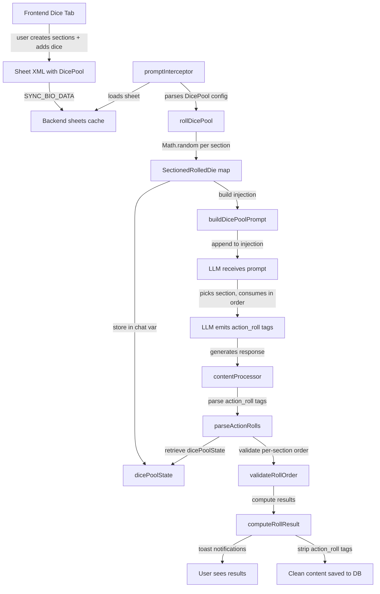

# Dice System Implementation Plan — Pre-Rolled Dice Pool (Sectioned)

> **Status**: Final design, pending implementation
> **Approach**: Pre-Rolled Dice Pool — extension rolls dice before LLM generation, LLM consumes sequentially

## Overview

A pre-rolled dice pool system that gives the LLM access to randomness it cannot generate itself. The extension rolls dice **before** LLM generation, injects the values into the prompt, and the LLM consumes them sequentially via `<action_roll>` tags. Post-processing validates usage order and computes results.

**Key design**: Dice are organized into **named sections** (e.g., "Combat", "Social", "Magic"). Each section is an **independent pool** — the LLM picks the relevant section for an action and consumes dice in order within that section. Multiple sections can be used in the same response.

## Architecture



## Data Flow Per Turn

1. **promptInterceptor** (before generation):
   - Loads cached sheet XML (contains `<DicePool>` config with sections)
   - If `engineToggles.diceSystem` is true:
     - Parses `<DicePool>` from sheet → `DiceSection[]`
     - Calls `rollDicePool(sections)` → `RolledSection[]` (uses `Math.random()` per die)
     - Stores `RolledSection[]` as JSON in chat variable `dicePoolState`
     - Calls `buildDicePoolPrompt(rolledSections)` → injection string with rules + values grouped by section
     - Appends to injection: `buildSheetPrompt(sheet) + populateInstructions + struggleNotification + dicePoolInjection`

2. **LLM generates** (single pass):
   - Sees dice pool with sections, values, and rules
   - When an action needs a roll, picks the relevant section and consumes the NEXT die in that section
   - Emits `<action_roll type="escape" section="Combat" attribute="DEX" dc="15" die_used="1" />`
   - Narrates the outcome based on die value + modifier vs DC (LLM can do this math)
   - May use multiple dice from multiple sections in one response

3. **contentProcessor** (after generation, before DB write):
   - If `engineToggles.diceSystem` is true:
     - Calls `parseActionRolls(content)` → extracts all `<action_roll>` tags
     - Retrieves `dicePoolState` from chat variable
     - Calls `validateRollOrder(rolls, pool)` → checks sequential consumption **per section**
     - For each roll: calls `computeRollResult(roll, sheetXml, pool)` → computes total + result
     - Sends toast notifications for each roll
     - Strips `<action_roll>` tags from content
     - Deletes `dicePoolState` chat variable
   - Returns cleaned content

## XML Schemas

### Dice Config in Sheet XML (stored per-chat, syncs with character)
```xml
<DicePool>
  <Section name="Combat">
    <Die sides="20" count="2" />
    <Die sides="6" count="3" />
  </Section>
  <Section name="Social">
    <Die sides="100" count="1" />
  </Section>
  <Section name="Magic">
    <Die sides="7" count="2" />
    <Die sides="12" count="1" />
  </Section>
</DicePool>
```

### Action Roll in LLM Output (consumed during generation)
```xml
<action_roll type="escape" section="Combat" attribute="DEX" dc="15" die_used="1" />
```

Attributes:
- `type` (required): freeform action descriptor — "escape", "attack", "persuade", etc.
- `section` (required): which dice section's pool was consumed from
- `die_used` (required): index of the consumed die within that section (1-based, per-section)
- `attribute` (optional): STR/DEX/CON/INT/WIS/CHA — used for modifier computation
- `dc` (optional): difficulty class — if provided, system computes success/failure

### Dice Pool Injection (shown to LLM in prompt)
```
═══ DICE POOL ═══
You have the following pre-rolled dice available, organized into sections.
Within each section, you MUST use dice IN ORDER. Do NOT skip dice or use them out of order.
You MAY use dice from multiple sections in one response.

SECTION: Combat
  Die #1: d20 → 14
  Die #2: d20 → 7
  Die #3: d6 → 4
  Die #4: d6 → 5
  Die #5: d6 → 3

SECTION: Social
  Die #1: d100 → 73

SECTION: Magic
  Die #1: d7 → 5
  Die #2: d7 → 2
  Die #3: d12 → 11

RULES:
1. When a character attempts an action with uncertain outcome, pick the most relevant section and consume the NEXT available die from it.
2. Emit: <action_roll type="escape" section="Combat" attribute="DEX" dc="15" die_used="1" />
3. die_used is the index WITHIN the section (starts at 1 for each section).
4. You MAY use multiple dice from different sections in one response.
5. Unused dice are discarded at end of turn.
6. You can see the die values above — use them to narrate the outcome.
7. If attribute and dc are provided, system computes: total = dieValue + attributeModifier vs dc.
═══ END DICE POOL ═══
```

## Frontend UI Design

### Tab Button
The tab button uses a 🎲 emoji as the label, placed before the ⚙️ settings tab:
```html
<button class="bt-tab-btn" data-tab="tab-dice">🎲</button>
```

### Dice Tab Layout
```
┌─────────────────────────────────┐
│ Dice Pool                       │
│                                 │
│ Pre-rolled dice are refreshed   │
│ every turn. The LLM consumes    │
│ them in order within each       │
│ section.                        │
│                                 │
│ [+ Add Section]                 │
│                                 │
│ ┌─────────────────────────┐     │
│ │ Combat          [✖]     │     │
│ │ ┌─────────────────────┐ │     │
│ │ │ d20  x2  [✖]        │ │     │
│ │ │ d6   x3  [✖]        │ │     │
│ │ │ [+ Add Die]         │ │     │
│ │ └─────────────────────┘ │     │
│ └─────────────────────────┘     │
│                                 │
│ ┌─────────────────────────┐     │
│ │ Social          [✖]     │     │
│ │ ┌─────────────────────┐ │     │
│ │ │ d100 x1  [✖]        │ │     │
│ │ │ [+ Add Die]         │ │     │
│ │ └─────────────────────┘ │     │
│ └─────────────────────────┘     │
│                                 │
│ ┌─────────────────────────┐     │
│ │ Magic           [✖]     │     │
│ │ ┌─────────────────────┐ │     │
│ │ │ d7   x2  [✖]        │ │     │
│ │ │ d12  x1  [✖]        │ │     │
│ │ │ [+ Add Die]         │ │     │
│ │ └─────────────────────┘ │     │
│ └─────────────────────────┘     │
└─────────────────────────────────┘
```

### Add Die Dialog (inline, not modal)
When user clicks [+ Add Die] inside a section:
- A new row appears with:
  - **Sides input**: number input (default 20) — user can type any number (d7, d13, d100, etc.)
  - **Count input**: number input (default 1) — how many of this die type
  - **[✖] remove button**: removes this die type from the section

### Add Section
When user clicks [+ Add Section]:
- A new section card appears with:
  - **Name input**: text input (default "New Section") — user types any name
  - **[✖] remove button**: removes entire section and all its dice
  - Empty dice container with [+ Add Die] button

### Presets
Presets are **global** (not per-chat) — they persist across all chats in `localStorage` under `bio-tracker-settings`.

The Dice tab has a presets area above the sections:
- **Save as Preset**: Button that prompts for a name, saves the current dice section configuration as a named preset
- **Load Preset**: Dropdown that lists all saved presets; selecting one replaces current sections with the preset's sections
- **Delete Preset**: ✖ button next to each preset entry to remove it

Preset data structure:
```typescript
interface DicePreset {
  name: string
  sections: DiceSection[]
}
```

Loaded as part of `BioTrackerSettings`:
```typescript
interface BioTrackerSettings {
  toast: ToastSettings
  engine: EngineToggles
  ui: UiSettings
  dicePresets?: DicePreset[]  // NEW — global, not per-chat
}
```

Presets only store the **configuration** (section names + die sides/counts), not rolled values. Loading a preset populates the sections in the UI — the actual rolling happens per-turn in the backend.

## File Changes

### Frontend (5 files)

#### 1. `src/frontend/types.ts`
- Add `diceSystem: boolean` to `EngineToggles` interface
- Add `dicePresets?: DicePreset[]` to `BioTrackerSettings` interface
- Add new interfaces:
  ```typescript
  export interface DiceConfig { sides: number; count: number }
  export interface DiceSection { name: string; dice: DiceConfig[] }
  export interface DicePreset { name: string; sections: DiceSection[] }
  ```

#### 2. `src/frontend/api.ts`
- Add `diceSystem: false` to `defaultEngineToggles`
- Update `loadSettings()` to load `dicePresets` from localStorage (merge with empty default)
- Update `saveSettings()` to persist `dicePresets` alongside existing keys

#### 3. `src/frontend/components.ts`
Two new factory functions following existing patterns (`createStomachItem()`, `createBuffEntry()`, etc.):

- `createDiceSection(): HTMLElement`
  - Creates a section card div with class `bt-dice-section`
  - Contains: name input (text), remove button (✖), dice container div, "Add Die" button
  - Returns HTMLElement ready to append to `#dice-container`

- `createDiceEntry(): HTMLElement`
  - Creates a die row div with class `bt-dice-entry`
  - Contains: sides input (number, default 20), "×" count label, count input (number, default 1), remove button (✖)
  - Returns HTMLElement ready to append to a section's dice container

#### 4. `src/frontend/styles.ts`
Add styles matching existing `.bt-*` aesthetic:
- `.bt-dice-presets` — container for preset controls (reuse `.bt-row` flex pattern)
- `.bt-dice-section` — section card (reuse `.bt-dynamic-item` pattern: bg #222, dashed border, padding, radius)
- `.bt-dice-section-header` — flex row with name input + remove button
- `.bt-dice-entry` — flex row with sides input, count input, remove button
- `.bt-dice-sides` — number input styled like `.bt-input-small`
- `.bt-dice-count` — number input styled like `.bt-input-small`
- `.bt-dice-remove` — reuse `.bt-remove-btn` positioning
- `.bt-dice-add` — reuse `.bt-add-btn` styling

#### 5. `src/frontend.ts`
- **Tab HTML**: Add 6th tab button (placed before the ⚙️ settings tab):
  ```html
  <button class="bt-tab-btn" data-tab="tab-dice">🎲</button>
  ```
  And content div:
  ```html
  <div id="tab-dice" class="bt-tab-content">
    <div class="bt-section-title">Dice Pool</div>
    <p style="font-size: 11px; color: #888; margin-bottom: 10px;">
      Pre-rolled dice are refreshed every turn. The LLM consumes them in order within each section.
    </p>
    <div class="bt-dice-presets" style="margin-bottom: 10px;">
      <div class="flex-row" style="gap: 5px; align-items: center;">
        <button class="bt-add-btn" id="bt-dice-save-preset">+ Save as Preset</button>
        <select class="bt-select" id="bt-dice-preset-select" style="flex: 1;">
          <option value="">Load Preset...</option>
        </select>
      </div>
    </div>
    <button class="bt-add-btn" id="bt-add-dice-section">+ Add Section</button>
    <div id="dice-container"></div>
  </div>
  ```
- **engineToggleDefs**: Add `{ key: 'diceSystem', label: 'Dice System', desc: 'Pre-rolled dice pool for action resolution' }`
- **buildCurrentXml()**: Collect sections from `#dice-container`, for each section collect dice entries, emit as `<DicePool><Section name="X"><Die sides="Y" count="Z" /></Section></DicePool>`
- **populateFormFromXml()**: Parse `<DicePool>` from XML, for each `<Section>` create a section card via `createDiceSection()`, for each `<Die>` create a die entry via `createDiceEntry()`, populate values
- **Preset management functions**:
  - `saveDicePreset()`: Prompt for name, collect current sections from `#dice-container`, serialize to `DicePreset`, append to `dicePresets` in settings, save to localStorage, refresh dropdown
  - `loadDicePreset(name)`: Find preset by name, clear `#dice-container`, for each section in preset call `createDiceSection()` + populate dice entries, append to `#dice-container`
  - `deleteDicePreset(name)`: Filter out preset from `dicePresets`, save to localStorage, refresh dropdown
  - `refreshPresetDropdown()`: Rebuild `#bt-dice-preset-select` options from `dicePresets` array
- **Event listeners** (via event delegation on `panel`):
  - Click `#bt-add-dice-section` → `createDiceSection()` + append to `#dice-container`
  - Click `.bt-dice-add-die` (inside a section) → `createDiceEntry()` + append to that section's dice container
  - Click `.bt-dice-section-remove` → remove parent section card
  - Click `.bt-dice-entry-remove` → remove parent die entry row
  - Click `#bt-dice-save-preset` → `saveDicePreset()`
  - Change `#bt-dice-preset-select` → if value is a preset name, `loadDicePreset(value)`; if "delete:X", `deleteDicePreset(X)`

### Backend (4 files)

#### 6. `src/backend/types.ts`
Add interfaces:
```typescript
export interface DiceConfig { sides: number; count: number }
export interface DiceSection { name: string; dice: DiceConfig[] }
export interface RolledDie { index: number; sides: number; value: number }
export interface RolledSection { name: string; dice: RolledDie[] }
export interface ActionRoll {
  type: string; section: string; attribute: string; dc: number;
  dieIndex: number; dieValue: number; modifier: number;
  total: number; result: 'success' | 'failure' | 'narrative'
}
```

#### 7. `src/backend/state.ts`
- Add `diceSystem: false` to `engineToggles` defaults

#### 8. `src/backend/engine.ts`
New helper functions:

- `parseDiceConfig(sheetXml: string): DiceSection[]`
  - Regex-extracts `<DicePool>` block from sheet XML
  - Parses each `<Section name="X">` and its `<Die sides="Y" count="Z" />` children
  - Returns `DiceSection[]`

- `rollDicePool(sections: DiceSection[]): RolledSection[]`
  - Iterates sections, for each section iterates dice configs
  - For each die config, rolls `count` dice of `sides` sides: `Math.floor(Math.random() * sides) + 1`
  - Assigns sequential indices **per section** (each section starts at index 1)
  - Returns `RolledSection[]`

- `buildDicePoolPrompt(sections: RolledSection[]): string`
  - Builds the injection string with rules + available dice values grouped by section
  - Each section header shows section name, each die shows index + sides + rolled value

- `parseActionRolls(content: string): ActionRoll[]`
  - Regex-extracts all `<action_roll>` tags from content
  - Parses attributes: type, section, die_used, attribute, dc
  - Returns `ActionRoll[]` (in order of appearance in text)

- `validateRollOrder(rolls: ActionRoll[], pool: RolledSection[]): { valid: boolean; errors: string[] }`
  - Groups rolls by section
  - For each section, checks `die_used` values are strictly sequential (1, 2, 3, ...)
  - No gaps, no repeats, no out-of-order within a section
  - Returns validity + list of error messages (for logging)

- `computeRollResult(roll: ActionRoll, sheetXml: string, pool: RolledSection[]): ActionRoll`
  - Looks up die value from pool by section name + die index
  - If `attribute` specified and `attributeSystem` enabled: computes modifier via existing `getAttribute(xml, key)` + `Math.floor((attr - 10) / 2)`
  - Total = dieValue + modifier
  - If `dc` specified: result = total >= dc ? "success" : "failure"
  - If no `dc`: result = "narrative"

- `processActionRolls(xml: string, chatId: string, content: string): { xml: string; cleanedContent: string }`
  - Orchestrates: parse → validate → compute → toast → strip tags → cleanup chat variable
  - Retrieves `dicePoolState` from chat variable
  - If missing, returns content unchanged
  - Calls all above functions in sequence
  - Sends toast for each roll via `maybeToast('dice', ...)`
  - Strips `<action_roll>` tags from content
  - Deletes `dicePoolState` chat variable
  - Returns `{ xml, cleanedContent }`

#### 9. `src/backend/interceptor.ts`
- **promptInterceptor()** (lines 690-806): After building `struggleNotification`, if `engineToggles.diceSystem`:
  - Parse dice config from sheet XML via `parseDiceConfig(sheet)`
  - If sections exist: call `rollDicePool(sections)` to get rolled sections
  - Store rolled sections as JSON in chat variable `dicePoolState`
  - Call `buildDicePoolPrompt(rolledSections)` to get injection text
  - Append to injection content: `... + struggleNotification + dicePoolInjection`
- **contentProcessor()** (lines 574-645): After `runDigestionTick` returns `finalXml`, if `engineToggles.diceSystem`:
  - Call `processActionRolls(finalXml, chatId, ctx.content)` → get `{ xml, cleanedContent }`
  - Use returned `xml` as the final sheet XML
  - Use returned `cleanedContent` as the content (with `<action_roll>` tags stripped)

### Docs (1 file)

#### 10. `plans/rpg-mechanics-proposal.md`
- Update Proposal 7 section to reflect the finalized Pre-Rolled Dice Pool design with sections
- Document the XML schemas, data flow, and validation logic

## Validation Logic

The core validation ensures the LLM consumes dice sequentially **within each section**:

1. `dicePoolState` stores rolled sections: `[{name: "Combat", dice: [{index: 1, sides: 20, value: 14}, {index: 2, ...}]}, ...]`
2. `parseActionRolls()` extracts `section` + `die_used` attributes from `<action_roll>` tags in order of appearance
3. `validateRollOrder()` groups rolls by section, checks `die_used` values are strictly increasing within each section (1, 2, 3, ...)
4. If validation fails: log warning via `spindle.log.warn()` but still process rolls (lenient — don't break the flow)

## Modifier Computation

When `engineToggles.attributeSystem` is enabled and the `<action_roll>` includes an `attribute`:
- Look up attribute value from sheet via existing `getAttribute(xml, key)` function
- Compute D&D-style modifier: `Math.floor((attributeValue - 10) / 2)`
- Total = dieValue + modifier
- Result = total >= dc ? "success" : "failure"

When attribute system is disabled or no attribute specified:
- Modifier = 0
- Total = dieValue
- Result = "narrative" (no success/fail computation, just a raw roll)

## Edge Cases

| Case | Behavior |
|------|----------|
| Dice system disabled | No injection, no parsing, no validation — system is invisible |
| No sections configured | Empty pool, no injection — LLM has no dice to use |
| Section with no dice | Section appears in prompt with no dice listed — harmless |
| LLM uses no dice | Fine — unused dice are discarded at end of turn |
| LLM references nonexistent section | Validation logs warning, roll processed with dieValue=0 |
| LLM uses more dice than available in section | Validation logs warning, extra rolls processed with dieValue=0 |
| LLM uses dice out of order within section | Validation logs warning, rolls still processed |
| LLM doesn't emit action_roll tags | Fine — no rolls to process, dice silently discarded |
| Chat variable dicePoolState missing | Skip processing (already consumed or never created) |
| Duplicate section names | First match used; validation logs warning |

## Toast Notifications

Each roll sends a toast notification:
- Success: `🎲 [Combat] Escape: 14 + 2 = 16 vs DC 15 → Success!`
- Failure: `🎲 [Combat] Escape: 7 + 2 = 9 vs DC 15 → Failure`
- Narrative (no DC): `🎲 [Social] Persuasion: 73`

Uses existing `maybeToast()` function with category "dice".

## Implementation Order

1. **Backend types** (`src/backend/types.ts`) — Define interfaces first
2. **Backend state** (`src/backend/state.ts`) — Add `diceSystem` toggle
3. **Backend engine helpers** (`src/backend/engine.ts`) — All new functions
4. **Backend interceptor** (`src/backend/interceptor.ts`) — Wire into promptInterceptor + contentProcessor
5. **Frontend types** (`src/frontend/types.ts`) — Add `diceSystem` + `DiceConfig` + `DiceSection`
6. **Frontend api** (`src/frontend/api.ts`) — Add default toggle
7. **Frontend components** (`src/frontend/components.ts`) — `createDiceSection()` + `createDiceEntry()`
8. **Frontend styles** (`src/frontend/styles.ts`) — Dice section + entry CSS
9. **Frontend main** (`src/frontend.ts`) — Tab HTML, toggle def, buildCurrentXml, populateFormFromXml, event listeners
10. **Update proposal doc** (`plans/rpg-mechanics-proposal.md`) — Document finalized design

## Key Design Decisions

- **Sectioned dice pools**: Users organize dice into named sections for different purposes (Combat, Social, Magic, etc.). Each section is an independent pool.
- **Independent consumption**: The LLM picks the relevant section per action and consumes dice in order within that section. Multiple sections can be used in one response.
- **Custom die sides**: Users can input any number for die sides (d7, d13, d100, etc.) — not limited to standard RPG dice.
- **Dice config stored in sheet XML** (per-chat): Different characters can have different dice. Syncs via existing mechanism. LLM sees config in sheet but rolled values are injected separately.
- **Rolled values stored in chat variable** (`dicePoolState`): Created in promptInterceptor, consumed in contentProcessor, deleted after processing. One-turn lifecycle.
- **No persistent roll log** (MVP): Toast notifications provide ephemeral feedback. A persistent log in the Dice tab can be added as a future enhancement.
- **Lenient validation**: Log warnings but don't reject rolls. The LLM might make mistakes — breaking the flow is worse than a minor inconsistency.
- **LLM narrates outcomes**: The LLM sees die values and can compute results itself during generation. The system's post-processing is for validation and logging, not for overriding the LLM's narrative.
