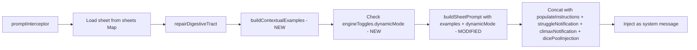

# LLM Instruction System Redesign

## Problem Statement

The LLM frequently writes XML incorrectly — for example, omitting the `<digestion>` tag, which breaks digestion. The root cause is that the current [`buildSheetPrompt()`](src/backend/engine.ts:1521) is a ~450-line static text block. It tells the LLM what to do in prose but never shows it what empty fields should look like when filled. The LLM also never fills out entries that don't already have something in them (skills, traits, clothing, states, etc.) because the instructions only say "copy everything" — they never invite the LLM to populate blank fields.

## Two Proposed Features

### Feature A: Contextual Examples for Empty Fields

**Concept:** For every empty field or entry in the character sheet, the LLM receives a short format example showing how that entry should look. Once the entry is filled out, the example stops being sent to save tokens.

**How it works:**

1. A new function [`buildContextualExamples()`](src/backend/engine.ts:1521) is added to `engine.ts`. It receives the current `sheetXml` and parses it to detect which fields/sections are empty.
2. For each empty field, it generates a minimal XML snippet showing the correct format.
3. The examples are injected into the prompt as a new `─── EMPTY FIELD EXAMPLES ───` section, inserted between the `<CurrentCharacterSheet>` block and the rules section.
4. The section header explicitly tells the LLM: "The following fields in your sheet are currently empty. Here is the correct FORMAT for each. These are EXAMPLES ONLY — do NOT copy these example values into your sheet. Use them as a structural template and fill in your own scene-appropriate values."
5. Each example is wrapped in a clearly labeled block (e.g. `EXAMPLE FORMAT:`) and the section ends with a reminder: "The above are FORMAT EXAMPLES showing XML structure only. Do NOT copy the example text/values into your sheet. Create your own content matching the scene."

**What counts as "empty" and what examples are shown:**

| Empty Field/Section | Example Injected |
|---|---|
| `<Weather>` blank/missing | `<Weather>Overcast, light drizzle</Weather>` |
| `<Temperature>` blank/missing | `<Temperature>18°C</Temperature>` |
| `<Area>` blank/missing | `<Area>Old Town Market</Area>` |
| `<Building>` blank/missing | `<Building>The Copper Mug Tavern</Building>` |
| `<Room>` blank/missing | `<Room>Common Hall</Room>` |
| `<Clothing>` has no `<Equip>` | `<Equip slot="Torso Base" elasticity="standard">Linen Shirt</Equip>` |
| `<Backpack>` has no `<Item>` | `<Item qty="1" desc="Holds 2L">Waterskin</Item>` |
| `<SkillsAndTraits>` has no `<Skill>` | `<Skill name="Iron Stomach" level="3" buffs="BaseDigestionRate:+25">Iron-lined stomach.</Skill>` |
| `<SkillsAndTraits>` has no `<Trait>` | `<Trait name="Patient Hunter" buffs="ArousalDecay:-20">Calm under pressure.</Trait>` |
| `<Attributes>` missing or all 10 | Full `<Attributes><STR>10</STR>...</Attributes>` block with note "set scores 8-15" |
| `<Vitals>` / `<Health>` missing | `<Vitals><Health current="100" max="100" /></Vitals>` |
| `<Stomach>` has no `<Item>` | `<Item type="Food" name="Bread" volume_L="0.5" digestion="0%">...</Item>` |
| `<Bowels>` has no `<Item>` or `<Remains>` | `<Remains volume_L="0.5">Waste</Remains>` |
| `<Womb>` has no `<Item>` (if unbirth engine on) | `<Item type="Prey" name="..." volume_L="60" absorption="0%">...</Item>` |
| `<Balls>` has no `<Item>` (if cock vore engine on) | `<Item type="Prey" name="..." volume_L="60" conversion="0%">...</Item>` |
| Currency fields at 0/missing | `<CashBalance>1500</CashBalance>` or `<Gold>12</Gold>...` |
| `<Description>` missing on a prey item | `<Description>Squirming as acids rise.</Description>` |
| `<Appearance>` missing on a prey item | `<Appearance>22-year-old human woman, slender, red hair, green eyes</Appearance>` |
| `<BoundGear>` missing on a prey item | `<BoundGear>blue dress, leather boots</BoundGear>` |

**Token savings:** Examples are only injected for fields that are currently empty. As the LLM fills fields over turns, the examples naturally drop out. A fully filled sheet produces zero example tokens.

**Implementation details:**

- The function uses simple regex checks (same patterns already used throughout `engine.ts`) to detect emptiness — no new parsing infrastructure needed.
- The function respects `engineToggles` — e.g., only shows Womb/Balls examples if those engines are enabled.
- The examples section is built as a string and concatenated into the prompt in [`promptInterceptor()`](src/backend/interceptor.ts:1542) alongside the existing injections, OR passed into `buildSheetPrompt()` as a second parameter. Preferred: pass as second parameter to keep all prompt text in one function.

**Signature change:**
```typescript
export function buildSheetPrompt(sheetXml: string, contextualExamples: string): string
```

### Feature B: Dynamic Mode Toggle

**Concept:** A new engine toggle (`dynamicMode`) that, when enabled, tells the LLM it may freely fill out and modify ANY field on the sheet — except the engine-computed values. This replaces the current conservative behavior where the LLM only copies existing values and never populates blank entries.

**How it works:**

1. Add `dynamicMode: false` to `engineToggles` in [`state.ts`](src/backend/state.ts:48)
2. Add `dynamicMode: boolean` to `EngineToggles` interface in [`frontend/types.ts`](src/frontend/types.ts:30)
3. Add `dynamicMode: false` to `defaultEngineToggles` in [`frontend/api.ts`](src/frontend/api.ts:34)
4. Add toggle definition to `engineToggleDefs` in [`frontend.ts`](src/frontend.ts:411):
   ```typescript
   { key: 'dynamicMode', label: 'Dynamic Mode', desc: 'Allow LLM to freely fill out and modify non-engine-computed sheet fields' },
   ```
5. Modify [`buildSheetPrompt()`](src/backend/engine.ts:1521) to accept `engineToggles` (or just a `dynamicMode: boolean` flag) and change the instructions accordingly.

**Instruction changes when dynamic mode is ON:**

The "YOUR RESPONSIBILITIES" section is replaced with an expanded version:

```
─── YOUR RESPONSIBILITIES (DYNAMIC MODE ENABLED) ───
You have CREATIVE FREEDOM over the character sheet. You may fill out, modify, and
update ANY field on the sheet — including Skills, Traits, Clothing, Backpack items,
State/World fields, BaseStats, Attributes, and character identity fields — to reflect
what is happening in the story and what makes sense for the character.

The ONLY values you must NOT modify are the ENGINE-COMPUTED VALUES listed below.
Those are calculated by the extension and must be copied verbatim.

When you fill out an empty field for the first time, use the EMPTY FIELD EXAMPLES
section above as a format guide. Once a field has content, maintain and update it
as the story progresses.

Specific things you ARE encouraged to do in dynamic mode:
- Add new Skills and Traits as the character develops them
- Add or change Clothing as the character dresses/undresses/changes
- Add Backpack items when the character acquires things
- Fill in State/World fields (Weather, Area, Building, Room) to set the scene
- Adjust Attributes when the character grows (rarely — through training or transformation)
- Set character identity fields (Name, Age, Species, etc.) if they are blank
- Update Currency fields when money is earned or spent
- Create new quests via <quest_create> tags as story objectives emerge
- Complete quests via <quest_complete> when objectives are met
- Abandon quests via <quest_abandon> when the character gives up or fails
- Award bonus XP via <xp_award> tags for significant narrative milestones
```

The "PRE-COMPUTED VALUES" section stays exactly the same — those are always off-limits regardless of mode.

**Instruction changes when dynamic mode is OFF (current behavior):**

The instructions stay as they are now. The LLM is told to copy everything and only make specific allowed changes (time, arousal, descriptions, willingness, etc.). This is the conservative mode.

**Key distinction — the field categorization:**

```mermaid
graph TD
    A[Character Sheet Fields] --> B[Engine-Computed - Always Copy Verbatim]
    A --> C[LLM-Controlled - Dynamic Mode Can Modify]
    
    B --> B1[digestion pct on prey items]
    B --> B2[transit pct on bowels prey]
    B --> B3[timeAdded timestamps]
    B --> B4[indigestion on Stomach tag]
    B --> B5[stamina on prey items]
    B --> B6[struggle on prey items]
    B --> B7[FirstItemTime / StomachEmptyTime]
    B --> B8[CurrentAcidPct]
    B --> B9[Climax]
    B --> B10[CurrentPenisLength_cm / Girth_cm]
    B --> B11[InventoryCapacity / Overcapacity]
    B --> B12[Clothing stress and condition]
    B --> B13[stomachFatigue]
    B --> B14[Health current and max]
    B --> B15[Height / Weight / BreastVolume / Hips / Penis max dims]
    B --> B16[Progression block - Level / XP / AttributePoints]
    B --> B17[Quests block - copy verbatim, but LLM controls via quest_create/quest_complete/quest_abandon tags]
    B --> B18[MilkVolume_ml]
    B --> B19[CumVolume_ml]
    
    C --> C1[Time - advance forward]
    C --> C2[Arousal - set based on scene]
    C --> C3[Energy - set based on scene]
    C --> C4[State/World fields - Weather / Temperature / Area / Building / Room]
    C --> C5[Prey Description / Appearance / BoundGear]
    C --> C6[willingness on prey items]
    C --> C7[suppressing on Stomach tag]
    C --> C8[resting on BaseStats]
    C --> C9[StomachResistance trait]
    C --> C10[Add/remove prey items in Stomach/Bowels/Womb/Balls]
    C --> C11[Clothing Equip entries]
    C --> C12[Backpack Item entries]
    C --> C13[SkillsAndTraits entries]
    C --> C14[BaseStats identity fields - Name / Age / Species / Gender etc]
    C --> C15[Attributes STR/DEX/CON/INT/WIS/CHA]
    C --> C16[Currency fields - CashBalance / Gold / Silver / Copper]
    C --> C17[CurrencySystem / ClothingMode / CapacityMultiplier]
    C --> C18[LactationRateMultiplier]
    C --> C19[quest_create / quest_complete / quest_abandon / xp_award tags - LLM freely uses these in both modes]
```



## Implementation Plan

### Step 1: Add `dynamicMode` toggle to settings infrastructure

**Files to modify:**
- [`src/backend/state.ts`](src/backend/state.ts:48) — add `dynamicMode: false` to `engineToggles`
- [`src/frontend/types.ts`](src/frontend/types.ts:30) — add `dynamicMode: boolean` to `EngineToggles`
- [`src/frontend/api.ts`](src/frontend/api.ts:34) — add `dynamicMode: false` to `defaultEngineToggles`
- [`src/frontend.ts`](src/frontend.ts:411) — add toggle def to `engineToggleDefs`

### Step 2: Create `buildContextualExamples()` function in engine.ts

**File:** [`src/backend/engine.ts`](src/backend/engine.ts:1520) (add new function before `buildSheetPrompt`)

The function:
- Takes `sheetXml: string` as input
- Returns a string containing the `─── EMPTY FIELD EXAMPLES ───` section (or empty string if no empty fields)
- Uses regex to check each field/section for emptiness
- Respects `engineToggles` for engine-gated sections (Womb, Balls, Lactation, etc.)
- Groups examples by section (State, BaseStats, Clothing, Backpack, SkillsAndTraits, DigestiveTract)

### Step 3: Modify `buildSheetPrompt()` to accept new parameters

**File:** [`src/backend/engine.ts`](src/backend/engine.ts:1521)

Change signature to:
```typescript
export function buildSheetPrompt(sheetXml: string, contextualExamples: string, dynamicMode: boolean): string
```

Changes inside the function:
- Insert `contextualExamples` string after the `<CurrentCharacterSheet>` block (before the rules sections) if non-empty
- Conditionally swap the "YOUR RESPONSIBILITIES" section based on `dynamicMode`:
  - `false`: keep current conservative text
  - `true`: use expanded "DYNAMIC MODE ENABLED" text (see above)
- The "PRE-COMPUTED VALUES" section stays the same in both modes

### Step 4: Wire up `promptInterceptor()` to pass new parameters

**File:** [`src/backend/interceptor.ts`](src/backend/interceptor.ts:1542)

Change the injection construction:
```typescript
const contextualExamples = buildContextualExamples(sheet)
const injection = {
  role: 'system' as const,
  content: buildSheetPrompt(sheet, contextualExamples, engineToggles.dynamicMode ?? false) 
    + populateInstructions + struggleNotification + climaxNotification + dicePoolInjection,
}
```

### Step 5: Test and verify

- Verify that with all fields filled, `buildContextualExamples()` returns an empty string (no token waste)
- Verify that with blank fields, the examples appear in the prompt
- Verify that `dynamicMode: false` produces the same instructions as before (no regression)
- Verify that `dynamicMode: true` produces the expanded creative-freedom instructions
- Verify the toggle appears in the frontend settings panel and persists correctly

## Architecture Diagram



## Edge Cases and Considerations

1. **Prey items with missing sub-tags:** If a prey `<Item>` exists but has no `<Description>`, `<Appearance>`, or `<BoundGear>`, the examples function should detect this and show the format for the missing sub-tag specifically.

2. **Engine toggle interaction:** If `unbirthEngine` is off, don't show Womb examples. If `cockVoreEngine` is off, don't show Balls examples. If `lactationEngine` is off, don't show lactation-related examples. If `healthSystem` is off, don't show Vitals/Health examples. If `attributeSystem` is off, don't show Attributes examples.

3. **Dynamic mode + pre-computed values:** Even in dynamic mode, the LLM must NEVER touch engine-computed values. The pre-computed values list is the hard boundary. The instructions must make this crystal clear.

4. **Dynamic mode + populate instructions:** The existing `populateInstructions` (from the "Populate" button) should still work alongside dynamic mode. Dynamic mode is a persistent setting; populate is a one-shot request. They are complementary.

5. **Token budget:** The examples section is designed to be minimal — one line per empty field. A completely blank sheet would produce maybe 15-20 lines of examples. As fields fill, the section shrinks. This is far cheaper than the current approach of the LLM guessing wrong and producing broken XML.

6. **No changes to contentProcessor or commitUpdate:** The redesign is purely prompt-side. The backend parsing/validation logic stays the same — it already handles whatever XML the LLM produces.

7. **Examples are FORMAT ONLY, not data:** The EMPTY FIELD EXAMPLES section must be framed unambiguously as structural templates. The section header, each example label (EXAMPLE FORMAT:), and the closing reminder all reinforce that the LLM should use the examples to understand XML structure — not copy the example values. This prevents the LLM from blindly inserting example placeholder text like "Bread" or "Linen Shirt" into the actual sheet.

8. **Quests in dynamic mode:** The LLM has quest control in BOTH modes via the quest action tags (<quest_create>, <quest_complete>, <quest_abandon>, <xp_award>). These tags are placed inside <sheet_update> but outside <CharacterSheet>. The engine processes them in processQuestTags() and processXpAwards(). Dynamic mode does not change this — it simply means the LLM is also encouraged to proactively create quests as story objectives emerge, rather than only doing so when explicitly prompted. The Quests block inside <CharacterSheet> itself remains engine-computed (the engine rewrites it based on the action tags), so the LLM must still copy it verbatim.
