# Inventory Slot System Design

## Overview

Replace the current free-form backpack list with a **slot-based capacity system**. The character has a limited number of inventory slots determined by what they wear. Each clothing item can grant additional slots (the LLM decides how many). Items also gain an optional short description field.

## Core Design Principles

1. **Memory-efficient** — descriptions are short attributes (≤8 words), not child tags. Items with the same name auto-stack. No per-item weight, value, or rarity.
2. **LLM-driven slot counts** — the LLM sets `slots="N"` on `<Equip>` tags. The backend sums them and injects the total. This mirrors the existing pattern where the LLM sets inputs (willingness, suppressing) and the backend computes outputs (stamina, struggle, indigestion).
3. **Minimal format change** — only one new attribute on items (`desc`) and one new attribute on equipment (`slots`). Everything else stays the same.

---

## Data Model

### Clothing / Equipment

Current format:
```xml
<Equip slot="Back" elasticity="rigid">Backpack</Equip>
```

New format:
```xml
<Equip slot="Back" elasticity="rigid" slots="5">Backpack</Equip>
```

- `slots` is optional. If omitted, the item grants **0** slots.
- The LLM determines the slot count based on what the item logically is (a backpack = 5, a belt with pouches = 2, a hat = 0, a scabbard = 1).
- The system prompt gives guidance but the LLM has creative freedom.

### Backpack Items

Current format:
```xml
<Item qty="1">Waterskin</Item>
```

New format:
```xml
<Item qty="1" desc="Holds 2L of water">Waterskin</Item>
```

- `desc` is **optional**. If omitted, the item has no description.
- `desc` must be ≤8 words. The system prompt enforces this.
- Items with the same name **auto-stack** — the backend merges them into one row with summed `qty`. The `desc` from the first occurrence is kept; if descriptions differ, the longest is kept.
- Each **unique item name** consumes **1 slot**, regardless of `qty`. A stack of 50 arrows = 1 slot.

### Capacity

```xml
<InventoryCapacity>8</InventoryCapacity>
```

- Computed by the backend: `3 (base naked) + sum of all Equip@slots`
- Injected into the sheet inside `<State>` (same location as other computed values like `<CurrentAcidPct>`)
- The LLM copies it verbatim (same rule as digestion%, stamina, etc.)

### Over-Capacity

When the number of unique items exceeds capacity:
```xml
<InventoryOvercapacity>2</InventoryOvercapacity>
```

- `0` = fine. `2` = 2 items over limit.
- Injected by the backend into `<State>`.
- The system prompt instructs the LLM to narrate the character being overburdened and to drop/remove items until within capacity.

---

## System Architecture

```mermaid
flowchart LR
    A[LLM writes sheet_update] --> B[Backend interceptor]
    B --> C[Normalize Backpack items]
    C --> D[Auto-stack same-name items]
    D --> E[Compute capacity from Equip slots]
    E --> F[Count unique items vs capacity]
    F --> G[Inject InventoryCapacity + InventoryOvercapacity]
    G --> H[Store sheet]
    H --> I[Frontend parses + renders]
```



### Backend Changes

#### 1. Equip slot normalization (`src/backend/interceptor.ts`)

After the existing clothing stress processing, add a step that:
- Scans all `<Equip>` tags
- Reads the `slots` attribute (default 0 if missing or invalid)
- Sums them: `clothingSlots = sum(Equip@slots)`
- Computes: `capacity = 3 + clothingSlots`
- Injects `<InventoryCapacity>{capacity}</InventoryCapacity>` into `<State>`
- Counts unique item names in `<Backpack>`
- Computes: `overcap = max(0, uniqueItems - capacity)`
- Injects `<InventoryOvercapacity>{overcap}</InventoryOvercapacity>` into `<State>`

#### 2. Backpack item normalization (`src/backend/interceptor.ts`)

Update the existing normalization block (currently at line ~539) to:
- Preserve `qty` and `desc` attributes, strip everything else
- Auto-stack: after normalizing all items, merge entries with the same name (sum qty, keep longest desc)
- Output format: `<Item qty="N" desc="...">name</Item>` (desc omitted if empty)

```typescript
// Pseudocode for updated normalization
const items: Map<string, { qty: number, desc: string }> = new Map()
inner.replace(/<Item\s+([^>]*?)(?:\/>|>([\s\S]*?)<\/Item>)/gi, (m, attrs, text) => {
  const qty = parseInt(getAttrFromString(attrs, 'qty') || '1') || 1
  const desc = getAttrFromString(attrs, 'desc') || ''
  const name = getAttrFromString(attrs, 'name') || (text || '').trim()
  if (!name) return ''
  const existing = items.get(name)
  if (existing) {
    existing.qty += qty
    if (desc.length > existing.desc.length) existing.desc = desc
  } else {
    items.set(name, { qty, desc })
  }
  return '' // consumed
})
// Rebuild XML from map
let result = ''
for (const [name, { qty, desc }] of items) {
  const descAttr = desc ? ` desc="${desc}"` : ''
  result += `\n    <Item qty="${qty}"${descAttr}>${name}</Item>`
}
return `<Backpack${attrs}>${result}\n  </Backpack>`
```

#### 3. System prompt update (`src/backend/engine.ts`)

Add a new section to the system prompt:

```
─── INVENTORY SLOT SYSTEM ───
The character has a limited number of inventory slots. The base capacity is 3 slots when naked. Each equipped clothing item can grant additional slots — set a slots="N" attribute on <Equip> tags to indicate how many inventory slots that item provides. Examples:
  <Equip slot="Back" elasticity="rigid" slots="5">Backpack</Equip>
  <Equip slot="Waist" elasticity="standard" slots="2">Belt with pouches</Equip>
  <Equip slot="Head Top" elasticity="rigid" slots="0">Hat</Equip>

The extension computes total capacity and injects <InventoryCapacity> into the sheet. Copy it verbatim.

BACKPACK ITEM FORMAT:
  <Item qty="1" desc="Holds 2L of water">Waterskin</Item>
- desc is OPTIONAL. If included, keep it to 8 words or fewer.
- Items with the same name automatically stack (their quantities are merged). Do not create duplicate entries for the same item.
- Each unique item name uses 1 slot, regardless of quantity. 50 arrows = 1 slot.
- The extension computes <InventoryOvercapacity>. If it is >0, the character is carrying more items than they have slots for. Narrate them being overburdened and have them drop, store, or discard items until within capacity.
- When the character equips or removes clothing, update the slots attribute on the relevant <Equip> tag. The capacity will recalculate automatically.
```

Update rule 19 to mention the `desc` attribute and slot-based capacity.

### Frontend Changes

#### 4. `createInvItem()` component (`src/frontend/components.ts`)

Updated markup:
```html
<div class="bt-row bt-inv-row dyn-inv">
  <input type="number" class="bt-input bt-inv-qty d-qty" placeholder="#" value="1">
  <input type="text" class="bt-input bt-inv-name d-name" placeholder="Item name...">
  <button class="bt-inv-toggle" data-action="toggle-inv-desc">ⓘ</button>
  <button class="bt-inv-remove" data-action="remove-inv">✖</button>
  <input type="text" class="bt-input bt-inv-desc d-desc" placeholder="Short description (optional)..." style="display:none;">
</div>
```

- The `ⓘ` button toggles the description input visibility (collapsed by default to save vertical space).
- The description input is a single-line text input (not textarea) to enforce brevity.

#### 5. Capacity bar UI (`src/frontend.ts`)

Add above the backpack container, replacing the simple section title:

```html
<div class="bt-section-title flex">
  <span>BACKPACK / POCKETS</span>
  <span class="bt-inv-capacity">
    <span id="bt-inv-used">0</span> / <span id="bt-inv-max">3</span> slots
  </span>
</div>
<div class="bt-fillbar thin">
  <div class="bt-fillbar-track">
    <div id="bt-inv-cap-bar" class="bt-fillbar-fill tier-safe" style="width:0%"></div>
  </div>
</div>
<button class="bt-add-btn" id="add-inv-btn">+ Add Item</button>
```

- The bar fills proportionally: `used / max`.
- Color tiers: `tier-safe` (green, <80%), `tier-warn` (yellow, 80-99%), `tier-danger` (red, ≥100%).
- When over capacity, the bar shows 100% red and a warning text appears: "Over capacity by N items".

#### 6. Frontend XML serializer (`src/frontend.ts`)

Update the backpack serialization block (~line 1375):

```typescript
document.querySelectorAll('.dyn-inv').forEach((el) => {
  const qty = (el.querySelector('.d-qty') as HTMLInputElement)?.value.trim() || '1'
  const name = (el.querySelector('.d-name') as HTMLInputElement)?.value.trim()
  const desc = (el.querySelector('.d-desc') as HTMLInputElement)?.value.trim()
  if (name) {
    const descAttr = desc ? ` desc="${desc}"` : ''
    xml += `    <Item qty="${qty}"${descAttr}>${name}</Item>\n`
  }
})
```

Also update the Equip serialization (~line 1364) to include the `slots` attribute:

```typescript
document.querySelectorAll('.bt-cloth-slot').forEach((el) => {
  const input = el as HTMLInputElement
  const val = input.value.trim()
  const slot = input.getAttribute('data-slot')
  if (val !== '') {
    const flexEl = input.previousElementSibling?.querySelector('.bt-cloth-flex') as HTMLSelectElement
    const flexStr = flexEl ? ` elasticity="${flexEl.value}"` : ''
    const slotsInput = input.parentElement?.querySelector('.bt-cloth-slots') as HTMLInputElement
    const slotsVal = slotsInput?.value.trim()
    const slotsStr = slotsVal ? ` slots="${slotsVal}"` : ''
    xml += `    <Equip slot="${slot}"${flexStr}${slotsStr}>${val}</Equip>\n`
  }
})
```

#### 7. Frontend XML parser (`src/frontend.ts`)

Update the Backpack parser (~line 1935):

```typescript
doc.querySelectorAll('Backpack > Item').forEach((itemNode) => {
  const qty = itemNode.getAttribute('qty') || '1'
  const desc = itemNode.getAttribute('desc') || ''
  const name = itemNode.textContent || ''
  const div = createInvItem()
  document.getElementById('inv-container')?.appendChild(div)
  ;(div.querySelector('.d-qty') as HTMLInputElement).value = qty
  ;(div.querySelector('.d-name') as HTMLInputElement).value = name
  ;(div.querySelector('.d-desc') as HTMLInputElement).value = desc
  if (desc) {
    // Auto-expand description if present
    const descInput = div.querySelector('.d-desc') as HTMLInputElement
    descInput.style.display = 'block'
  }
})
```

Update the Equip parser (~line 1902) to read `slots`:

```typescript
const slots = equipNode.getAttribute('slots') || ''
if (slots) {
  const slotsInput = input.parentElement?.querySelector('.bt-cloth-slots') as HTMLInputElement
  if (slotsInput) slotsInput.value = slots
}
```

Update capacity parsing — read `<InventoryCapacity>` and `<InventoryOvercapacity>` from `<State>`:

```typescript
const capacity = parseInt(getText('InventoryCapacity')) || 3
const overcap = parseInt(getText('InventoryOvercapacity')) || 0
updateInventoryCapacityUI(capacity, overcap)
```

#### 8. Clothing slot UI — add slots input (`src/frontend.ts`)

Add a small number input next to each clothing slot's elasticity dropdown:

```html
<div class="flex-row">
  <span class="slot-label">Back</span>
  <select class="bt-select bt-cloth-flex">...</select>
  <input type="number" class="bt-input bt-cloth-slots" placeholder="0" min="0" max="20" value="0" title="Inventory slots provided">
  <span class="slot-slots-label">slots</span>
</div>
```

- Only show the slots input on slots that make sense (Back, Waist, Torso Shell — containers). Actually, show it on ALL slots for maximum flexibility — the LLM/user can leave it at 0.
- Compact styling: 30px wide, centered.

#### 9. Capacity update function (`src/frontend.ts`)

```typescript
function updateInventoryCapacityUI(capacity: number, overcap: number): void {
  const container = document.getElementById('inv-container')
  const used = container ? container.querySelectorAll('.dyn-inv').length : 0
  const usedEl = document.getElementById('bt-inv-used')
  const maxEl = document.getElementById('bt-inv-max')
  const barEl = document.getElementById('bt-inv-cap-bar')
  if (usedEl) usedEl.textContent = String(used)
  if (maxEl) maxEl.textContent = String(capacity)
  if (barEl) {
    const pct = capacity > 0 ? Math.min(100, (used / capacity) * 100) : 100
    barEl.style.width = pct + '%'
    barEl.className = 'bt-fillbar-fill ' + (
      overcap > 0 ? 'tier-danger' :
      pct >= 80 ? 'tier-warn' : 'tier-safe'
    )
  }
  // Show/hide overcapacity warning
  const warnEl = document.getElementById('bt-inv-overcap-warn')
  if (warnEl) {
    warnEl.style.display = overcap > 0 ? 'block' : 'none'
    warnEl.textContent = `Over capacity by ${overcap} item${overcap > 1 ? 's' : ''}`
  }
}
```

Call this function:
- After parsing a sheet from the LLM
- After adding/removing an inventory item
- After changing any clothing slot's slots value

#### 10. CSS (`src/frontend/styles.ts`)

```css
/* ── Inventory capacity bar ─────────────────────────────── */
.bt-inv-capacity { font-size: var(--bt-font-sm); color: var(--bt-text-dim); }
.bt-inv-cap-bar { transition: width 0.3s ease, background 0.3s ease; }
.bt-inv-overcap-warn { display: none; color: var(--bt-danger, #e74c3c); font-size: var(--bt-font-sm); margin-bottom: 5px; font-weight: bold; }

/* ── Inventory item rows ─────────────────────────────────── */
.bt-inv-row { margin-bottom: 5px; background: var(--bt-surface); padding: 5px; border-radius: 4px; border: 1px dashed var(--bt-border-dashed); flex-wrap: wrap; }
.bt-inv-qty { width: 40px; text-align: center; padding: 4px; }
.bt-inv-name { margin-bottom: 0; flex: 1; margin-left: 5px; text-align: left; }
.bt-inv-toggle { background: transparent; border: none; color: var(--bt-text-dim); cursor: pointer; font-size: var(--bt-font-md); padding: 0 4px; }
.bt-inv-desc { width: 100%; margin-top: 4px; margin-left: 45px; font-size: var(--bt-font-sm); }
.bt-inv-remove { background: transparent; border: none; color: var(--bt-accent); cursor: pointer; font-size: var(--bt-font-lg); margin-left: 5px; }

/* ── Clothing slots input ────────────────────────────────── */
.bt-cloth-slots { width: 30px; text-align: center; padding: 2px; font-size: var(--bt-font-sm); }
.slot-slots-label { font-size: var(--bt-font-xs); color: var(--bt-text-dim2); }
```

---

## Implementation Order

| Step | File | Description |
|------|------|-------------|
| 1 | `src/backend/engine.ts` | Add inventory slot system prompt section + update rule 19 |
| 2 | `src/backend/interceptor.ts` | Update Backpack normalization: preserve desc, auto-stack, compute capacity + overcapacity, inject into State |
| 3 | `src/frontend/components.ts` | Update `createInvItem()`: add desc input + toggle button |
| 4 | `src/frontend.ts` | Add slots input to clothing slot HTML template |
| 5 | `src/frontend.ts` | Add capacity bar + overcapacity warning to backpack section HTML |
| 6 | `src/frontend.ts` | Update XML serializer: emit desc on items, emit slots on Equip |
| 7 | `src/frontend.ts` | Update XML parser: read desc, read slots, read InventoryCapacity/Overcapacity |
| 8 | `src/frontend.ts` | Add `updateInventoryCapacityUI()` function + wire up event listeners |
| 9 | `src/frontend/styles.ts` | Add CSS for capacity bar, desc input, slots input, overcapacity warning |
| 10 | — | Manual testing: equip items with slots, add items, verify capacity bar and stacking |

---

## Edge Cases

- **LLM omits slots on Equip**: defaults to 0, capacity stays at base 3. No breakage.
- **LLM adds extra attributes to Backpack items**: backend strips them, keeps only qty + desc.
- **LLM creates duplicate items**: backend auto-stacks them.
- **LLM omits desc on an item that had one**: desc is dropped (not re-injected). This is intentional — saves memory.
- **Character is naked**: capacity = 3. If they have more than 3 unique items, overcapacity warning triggers.
- **Capacity is 0** (shouldn't happen — base is always 3): treated as 3 minimum.
- **User manually adds items over capacity**: UI shows red bar + warning. No hard block — the LLM handles it narratively.
