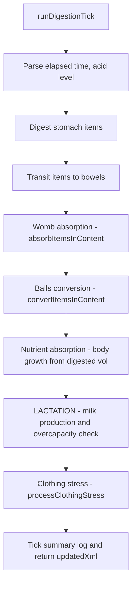
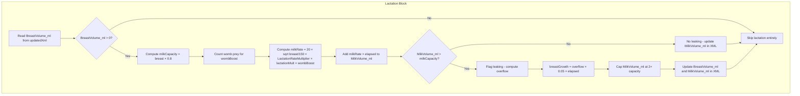

# Lactation Mechanic — Design Document

## Objective

Add a lactation system that models milk production, accumulation, and overcapacity leaking as a passive body process that runs during digestion ticks. Breast size determines milk capacity — larger breasts hold more milk and produce it faster (sub-linearly). Womb prey presence boosts production, which can push milk over capacity and trigger leaking (narrative) along with slow breast swelling. Skills and traits can modify lactation speed via the existing buff/debuff system. AA cups / 0 ml breasts have zero capacity, so males and flat-chested characters never lactate.

---

## Current Architecture

### XML Structure

Milk volume will be stored as a new stat inside `<BaseStats>`, alongside the existing `BreastVolume_ml`:

```xml
<CharacterSheet>
  <State>
    <Health>...</Health>
    <Energy>...</Energy>
    <Arousal>50</Arousal>
    ...
  </State>
  <BaseStats>
    <Height_cm>165</Height_cm>
    <Weight_kg>60</Weight_kg>
    <BreastVolume_ml>450</BreastVolume_ml>
    <MilkVolume_ml>180</MilkVolume_ml>   <!-- NEW -->
    <WombCapacityMultiplier>1.0</WombCapacityMultiplier>
    <BallsCapacityMultiplier>1.0</BallsCapacityMultiplier>
    <LactationRateMultiplier>1.0</LactationRateMultiplier>  <!-- NEW -->
    ...
  </BaseStats>
  ...
</CharacterSheet>
```

### Tick Flow (existing, with lactation insertion point)



The lactation block runs **after** nutrient absorption and **before** clothing stress. This ordering ensures:
- Nutrient absorption has already updated `BreastVolume_ml` (which determines milk capacity)
- Womb absorption has already run, so we know if womb prey is present for the production boost
- Clothing stress runs last and can account for any breast growth from overcapacity milk

### Key Functions

| Function | File | Lines | Role |
|---|---|---|---|
| `runDigestionTick()` | [`interceptor.ts`](src/backend/interceptor.ts:56) | 56–734 | Orchestrator — lactation block inserts at ~line 707 |
| `getStat()` / `setStat()` | [`engine.ts`](src/backend/engine.ts:220) | 220–257 | Read/write XML stat tags (used for MilkVolume_ml) |
| `collectModifiers()` | [`engine.ts`](src/backend/engine.ts:159) | 159–182 | Sums buffs + attributes, clamps to ±50% — provides LactationRate modifier |
| `buildSheetPrompt()` | [`engine.ts`](src/backend/engine.ts:915) | 915–1187 | LLM instruction prompt — new LACTATION SYSTEM section inserts at ~line 1181 |
| `updateCapacities()` | [`frontend.ts`](src/frontend.ts:590) | 590–726 | Frontend capacity calculator — milk capacity display adds here |
| `buildCurrentXml()` | [`frontend.ts`](src/frontend.ts:1110) | 1110–1354 | Form → XML bridge — MilkVolume_ml auto-included via `.bt-scrape` |
| `populateFormFromXml()` | [`frontend.ts`](src/frontend.ts:1609) | 1609–2044 | XML → form bridge — MilkVolume_ml auto-parsed via `.bt-scrape` |

### Engine Toggles

| Toggle | Key | Default | Description |
|---|---|---|---|
| Digestion Engine | `digestionEngine` | `true` | Master switch for digestion ticks |
| Clothing Stress | `clothingStress` | `true` | Clothing damage from body changes |
| Nutrient Absorption | `nutrientAbsorption` | `true` | Body growth from digested volume |
| Arousal/Climax | `arousalClimax` | `true` | Arousal tracking and climax events |
| Struggle Engine | `struggleEngine` | `true` | Prey struggle and indigestion |
| Dice System | `diceSystem` | `false` | RPG dice pools |
| Unbirth Engine | `unbirthEngine` | `false` | Womb absorption of prey |
| Cock Vore Engine | `cockVoreEngine` | `false` | Balls conversion of prey |
| **Lactation Engine** | **`lactationEngine`** | **`false`** | **Milk production, accumulation, and overcapacity leaking** |

### Related Systems

| System | Interaction |
|---|---|
| Nutrient Absorption | Updates `BreastVolume_ml` before lactation runs. Lactation reads the updated breast volume to compute milk capacity. |
| Womb Absorption | Determines womb prey presence and count for the production boost. The lactation block checks `<Womb>` for `<Item>` tags. |
| Buff/Debuff | New `LactationRate` buff target allows skills/traits to modify milk production speed by ±50%. |
| Clothing Stress | Runs after lactation. Breast growth from overcapacity milk may trigger clothing stress on chest garments. |

---

## Key Design Decisions

### 1. New Stat: `MilkVolume_ml`

Stored in `<BaseStats>` alongside `BreastVolume_ml`. Defaults to 0. Tracks the current volume of milk in the breasts. The backend tick adds production each tick. The LLM can reduce it when the character expresses milk (narrative action). The frontend includes it as a `.bt-scrape` input so it is automatically picked up by `buildCurrentXml()` and `populateFormFromXml()`.

### 2. Milk Capacity Formula

```
milkCapacity = BreastVolume_ml × 0.8
```

- Linear relationship: bigger breasts = proportionally more capacity.
- At 0 ml (AA cup): capacity = 0 → no lactation possible. Males and flat-chested characters never lactate.
- At 150 ml (A cup): capacity = 120 ml.
- At 450 ml (D cup): capacity = 360 ml.
- At 1000 ml (H+ cup): capacity = 800 ml.
- Capacity is fixed by breast volume alone — no capacity multiplier. The user-adjustable stat is `LactationRateMultiplier`, which controls production **speed** (see Decision 3).

### 3. Milk Production Rate

```
milkRate = baseRate × √(BreastVolume_ml / 150) × LactationRateMultiplier × lactationMult × wombBoost
```

- `baseRate` = **20 ml/h** — a steady, noticeable accumulation that fills an A cup in ~6 hours and a D cup in ~18 hours.
- `LactationRateMultiplier` = user-adjustable stat (default 1.0) that lets users fine-tune production speed. At 1.0 → 20 ml/h base; at 2.0 → 40 ml/h base; at 0.5 → 10 ml/h base. The frontend shows a **live ml/h display** next to the multiplier input that updates immediately when the multiplier changes.
- **Square root scaling** ensures bigger breasts produce faster but **not exponentially**:
  - A cup (150 ml): √(1.0) = 1.0× → 20 ml/h (at multiplier 1.0)
  - C cup (350 ml): √(2.33) = 1.53× → 30.5 ml/h
  - DD cup (550 ml): √(3.67) = 1.91× → 38.3 ml/h
  - H+ cup (1000 ml): √(6.67) = 2.58× → 51.6 ml/h
- `lactationMult` = `1 + (modifiers.LactationRate || 0)` — the buff/debuff modifier from skills/traits, clamped to ±50% by `applyModifierCap()`.
- `wombBoost` = `1 + (wombPreyCount × 0.5)` — each prey in the womb adds 50% to production. See Decision 4.
- At 0 ml breast volume: `√(0/150) = 0` → rate = 0. No production for AA cups.
- **Live ml/h display**: The frontend computes `displayedRate = 20 × √(breast/150) × LactationRateMultiplier` and shows it next to the multiplier input. This updates immediately on input change (before any tick runs), giving the user instant feedback on how their multiplier affects production.

### 4. Womb Prey Production Boost

When the unbirth engine is active and prey is in the womb, milk production increases for the duration of their stay. The boost is calculated from the number of `<Item>` tags inside `<Womb>`:

```
wombBoost = 1 + (wombPreyCount × 0.5)
```

- 0 prey: 1.0× (normal)
- 1 prey: 1.5× (50% boost)
- 2 prey: 2.0× (100% boost)
- 3 prey: 2.5× (150% boost)

This boost can push milk production past the capacity fill rate, causing milk to accumulate beyond capacity and trigger leaking. When prey leaves the womb (absorbed or expelled), the boost drops and production returns to normal.

**Note:** The womb boost applies regardless of whether `unbirthEngine` is toggled on — it only checks for the physical presence of prey in `<Womb>`. However, `lactationEngine` must be on for any milk production to occur.

### 5. Overcapacity and Leaking

When `MilkVolume_ml > milkCapacity`:
- **Leaking flag**: The character is "leaking" — the LLM is instructed to narrate milk leaking from the breasts.
- **Breast growth**: The overflow causes slow breast swelling at 5% of the overflow per hour:
  ```
  overflow = MilkVolume_ml - milkCapacity
  breastGrowth = overflow × 0.05 × elapsed
  BreastVolume_ml += breastGrowth
  ```
  This is the **only** way milk causes breast enlargement — normal milk accumulation up to capacity does NOT grow breasts. This matches the user's rule: "milk slowly rises to capacity but does not enlarge the breasts unless it goes overcapacity."
- **Milk cap**: `MilkVolume_ml` is capped at `milkCapacity × 2` to prevent unbounded accumulation. The cap prevents runaway growth while still allowing a meaningful overflow period.
- **Self-limiting**: As breasts grow from overflow, capacity increases (capacity = breast × 0.8). Since capacity scales linearly but production scales with √, the system naturally reaches equilibrium — capacity eventually outpaces production and overflow stops.

### 6. Leaking Is Narrative

Leaking has **no mechanical volume loss**. The milk volume does not decrease from leaking itself. The only ways `MilkVolume_ml` decreases are:
1. **Player expresses milk** (narrative action) — the LLM reduces `MilkVolume_ml` in the `<sheet_update>`. The prompt instructs the LLM to do this when the character expresses, pumps, or feeds.
2. **Overflow conversion** — overflow above capacity slowly converts to breast growth, but `MilkVolume_ml` itself stays at the capped value (it doesn't drain from leaking).

The leaking state is communicated to the LLM via the LACTATION SYSTEM prompt section, which instructs it to narrate milk stains, wetness, and visible leaking when `MilkVolume_ml > milkCapacity`.

### 7. Engine Toggle: `lactationEngine`

- Default: `false` (opt-in, like `unbirthEngine` and `cockVoreEngine`).
- When off: milk production freezes. `MilkVolume_ml` stays at its current value — no production, no leaking, no breast growth from overflow. The stat is still stored and displayed.
- When on: the full lactation cycle runs each tick.

### 8. Buff Target: `LactationRate`

Added to the VALID BUFF TARGETS list in `buildSheetPrompt()` and to `buffTargetDefs` in the frontend. Skills and traits can carry `buffs="LactationRate:+25"` or `buffs="LactationRate:-30"` to modify milk production speed. The modifier is collected by `collectModifiers()`, clamped to ±50% by `applyModifierCap()`, and applied as `lactationMult = 1 + modifier`.

Example skill: `<Skill name="Dairy Heritage" buffs="LactationRate:+30" />` → +30% milk production.
Example trait: `<Trait name="Hormonal Imbalance" buffs="LactationRate:+50" />` → +50% milk production (capped).

### 9. Toast Category: `lactationEvents`

New toast category for milk-related notifications:
- Milk reaches capacity: info toast "🥛 Breasts full — milk at capacity."
- Leaking starts: warning toast "💧 Breasts overcapacity — leaking!"
- Breast growth from overflow: info toast "🥛 Overfull breasts swelling +X ml."

Default: `true` (visible). Added to `defaultToastSettings` and `toastSettings` in state.ts.

### 10. New Interface: `LactationResult`

```typescript
export interface LactationResult {
  milkVolume: number       // final MilkVolume_ml after tick
  milkCapacity: number     // computed capacity
  breastGrowth: number     // ml of breast growth from overflow
  isLeaking: boolean       // true if milkVolume > capacity
  wombPreyCount: number    // prey in womb (for boost)
  productionRate: number   // ml/hour computed rate
}
```

---

## Mermaid Tick Flow



---

## Proposed Changes by File

### 1. `src/backend/types.ts` — Add `LactationResult` interface

Add after the existing `ConversionResult` interface (line ~124):

```typescript
export interface LactationResult {
  milkVolume: number
  milkCapacity: number
  breastGrowth: number
  isLeaking: boolean
  wombPreyCount: number
  productionRate: number
}
```

### 2. `src/backend/state.ts` — Add `lactationEngine` to `engineToggles`

Update the `engineToggles` object (line 30–37):

```typescript
export let engineToggles: Record<string, boolean> = {
  digestionEngine: true, clothingStress: true, nutrientAbsorption: true, arousalClimax: true,
  struggleEngine: true, buffSystem: true,
  attributeSystem: false,
  diceSystem: false,
  unbirthEngine: false,
  cockVoreEngine: false,
  lactationEngine: false,   // NEW
}
```

Also add `lactationEvents: true` to `toastSettings` (line 24–29):

```typescript
export let toastSettings: Record<string, boolean> = {
  digestionTicks: true, climaxEvents: true, clothingDamage: true,
  nutrientAbsorption: false, digestionSkips: false, sheetSync: true,
  rollbackEvents: true, rollbackWarnings: true, errors: true, chatWarnings: false,
  struggleEvents: true, vomitEvents: true,
  lactationEvents: true,   // NEW
}
```

### 3. `src/frontend/types.ts` — Add `lactationEngine` to `EngineToggles`

Update the `EngineToggles` interface (line 27–37):

```typescript
export interface EngineToggles {
  [key: string]: boolean
  digestionEngine: boolean
  clothingStress: boolean
  nutrientAbsorption: boolean
  arousalClimax: boolean
  struggleEngine: boolean
  diceSystem: boolean
  unbirthEngine: boolean
  cockVoreEngine: boolean
  lactationEngine: boolean   // NEW
}
```

### 4. `src/frontend/api.ts` — Add `lactationEngine` to `defaultEngineToggles`

Update `defaultEngineToggles` (line 30–39):

```typescript
export const defaultEngineToggles: EngineToggles = {
  digestionEngine: true,
  clothingStress: true,
  nutrientAbsorption: true,
  arousalClimax: true,
  struggleEngine: true,
  diceSystem: false,
  unbirthEngine: false,
  cockVoreEngine: false,
  lactationEngine: false,   // NEW
}
```

Also add `lactationEvents: true` to `defaultToastSettings` (line 15–28):

```typescript
export const defaultToastSettings: ToastSettings = {
  digestionTicks: true,
  climaxEvents: true,
  clothingDamage: true,
  nutrientAbsorption: false,
  digestionSkips: false,
  sheetSync: true,
  rollbackEvents: true,
  rollbackWarnings: true,
  struggleEvents: true,
  vomitEvents: true,
  errors: true,
  chatWarnings: false,
  lactationEvents: true,   // NEW
}
```

### 5. `src/frontend.ts` — Add `lactationEngine` to `engineToggleDefs` and `LactationRate` to `buffTargetDefs`

Update `engineToggleDefs` (line 379–390):

```typescript
const engineToggleDefs: EngineToggleDef[] = [
  { key: 'digestionEngine', label: 'Digestion Engine', desc: 'Master switch for digestion ticks' },
  { key: 'clothingStress', label: 'Clothing Stress', desc: 'Clothing damage from body changes' },
  { key: 'nutrientAbsorption', label: 'Nutrient Absorption', desc: 'Body growth from digested volume' },
  { key: 'arousalClimax', label: 'Arousal/Climax', desc: 'Arousal tracking and climax events' },
  { key: 'struggleEngine', label: 'Struggle Engine', desc: 'Prey struggle and indigestion' },
  { key: 'diceSystem', label: 'Dice System', desc: 'RPG dice pools' },
  { key: 'unbirthEngine', label: 'Unbirth Engine', desc: 'Womb absorption of prey (same nutrient absorption as stomach)' },
  { key: 'cockVoreEngine', label: 'Cock Vore Engine', desc: 'Balls conversion of prey into cum, expelled on climax' },
  { key: 'lactationEngine', label: 'Lactation Engine', desc: 'Milk production, accumulation, and overcapacity leaking' },  // NEW
]
```

Update `buffTargetDefs` (line 391–402):

```typescript
const buffTargetDefs: BuffTargetDef[] = [
  { value: 'BaseDigestionRate', label: 'Digestion Rate' },
  { value: 'AcidRiseRate', label: 'Acid Rise Rate' },
  { value: 'StomachResistance', label: 'Stomach Resistance' },
  { value: 'ArousalDecay', label: 'Arousal Decay' },
  { value: 'ArousalGain', label: 'Arousal Gain' },
  { value: 'NutrientAbsorption', label: 'Nutrient Absorption' },
  { value: 'ClothingStress', label: 'Clothing Stress' },
  { value: 'EnergyDrain', label: 'Energy Drain' },
  { value: 'WombAbsorptionRate', label: 'Womb Absorption Rate' },
  { value: 'BallsConversionRate', label: 'Balls Conversion Rate' },
  { value: 'LactationRate', label: 'Lactation Rate' },  // NEW
]
```

### 6. `src/frontend.ts` — Add LACTATION section to Metabolism tab HTML

Insert after the BALLS section (after line 308, before the sync buttons at line 309):

```html
        <hr style="border-color: #333; margin: 15px 0;">
        <div class="bt-section-title" style="display:flex; justify-content:space-between; align-items:center;">
          <span>LACTATION</span>
        </div>
        <div class="bt-row"><span>Lactation Rate Multiplier:</span> <input type="number" class="bt-input bt-scrape" data-id="LactationRateMultiplier" id="bt-lact-rate-mult" step="0.1" value="1.0"> <span id="bt-lact-rate-display" style="margin-left:8px; font-weight:bold; color:#4CAF50;">20 ml/h</span></div>
        <div class="bt-row"><span>Milk Capacity:</span> <span class="bt-value" id="bt-milk-cap">0 ml</span></div>
        <div class="bt-row"><span>Current Milk:</span> <input type="number" class="bt-input bt-scrape" data-id="MilkVolume_ml" id="bt-milk-ml" style="flex:1;" value="0"> <span id="bt-milk-status" style="width: 60px; text-align:right; font-weight:bold; color:#888;">Empty</span></div>
        <div class="bt-row"><span>Production Rate:</span> <span class="bt-value" id="bt-milk-rate">0 ml/h</span></div>
        <div class="bt-row"><span>Womb Boost:</span> <span class="bt-value" id="bt-milk-boost">1.0×</span></div>
```

**Design notes:**
- `MilkVolume_ml` is a `.bt-scrape` input with `data-id="MilkVolume_ml"` — it is automatically included in `buildCurrentXml()` (emitted in `<BaseStats>`) and parsed by `populateFormFromXml()`.
- `LactationRateMultiplier` is also a `.bt-scrape` input — same auto-include behavior.
- The **live ml/h display** (`bt-lact-rate-display`) sits next to the multiplier input and shows the actual production rate at the current multiplier and breast size. It updates immediately when the multiplier changes — at 1.0 it shows 20 ml/h (for an A cup baseline), and bumping it up or down immediately changes the displayed amount.
- The milk status span shows: `Empty`, `Filling`, `Full`, `Leaking` with color coding.
- Production rate and womb boost are display-only spans, updated by `updateCapacities()`.

### 7. `src/frontend.ts` — Add milk capacity and status to `updateCapacities()`

Insert after the balls capacity block (after line 650, before the belly status block at line 652):

```typescript
    // ─── Milk capacity ──────────────────────────────────────────
    const lactRateMultEl = document.getElementById('bt-lact-rate-mult') as HTMLInputElement
    const lactRateMult = parseFloat(lactRateMultEl?.value || '1.0') || 1.0
    const breastMl = parseFloat((document.getElementById('bt-breast-ml') as HTMLInputElement)?.value || '0') || 0
    const milkCapacity = breastMl * 0.8
    const milkCapDisp = document.getElementById('bt-milk-cap')
    if (milkCapDisp) milkCapDisp.innerText = milkCapacity.toFixed(0) + ' ml'

    const milkInput = document.getElementById('bt-milk-ml') as HTMLInputElement
    const milkVol = parseFloat(milkInput?.value || '0') || 0
    const milkStatusEl = document.getElementById('bt-milk-status')
    if (milkStatusEl) {
      if (breastMl <= 0) { milkStatusEl.innerText = 'N/A'; milkStatusEl.style.color = '#666' }
      else if (milkVol <= 0) { milkStatusEl.innerText = 'Empty'; milkStatusEl.style.color = '#888' }
      else if (milkVol >= milkCapacity * 0.95 && milkVol <= milkCapacity) { milkStatusEl.innerText = 'Full'; milkStatusEl.style.color = '#ffeb3b' }
      else if (milkVol > milkCapacity) { milkStatusEl.innerText = 'Leaking'; milkStatusEl.style.color = '#ff4444' }
      else { milkStatusEl.innerText = 'Filling'; milkStatusEl.style.color = '#4CAF50' }
    }

    // Production rate (without womb boost — actual boost computed in backend)
    const baseRate = 20.0
    const milkRate = breastMl > 0 ? baseRate * Math.sqrt(breastMl / 150) * lactRateMult : 0
    const milkRateDisp = document.getElementById('bt-milk-rate')
    if (milkRateDisp) milkRateDisp.innerText = milkRate.toFixed(1) + ' ml/h'

    // Live ml/h display next to the multiplier input — updates immediately on multiplier change
    const lactRateDisplay = document.getElementById('bt-lact-rate-display')
    if (lactRateDisplay) {
      const displayRate = breastMl > 0 ? baseRate * Math.sqrt(breastMl / 150) * lactRateMult : 0
      lactRateDisplay.innerText = displayRate.toFixed(1) + ' ml/h'
    }

    // Womb boost display
    let wombPreyForMilk = 0
    document.querySelectorAll('#womb-container .vital-slot').forEach((el) => {
      const type = (el.querySelector('.v-type') as HTMLSelectElement)?.value
      if (type === 'Prey') wombPreyForMilk++
    })
    const wombBoost = 1 + (wombPreyForMilk * 0.5)
    const milkBoostDisp = document.getElementById('bt-milk-boost')
    if (milkBoostDisp) milkBoostDisp.innerText = wombBoost.toFixed(1) + '×'
```

Also add event listeners so milk-related fields trigger `updateCapacities()`:

```typescript
  document.getElementById('bt-milk-ml')?.addEventListener('input', updateCapacities)
  document.getElementById('bt-lact-rate-mult')?.addEventListener('input', updateCapacities)
```

(Add these near the existing `document.getElementById('bt-height')?.addEventListener('input', updateCapacities)` line at ~728.)

### 8. `src/backend/interceptor.ts` — Add lactation block in `runDigestionTick()`

Insert after the nutrient absorption block (after line 707 `} // end nutrientAbsorption`) and before the clothing stress block (line 709):

```typescript
    // ─── LACTATION SYSTEM ──────────────────────────────────────
    if (engineToggles.lactationEngine) {
      const breastVol = getStat(updatedXml, 'BreastVolume_ml') || 0
      const lactRateMult = getStat(updatedXml, 'LactationRateMultiplier') || 1.0
      const milkCapacity = breastVol * 0.8

      if (breastVol > 0 && milkCapacity > 0) {
        // Count womb prey for production boost
        let wombPreyCount = 0
        const wombMatch = updatedXml.match(/<Womb[^>]*>([\s\S]*?)<\/Womb>/i)
        if (wombMatch && wombMatch[1]) {
          wombPreyCount = (wombMatch[1].match(/<Item[\s>]/gi) || []).length
        }
        const wombBoost = 1 + (wombPreyCount * 0.5)

        // Production rate: base 20 ml/h × sqrt(breast/150) × LactationRateMultiplier × lactationMult × wombBoost
        const lactationMult = 1 + (modifiers.LactationRate || 0)
        const baseRate = 20.0
        const milkRate = baseRate * Math.sqrt(breastVol / 150) * lactRateMult * lactationMult * wombBoost
        const milkProduction = milkRate * elapsed

        // Read current milk (allow LLM to have reduced it via expressing)
        const oldMilkVol = getStat(oldXml, 'MilkVolume_ml') || 0
        let milkVol = getStat(updatedXml, 'MilkVolume_ml')
        if (milkVol === null || milkVol === undefined) {
          milkVol = oldMilkVol
        }
        milkVol = Math.max(0, milkVol) // clamp negative to 0
        milkVol += milkProduction

        // Check for overcapacity
        const isLeaking = milkVol > milkCapacity
        let breastGrowthFromMilk = 0

        if (isLeaking) {
          const overflow = milkVol - milkCapacity
          breastGrowthFromMilk = overflow * 0.05 * elapsed

          // Apply breast growth from overflow
          const currentBreastVol = getStat(updatedXml, 'BreastVolume_ml') || breastVol
          const newBreastVol = currentBreastVol + breastGrowthFromMilk
          updatedXml = setStat(updatedXml, 'BreastVolume_ml', newBreastVol)

          // Cap milk at 2× capacity (recompute capacity with new breast vol)
          const newCapacity = newBreastVol * 0.8
          milkVol = Math.min(milkVol, newCapacity * 2)

          maybeToast('lactationEvents', 'warning',
            `💧 Breasts overcapacity — leaking! +${breastGrowthFromMilk.toFixed(1)}ml breast growth from overfullness.`)
          spindle.log.info(
            `Lactation: leaking! milk ${milkVol.toFixed(1)}/${milkCapacity.toFixed(1)}ml, ` +
            `+${breastGrowthFromMilk.toFixed(2)}ml breast growth, womb boost ${wombBoost}×`,
          )
        } else {
          // Check if milk just reached capacity
          const oldMilkCap = (getStat(oldXml, 'BreastVolume_ml') || 0) * 0.8
          if (oldMilkVol < oldMilkCap && milkVol >= milkCapacity * 0.95) {
            maybeToast('lactationEvents', 'info', `🥛 Breasts full — milk at capacity.`)
          }
          spindle.log.info(
            `Lactation: milk ${milkVol.toFixed(1)}/${milkCapacity.toFixed(1)}ml, ` +
            `rate ${milkRate.toFixed(1)}ml/h, womb boost ${wombBoost}×`,
          )
        }

        // Update MilkVolume_ml in XML
        updatedXml = setStat(updatedXml, 'MilkVolume_ml', Math.round(milkVol))
      } else {
        // AA cup / 0ml — no lactation possible
        updatedXml = setStat(updatedXml, 'MilkVolume_ml', 0)
      }
    } // end lactationEngine
```

**Key implementation notes:**
- The block reads `BreastVolume_ml` from `updatedXml` (which has already been updated by nutrient absorption), so milk capacity reflects post-growth breast size.
- Womb prey count is determined by regex-matching `<Item>` tags inside `<Womb>`. This works regardless of whether `unbirthEngine` is on — it only checks physical presence.
- `MilkVolume_ml` is read from `updatedXml` first (allowing the LLM to have reduced it via expressing), falling back to `oldXml` if not present. No `Math.max` clamp against old value — milk is allowed to decrease.
- Negative milk is clamped to 0.
- When leaking, breast growth is applied to `BreastVolume_ml` and milk is capped at 2× the **new** capacity (after growth).
- `setStat` rounds milk to integer to avoid long decimal values in XML.

### 9. `src/backend/engine.ts` — Add `LactationRate` to VALID BUFF TARGETS

Update the buff targets list in `buildSheetPrompt()` (line ~1126–1136):

```typescript
   - BaseDigestionRate, AcidRiseRate, StomachResistance, ArousalDecay, ArousalGain,
     NutrientAbsorption, ClothingStress, EnergyDrain, WombAbsorptionRate, BallsConversionRate,
     LactationRate
```

### 10. `src/backend/engine.ts` — Add LACTATION SYSTEM section to `buildSheetPrompt()`

Insert after the BALLS CONVERSION SYSTEM section (after line 1180) and before the `<sheet_update>` template (line 1182):

```typescript
`
─── LACTATION SYSTEM ───
The character's breasts produce milk passively over time. The extension AUTOMATICALLY computes milk production each tick — copy the MilkVolume_ml value exactly.

Rules for lactation:
- MilkVolume_ml tracks the current milk in the breasts. It accumulates automatically.
- Milk capacity = BreastVolume_ml × 0.8. At 0 ml breast volume (AA cup), there is NO capacity and NO lactation.
- LactationRateMultiplier (default 1.0) is a user-adjustable stat that scales production speed. At 1.0 → 20 ml/h base rate; the frontend shows a live ml/h display next to the multiplier.
- Milk production is faster with larger breasts (sub-linear scaling) and boosted 50% per prey in the Womb.
- When MilkVolume_ml exceeds milk capacity, the character is LEAKING. Narrate visible milk stains, wetness, and drops leaking from the nipples. This is a narrative cue — the extension handles the mechanical values.
- Overfull breasts slowly swell from the pressure (the extension handles this growth automatically).
- The character can EXPRESS milk (manually pump, feed someone, let it flow) to reduce MilkVolume_ml. When the character does this, set MilkVolume_ml to the reduced amount in the sheet_update.
- Milk does NOT enlarge breasts when below capacity. Only overcapacity overflow causes breast growth (handled by the extension).
- Skills and traits with buffs="LactationRate:+X" or "LactationRate:-X" modify production speed.

`
```

### 11. `src/frontend.ts` — Add milk input listener for status update

The `MilkVolume_ml` input (`bt-milk-ml`) needs an `input` event listener to update the milk status display. Add near the breast cup calculator (after line 1430):

```typescript
  // ─── Milk status updater ────────────────────────────────────
  const milkInputEl = document.getElementById('bt-milk-ml') as HTMLInputElement
  milkInputEl?.addEventListener('input', () => {
    updateCapacities()
  })
```

This is also covered by the `updateCapacities` event listener added in Change 7, but having it explicit ensures the status updates even if the generic listener is removed.

### 12. `src/frontend.ts` — Ensure `populateFormFromXml()` handles new stats

The existing `populateFormFromXml()` function (line 1609) already scrapes all `.bt-scrape` inputs from `<BaseStats>` (lines 1640–1649). Since `MilkVolume_ml` and `LactationRateMultiplier` are both `.bt-scrape` inputs with matching `data-id` attributes, they will be **automatically parsed** — no changes needed to `populateFormFromXml()`.

Similarly, `buildCurrentXml()` (line 1110) already scrapes all `.bt-scrape` inputs for `<BaseStats>` (lines 1134–1141). Both new stats will be **automatically emitted** — no changes needed to `buildCurrentXml()`.

**However**, there is one edge case: the `buildCurrentXml` function skips fields where `val === '0'` (line 1138: `if (val !== '' && val !== '0' && id && !stateTags.includes(id))`). This means `MilkVolume_ml` and `LactationRateMultiplier` will NOT be emitted when their value is 0. This is acceptable because:
- `MilkVolume_ml = 0` → the backend treats missing stat as 0 via `getStat() || 0`
- `LactationRateMultiplier = 0` → this would be a user error (0 rate multiplier = no production). The default is 1.0, and the input has `value="1.0"`. If the user sets it to 0, it won't be emitted, and the backend will default to `getStat() || 1.0`.

Wait — `getStat()` returns `number | null`. The `|| 1.0` fallback in the backend handles the missing tag case. But `getStat() || 1.0` would also override a legitimate value of 0. Since 0 rate multiplier is nonsensical, this is fine.

Actually, looking more carefully at the backend code pattern: `getStat(updatedXml, 'LactationRateMultiplier') || 1.0` — if the stat is missing, `getStat` returns `null`, and `null || 1.0` = 1.0. If the stat is 0, `0 || 1.0` = 1.0 (because 0 is falsy). This is the desired behavior — 0 multiplier should default to 1.0, not zero out all production.

For `MilkVolume_ml`: `getStat(updatedXml, 'MilkVolume_ml') || 0` — if missing, defaults to 0. If 0, stays 0. This is correct.

### 13. `src/frontend.ts` — Add `lactationEvents` to toast category definitions

Search for where toast categories are defined (the `toastCategoryDefs` array or similar). Add:

```typescript
{ key: 'lactationEvents', label: 'Lactation Events', desc: 'Milk production, fullness, and leaking notifications' },
```

---

## Edge Cases & Safety

| Edge Case | Handling |
|---|---|
| `BreastVolume_ml = 0` (AA cup / male) | `milkCapacity = 0`, production rate = 0 (√0 = 0). Block sets `MilkVolume_ml = 0` and skips. No lactation. |
| `BreastVolume_ml` decreases (manual edit) | Milk capacity shrinks. If `MilkVolume_ml > new capacity`, leaking triggers immediately on next tick. |
| `MilkVolume_ml` manually set to 0 | Production starts accumulating from 0 on next tick. Normal behavior. |
| `MilkVolume_ml` negative (LLM error) | Clamped to 0 via `Math.max(0, milkVol)`. |
| Womb prey removed mid-tick | Womb prey count is re-counted each tick. Boost drops to 1.0× on the next tick after prey leaves. |
| `lactationEngine` toggled off | Block skipped entirely. `MilkVolume_ml` frozen at current value. No production, no leaking, no growth. |
| `lactationEngine` toggled on for first time | Production starts from current `MilkVolume_ml` (likely 0). Normal accumulation begins. |
| `LactationRateMultiplier = 0` | `getStat() \|\| 1.0` defaults to 1.0 (0 is falsy). Prevents accidental zero-production. |
| `LactationRate` buff at +50% (max) | `lactationMult = 1.5`. Production rate × 1.5. Clamped by `applyModifierCap()`. |
| `LactationRate` buff at -50% (min) | `lactationMult = 0.5`. Production rate × 0.5. Still produces, just slower. |
| Milk at 2× capacity (hard cap) | `milkVol = Math.min(milkVol, newCapacity * 2)`. Prevents unbounded accumulation. Breast growth from overflow continues each tick until capacity catches up. |
| Nutrient absorption grows breasts during same tick | Lactation reads `BreastVolume_ml` from `updatedXml` (post-nutrient-absorption). Milk capacity reflects the new breast size. This is the correct ordering — nutrient growth increases capacity before milk is produced. |
| LLM sets `MilkVolume_ml` to very high value | The tick adds production on top. On the next tick, if over capacity, leaking + breast growth triggers. The 2× cap prevents runaway. |
| LLM removes `MilkVolume_ml` tag entirely | `getStat()` returns `null`, falls back to `oldXml` value. Production continues from old value. |
| Both `lactationEngine` and `unbirthEngine` off, but womb has prey | Womb prey is still counted for the boost (physical presence check). But if `lactationEngine` is off, the block is skipped entirely. If `lactationEngine` is on but `unbirthEngine` is off, womb prey still boosts milk (they're physically present, just not being absorbed). |

---

## Implementation Order

1. Add `LactationResult` interface to [`src/backend/types.ts`](src/backend/types.ts:120)
2. Add `lactationEngine: false` to `engineToggles` in [`src/backend/state.ts`](src/backend/state.ts:30)
3. Add `lactationEvents: true` to `toastSettings` in [`src/backend/state.ts`](src/backend/state.ts:24)
4. Add `lactationEngine: boolean` to `EngineToggles` in [`src/frontend/types.ts`](src/frontend/types.ts:27)
5. Add `lactationEngine: false` to `defaultEngineToggles` in [`src/frontend/api.ts`](src/frontend/api.ts:30)
6. Add `lactationEvents: true` to `defaultToastSettings` in [`src/frontend/api.ts`](src/frontend/api.ts:15)
7. Add `lactationEngine` entry to `engineToggleDefs` in [`src/frontend.ts`](src/frontend.ts:379)
8. Add `LactationRate` entry to `buffTargetDefs` in [`src/frontend.ts`](src/frontend.ts:391)
9. Add LACTATION section HTML to Metabolism tab in [`src/frontend.ts`](src/frontend.ts:308) (after BALLS, before sync buttons)
10. Add milk capacity calculation to `updateCapacities()` in [`src/frontend.ts`](src/frontend.ts:650)
11. Add `bt-milk-ml` and `bt-lact-rate-mult` event listeners for `updateCapacities` in [`src/frontend.ts`](src/frontend.ts:728)
12. Add `LactationRate` to VALID BUFF TARGETS in `buildSheetPrompt()` in [`src/backend/engine.ts`](src/backend/engine.ts:1126)
13. Add LACTATION SYSTEM section to `buildSheetPrompt()` in [`src/backend/engine.ts`](src/backend/engine.ts:1180)
14. Add lactation block to `runDigestionTick()` in [`src/backend/interceptor.ts`](src/backend/interceptor.ts:707) (after nutrient absorption, before clothing stress)
15. Add `lactationEvents` toast category definition in [`src/frontend.ts`](src/frontend.ts) (wherever toast categories are defined)
16. Test: toggle `lactationEngine` on, set `BreastVolume_ml` to 450 (D cup), run ticks, verify milk accumulates
17. Test: add prey to womb, verify production boost and leaking trigger
18. Test: set `BreastVolume_ml` to 0, verify no lactation occurs
19. Test: add skill with `buffs="LactationRate:+30"`, verify production rate increases
20. Test: manually reduce `MilkVolume_ml` (simulating expressing), verify it accumulates from the reduced value

---

## Resolved Design Decisions

1. **Milk capacity is linear with breast volume** (× 0.8) — simple, intuitive, and ensures 0 ml = 0 capacity. No capacity multiplier; capacity is purely breast-driven.

2. **Production rate uses square root scaling** — sub-linear growth that satisfies "bigger = faster but not exponentially." Base rate is 20 ml/h; an A cup produces 20 ml/h; an H+ cup produces ~52 ml/h. The `LactationRateMultiplier` stat (default 1.0) lets users fine-tune speed, with a live ml/h display in the frontend.

3. **Womb boost is +50% per prey** — meaningful enough to cause overcapacity leaking with 1–2 prey, but not so extreme that it's instant. The boost is based on prey count, not volume, for simplicity.

4. **Overcapacity causes breast growth at 5% of overflow per hour** — slow enough to be gradual, fast enough to be noticeable over a long scene. The system is self-limiting because capacity (linear) outpaces production (√).

5. **Milk is capped at 2× capacity** — prevents unbounded accumulation while still allowing a meaningful overflow period for breast growth and leaking narrative.

6. **Leaking is narrative-only** — no mechanical volume loss from leaking. The LLM is instructed to narrate it. The only way milk decreases is through player-initiated expressing (LLM reduces `MilkVolume_ml`).

7. **`lactationEngine` defaults to off** — opt-in like other vore engines. Users who want lactation enable it explicitly.

8. **`LactationRate` buff target** — integrates with the existing buff/debuff system. Skills and traits can modify production speed by ±50%.

9. **No `Math.max` anti-rollback clamp on milk** — unlike `BreastVolume_ml` which uses `Math.max` to prevent shrinkage, milk is allowed to decrease (for expressing). The backend trusts the LLM's value if lower, and adds production on top.

10. **Womb prey boost works independently of `unbirthEngine`** — the boost checks physical presence of prey in `<Womb>`, not whether the unbirth engine is active. This allows scenarios where prey is placed in the womb manually (via sheet edit) without the unbirth engine running.

---

## Legacy Chat Migration

| Scenario | Migration Behavior |
|---|---|
| Existing character with no `MilkVolume_ml` stat | `getStat()` returns `null`, backend defaults to 0. No lactation until `lactationEngine` is toggled on. Milk starts accumulating from 0. |
| Existing character with `BreastVolume_ml` but `lactationEngine` off | No change. Milk stat is not added to XML. Character behaves exactly as before. |
| User enables `lactationEngine` on existing character | `MilkVolume_ml` starts at 0 (missing stat → 0 default). Production begins on next tick. `LactationRateMultiplier` defaults to 1.0 (missing stat → 1.0 default). |
| Character with `BreastVolume_ml = 0` enables `lactationEngine` | Block sets `MilkVolume_ml = 0` each tick. No production. No toast spam (block exits early). |
| LLM generates sheet without `MilkVolume_ml` after lactation was active | Backend falls back to `oldXml` value and adds production. The stat reappears in the next `setStat` call. |
| LLM generates sheet with `MilkVolume_ml` but without `LactationRateMultiplier` | Backend defaults multiplier to 1.0. Rate = 20 × √(breast/150) × 1.0 × buffMult × wombBoost. Normal behavior. |
