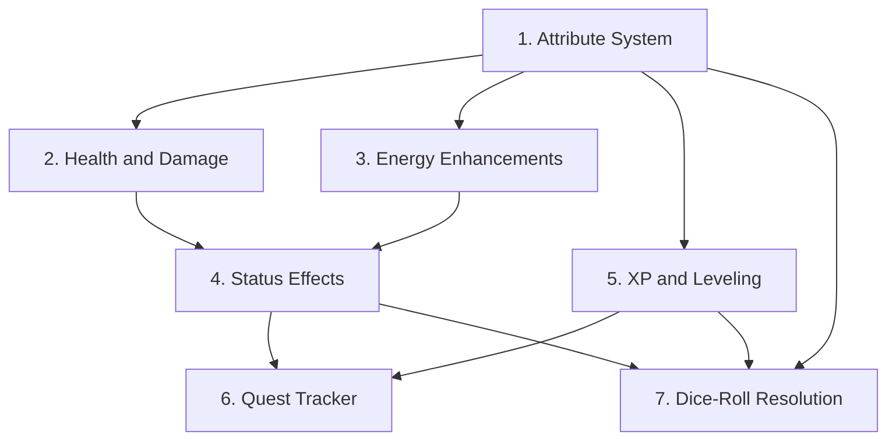

# RPG Mechanics Design — Revised

## Overview

This is the revised design for RPG mechanics to add to the lumiverse-bio-tracker extension, incorporating user feedback:

1. **Skill tree left blank** — structure exists but skills are designed later
2. **Leveling grants attribute points** (not skill points)
3. **All numbers carefully tuned** to prevent bars draining too fast from modifier stacking

## Critical Design Principle: Capped Additive Stacking

The biggest risk with multiple modifier sources (buffs, attributes, health states, status effects) is **runaway stacking** — where penalties accumulate and make bars drain at 2×, 3×, or worse.

### The Problem

Consider a character who is:
- Bruised (health 40%) → -3% to suppression (Bruised state, 59-30% band)
- Exhausted (stamina 15%) → proposed +25% indigestion gain
- Has a buff: EnergyDrain +20%
- Has a status effect: Bloated → +10% ClothingStress

If these stack **multiplicatively**, energy drain could become `1.25 × 1.25 × 1.20 = 1.875` — nearly double. With more effects, it gets worse.

### The Solution: Single Additive Pool, Hard Capped

**All modifiers for a given stat key are summed into one additive number, then clamped to `[-0.50, +0.50]`.**

```
finalMultiplier = clamp(
    buffModifier + attributeModifier + healthStateModifier + staminaStateModifier + statusEffectModifier,
    -0.50,
    +0.50
)
finalRate = baseRate * (1 + finalMultiplier)
```

This means:
- **Best case**: every positive modifier maxed out → rate is 1.5× base (never more)
- **Worst case**: every negative modifier maxed out → rate is 0.5× base (never less than half)
- **Typical case**: a few small modifiers → rate is 1.05× to 1.15× base (barely noticeable)

The existing `collectBuffs()` already produces additive modifiers (e.g., `BaseDigestionRate: +0.10`). The new systems simply **add their modifiers to the same sum** before clamping.

### Modifier Contribution Per Source

| Source | Typical Range | Notes |
|--------|--------------|-------|
| Buffs (existing) | ±5% to ±25% | From `<Skill>`/`<Trait>` `buffs` attr |
| Attributes | ±5% to ±25% | Modifier × 5% per point above/below 10 |
| Health state | 0% to -15% | Only when below 50% HP, specific stats only |
| Stamina state | 0% to -10% | Only when below 25% energy, specific stats only |
| Status effects | ±5% to ±20% | LLM-triggered, per effect, short-lived (duration in hours) |

Even if ALL sources contribute their maximum simultaneously (extremely unlikely), the sum is clamped to ±50%.

---

## Existing Engine Numbers (Reference)

These are the current values the new systems must coexist with. All rates are **per hour of elapsed time** (`elapsed` variable).

### Energy (Pred) — 0 to 100

| Scenario | Drain/Recovery | Formula |
|----------|---------------|---------|
| Fighting prey, not suppressing | Drain | `fightingStruggle × 0.5 × (1 + energyDrainMult)` |
| Fighting prey, suppressing | Drain | above + `numFighting × 2 × elapsed × (1 + energyDrainMult)` |
| No fighting | Recovery | `+3 × elapsed` |
| No prey at all | Recovery | `+5 × elapsed` |
| Post-vomit | One-time | `-20` |

**Typical drain** (1 fighting prey, suppressing, no buffs): ~6.5/hour → ~15 hours to deplete from full.

### Prey Stamina — 0 to 100 (per prey)

| Scenario | Drain/Recovery | Formula |
|----------|---------------|---------|
| Fighting | Drain | `3 × elapsed × sizeFactor` |
| Not fighting | Recovery | `+5 × elapsed` |

**Typical drain** (sizeFactor 1.0): 3/hour → ~33 hours to deplete.

### Indigestion — 0 to 100

| Scenario | Change | Formula |
|----------|--------|---------|
| Any fighting | Gain | `Σ(prey.personalStruggle) × stomachResistanceFactor × suppressionFactor` |
| No fighting | Decay | `indigestionDecayRate(20) × elapsed × decayMult` |

**Typical gain** (1 fighting prey, base stats): ~9/hour → ~11 hours to reach 100 (vomit).

### Arousal — 0 to 100

| Scenario | Change | Formula |
|----------|--------|---------|
| Decay | Drop | `50 × (1 + ArousalDecayBuff) × elapsed` |
| LLM stimulus | Rise | LLM sets value, engine applies `× (1 + ArousalGainBuff)` |

**Typical decay**: 50/hour → arousal halves every hour without stimulus.

### Acid — 0 to 100

| Scenario | Change | Formula |
|----------|--------|---------|
| Items in stomach | Rise | `acidRiseRate(10) × elapsed` |
| Empty stomach | Drop | `acidRiseRate(10) × elapsed` |

**Typical rise**: 10/hour → 10 hours to reach 100% from 0.

### Key Takeaway

The existing system is **already well-tuned** with ~10-15 hour depletion times for most pools. The new RPG systems must not shorten these times significantly. The capped additive stacking (±50% max) ensures that even in the worst case, depletion times only drop to ~7-10 hours — still reasonable.

---

## Proposal 1: Attribute System (Foundation)

### Concept

Six classic RPG attributes: **STR, DEX, CON, INT, WIS, CHA**. Default value 10 (modifier 0). Range 3-20. Modifier = `(score - 10) / 2`, rounded down.

### XML Schema

```xml
<Attributes>
  <Attribute name="STR" value="10" />
  <Attribute name="DEX" value="10" />
  <Attribute name="CON" value="10" />
  <Attribute name="INT" value="10" />
  <Attribute name="WIS" value="10" />
  <Attribute name="CHA" value="10" />
</Attributes>
```

### Attribute Modifier → Engine Impact

Each attribute contributes its modifier × 5% to the relevant stat's additive multiplier sum (before clamping). This gives attributes a **meaningful** impact on gameplay — a high STR character genuinely feels stronger, a low WIS character genuinely struggles with indigestion recovery. The ±50% cap still prevents runaway stacking:

| Attribute | Affects | Modifier Contribution |
|-----------|---------|----------------------|
| STR | StomachResistance (as pred), personalStruggle (as prey) | `STR_mod × 0.05` |
| CON | AcidRiseRate, HealthRegen | `CON_mod × 0.05` |
| DEX | ArousalDecay, escape chance | `DEX_mod × 0.05` |
| INT | NutrientAbsorption | `INT_mod × 0.05` |
| WIS | IndigestionDecayRate, EnergyRegen | `WIS_mod × 0.05` |
| CHA | Suppression effectiveness | `CHA_mod × 0.05` |

### Example Calculations

**CON 14 (modifier +2)**:
- AcidRiseRate contribution: `+2 × 0.05 = +0.10` (10% faster acid)
- HealthRegen contribution: `+2 × 0.05 = +0.10` (10% faster health regen)
- Combined with no other modifiers: acid rises at `10 × 1.10 = 11/hour` instead of 10. Noticeable but not dramatic.

**STR 18 (modifier +4)**:
- StomachResistance contribution: `+4 × 0.05 = +0.20` (20% more resistance)
- Combined with a buff `StomachResistance: +0.15`: total = `0.20 + 0.15 = 0.35`, clamped to 0.35 (under 0.50 cap). StomachResistance = `1.0 × 1.35 = 1.35`. A strong character genuinely feels more resistant.

**DEX 8 (modifier -1)**:
- ArousalDecay contribution: `-1 × 0.05 = -0.05` (5% slower decay)
- Arousal decays at `50 × 0.95 = 47.5/hour` instead of 50. A low-DEX character stays aroused longer.

**STR 20 (modifier +5)**:
- StomachResistance contribution: `+5 × 0.05 = +0.25` (25% more resistance)
- Combined with a buff `StomachResistance: +0.20`: total = `0.25 + 0.20 = 0.45`, clamped to 0.45 (under 0.50 cap). A maxed-out STR character with a matching buff is significantly more resistant — attributes feel powerful.

### Why These Numbers Are Safe

- Maximum attribute (20) gives modifier +5 → contributes +25% to one stat — **meaningful impact**
- Even with a +25% buff on the same stat, total = 50% — exactly at the cap, never exceeding it
- Default attributes (all 10) contribute 0% — the system is a no-op until the user raises attributes
- The ±50% cap ensures that even a maxed attribute + max buff can't push any rate beyond 1.5× base
- **Drain rates are still safe**: worst case (all penalties maxed at -50%) means energy drains at `6.5 × 1.5 = 9.75/hour` → ~10 hours to deplete instead of ~15. Still reasonable.

### Engine Toggle

```typescript
attributeSystem: false
```

---

## Proposal 2: Health and Damage System (Hybrid Redesign)

### Concept

A Health/HP pool (0-100 by default, max scales with CON). Health changes via **discrete damage events** tied to existing engine milestones (not per-tick drain). Health regenerates at a rate driven by **digestion activity** — a predator who eats heals faster than one who doesn't. This creates a core risk/reward loop: eating is the primary healing mechanic, but aggressive prey and overeating carry damage risk.

Health states apply **small, specific** penalties — not broad "all physical multipliers" penalties.

### XML Schema

```xml
<Vitals>
  <Health current="100" max="100" />
</Vitals>
```

The `resting="true|false"` attribute on `<BaseStats>` is an LLM-settable flag that boosts regen when the character is actively resting or sleeping.

### Max HP Calculation

```
maxHP = 100 + (CON_mod × 10)
```

- CON 10 (mod 0): 100 HP
- CON 14 (mod +2): 120 HP
- CON 18 (mod +4): 140 HP
- CON 8 (mod -1): 90 HP

### Damage Sources (Event-Based, Not Per-Tick)

All damage fires on **discrete events** that already exist in the engine. No per-tick drain calculations.

| Event | Damage | Trigger | Already Tracked? |
|--------|--------|---------|-------------------|
| Vomit | -8 HP | Indigestion reaches 100% | ✅ `processStruggle` vomit branch |
| Indigestion crisis | -4 HP (one-time) | Indigestion crosses 90% threshold | ✅ `indigestionEvents` threshold system |
| Indigestion strain | -2 HP (one-time) | Indigestion crosses 75% threshold | ✅ `indigestionEvents` threshold system |
| Prey escape | -2 HP per escape | Prey escapes during vomit roll | ✅ `escapedPrey` in vomit logic |
| Acid overload | -5 HP (one-time) | Acid reaches 100% | ✅ `acidLevel` tracking |
| Overcapacity strain | -3 HP (one-time) | Stomach crosses 150% capacity | ✅ `stomachMaxCapacity` computed |

### Damage Stacking Analysis

Worst realistic case: character vomits while overcapacity and acid is maxed:
- Vomit (-8) + 90% indigestion (-4) + 75% indigestion (-2) + 2 prey escape (-4) + acid overload (-5) + overcapacity (-3) = **-26 HP**
- At 100 HP: character drops to 74% (Bruised). Survivable but painful.
- This is an extreme edge case — all events firing in the same tick is very unlikely.

Typical case: character takes a 90% indigestion crisis hit:
- -4 HP, recovered via digestion regen in ~1.3 hours (3 HP/hour base)

### Health Regeneration (Digestion-Driven)

**Core principle: eating heals.** A predator who digests recovers faster than one who doesn't. This makes food/prey the primary healing mechanic.

```
baseRate = 1 HP/hour                          // empty stomach, not resting
if (stomachHasItems) baseRate = 3 + min(3, itemCount - 1)  // digesting: 3 + bonus per extra item
if (resting) baseRate *= 2                    // resting doubles the rate
baseRate *= (1 + CON_mod × 0.05)              // CON bonus
if (healthPct <= 4) baseRate *= 3             // Incapacitated emergency regen
regen = baseRate × elapsed
```

| Condition | Base Rate | Example Recovery |
|-----------|-----------|------------------|
| Empty stomach, not resting | 1 HP/hour | -15 HP → 15 hours |
| Empty stomach, resting | 2 HP/hour | -15 HP → 7.5 hours |
| Digesting 1 item | 3 HP/hour | -15 HP → 5 hours |
| Digesting 1 item, resting | 6 HP/hour | -15 HP → 2.5 hours |
| Digesting 4 items | 6 HP/hour (3 + 3 bonus) | -15 HP → 2.5 hours |
| Digesting 4 items, resting | 12 HP/hour | -15 HP → 1.25 hours |
| Incapacitated (HP ≤ 4%) | ×3 on whatever tier applies | Emergency recovery |

CON mod still applies as a multiplier on top: CON 14 (+2 mod) → ×1.10 regen.

### Risk/Reward Analysis

The digestion-driven regen creates a core gameplay loop:

| Scenario | Regen | Damage Risk | Net Effect |
|----------|-------|-------------|------------|
| Digesting **willing** prey (4h at 25%/h) | +12 HP (3/h × 4h) | 0 (no indigestion) | **+12 HP** — safe healing |
| Digesting **fighting** prey, suppressed (8h at 12.5%/h) | +24 HP (3/h × 8h) | -6 HP (75% + 90% thresholds) | **+18 HP** — gamble pays off |
| Digesting **fighting** prey, NOT suppressed (vomit at ~11h) | +33 HP (3/h × 11h) | -14 HP (thresholds + vomit + escape) | **+19 HP** — heals but loses the meal |
| Overeating (150% capacity, 2 items) | +5 HP/hour (3 + 2 bonus) | -3 HP (overcapacity event) + acid risk | **Net positive short-term**, compounding risk long-term |
| Empty stomach, resting | +2 HP/hour | 0 | **Slow recovery** — the "hurt and nothing to eat" scenario |

**Key insight:** Digesting is always net-positive for health. The risk comes from side effects (indigestion, acid, overcapacity) that can spike damage faster than regen keeps up. A predator who eats recklessly can still take damage faster than they heal.

### Future `<heal>` Mechanism (Deferred)

The LLM can emit `<heal amount="N" />` inside `<sheet_update>` when the character uses a healing item, receives medical attention, or magical recovery. The engine validates and applies it (clamped to max HP). This is **future scope** — the digestion-driven regen makes it less critical, but it provides LLM agency for non-eating healing scenarios.

### Health States (Graduated, Specific)

| HP% | State | Specific Effects |
|-----|-------|-----------------|
| 100-60% | Healthy | None |
| 59-30% | Bruised | -3% suppression effectiveness |
| 29-10% | Wounded | -8% suppression, -5% escape, +3% indigestion gain |
| 9-1% | Critical | -12% suppression, -10% escape, +8% indigestion, -5% energy regen |
| 0% | Incapacitated | Cannot suppress; digestion pauses; regen ×3; auto-rest |

States are graduated — Bruised has a small effect, making the progression feel natural rather than cliff-like. All state modifiers feed into the existing `collectModifiers()` pipeline and are subject to the ±50% clamp.

### Stacking Check

At Critical health (9-1%):
- Suppression: -12% from health + (say) +20% from STR 18 + (say) +15% from buff = +23% net → still positive, suppression works fine
- Indigestion gain: +8% from health + (say) -20% from WIS 18 = -12% net → a wise character recovers from indigestion faster even when critically wounded
- Energy regen: -5% from health + (say) +10% from WIS 14 = +5% net → energy still recovers, just slower
- These numbers create meaningful gameplay differences between characters while staying within safe bounds

### Engine Toggle

```typescript
healthSystem: false
```

---

## Proposal 3: Energy Enhancements (Not a New Stamina Pool)

### Concept

The existing **Energy** stat (0-100) already serves as the pred's stamina pool for struggle and suppression. **We do NOT add a parallel stamina pool** — that would double-dip and drain too fast. Instead, we enhance the existing energy system with:

1. **Energy state effects** — small modifiers when energy is low
2. **Attribute integration** — WIS affects energy regen, STR affects suppression efficiency
3. **Status effect integration** — the LLM can create status effects (e.g., Energized) that boost EnergyRegen, or effects (e.g., Bloated) that drain it

### Energy States (Revised — Very Mild)

| Energy Range | State | Effect |
|--------------|-------|--------|
| 100-30% | Normal | No change |
| 29-10% | Tired | -5% suppression effectiveness |
| 9-1% | Exhausted | -10% suppression, +5% indigestion gain |
| 0% | Collapsed | Cannot suppress (already exists in engine) |

### Stacking Check

At Exhausted energy (9-1%):
- Suppression: -10% from energy + (say) +20% from STR + (say) +15% from buff = +25% net → suppression still works
- The existing engine already handles energy=0 (suppressionFactor = 1.0, meaning no suppression). The states just add minor gradation above 0.

### Why Not Add a New Stamina Pool

The existing energy drain formula produces ~6.5/hour drain during active suppression. If we added a separate stamina pool draining at 5/hour on top, total drain would be ~11.5/hour — depleting in ~9 hours instead of ~15. That's a 40% reduction in time-to-deplete, which the user correctly identified as annoying.

By enhancing the existing energy system instead, we add RPG depth without changing the drain rate at all. The states only apply small modifiers when energy is already low — by which point the character is already in trouble.

### Engine Toggle

No new toggle needed — this integrates with the existing `struggleEngine` toggle.

---

## Proposal 4: Status Effects (LLM-Triggered)

### Concept

Status effects are **purely LLM-driven**, following the exact same pattern as the existing Skills/Traits buffs system. The LLM creates status effects via `<sheet_update>` when narratively appropriate, sets the exact modifier percentages it wants, and removes them when the narrative resolves them. The engine's role is limited to: parsing the `buffs` attribute, feeding values into the additive modifier pool, decrementing `duration` each tick, and removing expired effects.

There is **no fixed catalog** and **no engine-triggered thresholds**. The LLM invents effect names and decides when to apply them based on what's happening in the scene — just as it already does for Skills and Traits with `buffs` attributes.

### XML Schema

```xml
<StatusEffects>
  <StatusEffect name="Nauseous" duration="3" buffs="AcidRiseRate:-6;NutrientAbsorption:-10">Feeling sick from the spoiled food.</StatusEffect>
  <StatusEffect name="Bloated" duration="2" buffs="NutrientAbsorption:-5;EnergyRegen:-5">Stomach overfull and sluggish.</StatusEffect>
</StatusEffects>
```

Key design points:
- `buffs` uses the **exact same format** as `<Skill buffs="...">` and `<Trait buffs="...">` — `StatName:+Pct;StatName:-Pct`
- `duration` is in hours; the engine decrements it each tick by `elapsed` and removes effects at 0
- The LLM sets the **exact percentage** it wants — no severity multiplier needed
- The LLM creates effects when narratively appropriate and removes them when resolved (or lets duration expire)
- The inner text is a short description (optional, for LLM context)
- Valid buff targets are the same stat keys already documented for Skills/Traits (BaseDigestionRate, AcidRiseRate, StomachResistance, ArousalDecay, ArousalGain, NutrientAbsorption, ClothingStress, EnergyDrain, EnergyRegen, HealthRegen, Suppression, etc.)

### Engine Implementation

Two functions, both simple:

**1. `collectStatusEffects(xml)`** — nearly identical to `collectBuffs()` in engine.ts, but regexes for `<StatusEffect>` tags instead of `<Skill>`/`<Trait>`. Parses the `buffs` attribute and returns a `Record<string, number>`. Called from `collectModifiers()` when the `statusEffects` toggle is enabled, feeding values into the same additive pool.

**2. `processStatusEffectDurations(xml, elapsed)`** — runs during the digestion tick, decrements each effect's `duration` by `elapsed`, removes effects whose duration reaches 0. The modified durations are written into the stored sheet. The LLM sees the already-decremented durations in the next `<CurrentCharacterSheet>` and copies them exactly — same pattern as indigestion, stamina, and other engine-computed values.

### Suggested Effects Reference (Guidance, Not Rules)

The LLM prompt includes a suggested effects table — examples the LLM can use or draw inspiration from, but is free to ignore or invent its own:

| Suggested Name | When It Might Apply | Example Buffs | Example Duration |
|---------------|-------------------|---------------|-------------------|
| Nauseous | Ate something spoiled/unsettling | `AcidRiseRate:-6;NutrientAbsorption:-10` | 3h |
| Bloated | Stomach over capacity | `NutrientAbsorption:-5;EnergyRegen:-5` | 2h |
| Stunned | Took a heavy blow/critical event | `Suppression:-10;EnergyRegen:-5` | 1h |
| Charmed | Prey is compliant/complicit | `StomachResistance:+10` | 4h |
| Poisoned | Digesting something toxic | `HealthRegen:-15;NutrientAbsorption:-10` | 5h |
| Tipsy | Digesting alcohol | `ArousalGain:+5;EnergyRegen:-3` | 3h |
| Energized | Digesting a stimulant | `EnergyRegen:+10` | 2h |
| Numb | Prolonged high arousal | `ArousalGain:-10` | 2h |
| Berserk | Adrenaline surge, fighting hard | `Suppression:+10;EnergyDrain:+10` | 2h |

The LLM is told: *"These are suggestions. You may create any status effect with any name and any buffs that make narrative sense. The only constraint is that buffs target valid stat keys and respect the ±50% cap."*

### LLM Prompt Addition

A new section in `buildSheetPrompt()` (alongside the existing "BUFF/DEBUFF SYSTEM" section) explaining:
- How to create `<StatusEffect>` tags inside `<StatusEffects>`
- The `buffs` format (same as Skills/Traits)
- That `duration` is in hours and the engine decrements it automatically
- To copy existing effects and their engine-updated durations exactly
- To remove effects when the narrative resolves them (or let duration expire)
- The suggested effects table as inspiration
- That the engine handles duration decay and removal — the LLM just creates, copies, and narrates

### Stacking Check

Same capped-additive system. Worst case: Nauseous(-16% combined) + Bloated(-10% combined) + Stunned(-15% combined) + Energized(+10% combined) → all individual stat keys stay well under the ±50% cap, and `applyModifierCap()` enforces it regardless. Even combined with attribute modifiers, health state modifiers, and buff modifiers, the cap prevents runaway.

### Duration and Decay

- Duration decrements by `elapsed` each tick (so a 3-duration effect lasts 3 hours)
- When duration reaches 0, the engine removes the effect from the stored sheet
- The LLM may manually remove an effect before duration expires by omitting it from `<sheet_update>` when the narrative resolves it
- The LLM may refresh an effect by setting a new duration (e.g., character eats more spoiled food while already Nauseous)
- Different effects stack independently (each contributes to the additive pool)

### Engine Toggle

```typescript
statusEffects: false
```

### Why LLM-Triggered Instead of Engine-Triggered

The original design had 10 fixed effects with engine-triggered thresholds (e.g., "Nauseous triggers at indigestion > 80%"). This was redesigned to be purely LLM-triggered because:

1. **Consistency** — uses the exact same `buffs` format and collection mechanism as Skills/Traits
2. **Flexibility** — the LLM can create any effect for any narrative situation, not just 10 pre-defined ones
3. **Simplicity** — no severity multiplier, no trigger thresholds, no per-effect formulas to maintain
4. **Less engine code** — `collectStatusEffects()` is a near-copy of `collectBuffs()`, duration management is a simple regex replacement
5. **LLM creativity** — the LLM can invent context-appropriate effects (e.g., "Dizzy" from spinning, "Sore" from exercise, "Relaxed" from a massage)
6. **No stale triggers** — no risk of engine triggers firing at wrong times or conflicting with narrative
7. **The LLM already understands the buffs pattern** — it's already doing this for Skills and Traits

---

## Proposal 5: XP, Leveling, and Attribute Points

### Concept

A progression meta-layer with **dual-source XP**. The character earns XP from two complementary sources:

1. **Engine-awarded XP** — automatic, event-driven XP from digestion milestones, struggle outcomes, and survival events. The engine tracks these and awards XP without LLM involvement.
2. **LLM-awarded XP** — narrative-driven XP that the LLM grants via `<xp_award>` tags in `<sheet_update>`. This covers story milestones the engine cannot detect: defeating enemies, solving puzzles, surviving dangerous encounters, roleplay quality, story progression.

XP from both sources accumulates toward levels. **Each level grants 1 attribute point** that the user can assign to any attribute via the frontend UI. The skill tree structure exists in the XML schema but is left blank for future design.

### XML Schema

**Stored state** (engine-managed, injected into sheet after LLM generation):

```xml
<Progression>
  <Level value="1" />
  <XP current="0" next="100" />
  <AttributePoints available="0" />
</Progression>
```

**LLM-awarded XP** (LLM creates these in `<sheet_update>`, engine consumes and removes them):

```xml
<xp_award amount="50" reason="Defeated the bandit leader in combat" />
<xp_award amount="20" reason="Successfully negotiated passage through the guarded gate" />
```

The engine parses `<xp_award>` tags, adds their `amount` values to `XP.current`, then strips the tags from the stored XML. The `<Progression>` block itself is **engine-managed** — the LLM should never directly modify `<Level>`, `<XP>`, or `<AttributePoints>`. The engine injects the current progression state into the sheet after each LLM generation, similar to how it injects `<InventoryCapacity>` and other computed stats.

### XP Curve

```
xpForLevel(n) = 100 × n × (n + 1) / 2
```

| Level | XP to Next | Cumulative XP |
|-------|-----------|---------------|
| 1 → 2 | 100 | 100 |
| 2 → 3 | 300 | 400 |
| 3 → 4 | 600 | 1,000 |
| 4 → 5 | 1,000 | 2,000 |
| 5 → 6 | 1,500 | 3,500 |
| 10 → 11 | 5,500 | 22,000 |
| 20 → 21 | 21,000 | 154,000 |

### XP Sources

#### Engine-Awarded XP (Automatic)

These fire automatically from engine events during `runDigestionTick()`. No LLM involvement needed.

| Action | XP | Hook Point |
|--------|-----|------------|
| Fully digest an item | 5-20 | `digestItemsInContent()` — item reaches 100% digestion |
| Successful suppression round | 2 | `processStruggle()` — all prey fully suppressed this tick |
| Successful escape (prey) | 25 | `processStruggle()` — vomit event with prey escape |
| Survive a critical health event | 15 | `processHealthDamage()` — recovering from < 10% HP (requires Proposal 2) |
| Digest a prey (full digestion) | 30 | `digestItemsInContent()` — `type="Prey"` item reaches 100% |
| Vomit event (pred) | 10 | `processStruggle()` — vomit triggered |

#### LLM-Awarded XP (Narrative)

The LLM awards these via `<xp_award amount="X" reason="..." />` tags in `<sheet_update>`. The engine validates and applies them.

| Situation | Suggested XP | Notes |
|-----------|-------------|-------|
| Defeat an enemy in combat | 15-50 | Scale by enemy difficulty |
| Solve a puzzle or overcome an obstacle | 10-30 | Story milestone |
| Survive a dangerous encounter | 10-25 | Near-death, ambush, trap |
| Complete a story objective | 20-50 | Major plot advancement |
| Exceptional roleplay / character development | 5-15 | LLM's discretion |
| Quest completion (if Proposal 6 active) | 25-100 | Awarded automatically via `<quest_complete>` tag |

These are **guidelines only** — the LLM can award any amount it deems appropriate for the narrative context. The engine does not enforce caps on individual awards, but the XP curve ensures overall pacing remains slow.

### XP Rate Analysis

With dual-source XP, a typical session includes both engine-tracked and narrative awards:

**Engine-tracked** (digestion-focused session):
- 2 items fully digested: 2 × 10 (avg) = 20 XP
- 3 suppression rounds: 3 × 2 = 6 XP
- Subtotal: ~26 XP

**LLM-awarded** (narrative-focused session):
- 1 combat victory: ~30 XP
- 1 story milestone: ~20 XP
- Subtotal: ~50 XP

**Combined**: ~76 XP per active session

At this rate, reaching level 2 (100 XP) takes ~1-2 sessions. Level 3 (400 cumulative) takes ~5-6 sessions. Level 5 (2,000 cumulative) takes ~26 sessions. This makes leveling visible early on while keeping high levels a long-term achievement.

Sessions focused purely on digestion (no combat/story) still earn ~26 XP from engine sources alone, ensuring progression continues even without narrative milestones.

### Level-Up Process

1. Engine processes `<xp_award>` tags from LLM output → adds to `XP.current`
2. Engine processes engine-tracked events → adds to `XP.current`
3. Engine checks `currentXP >= nextXP` during `processProgression()`
4. If threshold met: level increments by 1, `AttributePoints.available` increments by 1
5. XP carries over: `currentXP -= nextXP; nextXP = xpForLevel(newLevel)`
6. Multiple level-ups possible in one tick if XP is high enough (loop until `currentXP < nextXP`)
7. Toast notification: "Level Up! You are now level X. You have N attribute point(s) to spend."
8. Engine injects updated `<Progression>` block into stored sheet
9. User opens frontend, goes to Attributes sub-tab, clicks + next to an attribute
10. Frontend sends message to backend, backend increments attribute value, decrements available points

### Attribute Point Spending

- Each attribute starts at 10
- Raising from 10 → 11 costs 1 point
- Raising from 15 → 16 costs 2 points
- Raising from 18 → 19 costs 3 points
- Formula: `cost = max(1, floor((currentScore - 10) / 5) + 1)` for scores above 10

| Current Score | Cost to Raise |
|--------------|--------------|
| 10 → 11 | 1 |
| 11 → 12 | 1 |
| 12 → 13 | 1 |
| 13 → 14 | 1 |
| 14 → 15 | 1 |
| 15 → 16 | 2 |
| 16 → 17 | 2 |
| 17 → 18 | 2 |
| 18 → 19 | 3 |
| 19 → 20 | 3 |

Max attribute score: 20 (modifier +5, contributing +25% to one stat — a genuinely powerful character).

### Engine Functions

Two new functions in `engine.ts`:

1. **`processXpAwards(xml: string): { xml: string; awardedXp: number }`** — parses `<xp_award amount="X" reason="..." />` tags from the LLM's `<sheet_update>`, sums their amounts, strips the tags from the XML, and returns the total. Called early in `processProgression()`.

2. **`processProgression(xml: string, engineXp: number, elapsed: number): { xml: string; levelUps: number }`** — orchestrates the full progression cycle:
   - Calls `processXpAwards()` to get LLM-awarded XP
   - Adds engine-tracked XP (passed in from event hooks)
   - Updates `XP.current` in the `<Progression>` block
   - Checks for level-ups (loops if multiple)
   - Updates `<Level>`, `<XP>`, `<AttributePoints>` in the XML
   - Returns updated XML and level-up count (for toast notifications)

### LLM Prompt Instructions

The `buildSheetPrompt()` function gains a new "PROGRESSION SYSTEM" section:

```
PROGRESSION SYSTEM:
You can award XP to the character for narrative milestones using <xp_award> tags.
Place them inside <sheet_update>:

<xp_award amount="30" reason="Defeated the bandit leader" />
<xp_award amount="15" reason="Solved the riddle of the locked door" />

Guidelines:
- Award XP for combat victories, puzzle solutions, story milestones, survival of danger, and exceptional roleplay
- Typical awards: 10-50 XP per event, up to 100 for major quest completions
- You can award multiple <xp_award> tags in a single update
- Do NOT modify <Progression>, <Level>, <XP>, or <AttributePoints> tags — the engine manages these automatically
- The engine will process your awards, update XP, and handle level-ups
```

### Skill Tree (Placeholder)

The XML schema includes a skill tree structure, but it is **intentionally left blank**:

```xml
<SkillTree>
  <!-- Skills to be designed and populated in a future update -->
</SkillTree>
```

The existing `<Skill>` and `<Trait>` tags with their `buffs` attributes continue to work as-is. The skill tree will be a future addition that provides a structured way to unlock and upgrade skills, but for now, leveling only grants attribute points.

### Engine Toggle

```typescript
progressionSystem: false
```

### Persistence

The `<Progression>` block is **engine-managed**, not LLM-managed. After each LLM generation:

1. Engine extracts any `<xp_award>` tags and processes them
2. Engine injects/updates the `<Progression>` block with current Level, XP, and AttributePoints
3. If the LLM accidentally modifies or drops `<Progression>`, the engine restores it from the last known state

This follows the same pattern as `<InventoryCapacity>`, `<CurrentAcidPct>`, and other engine-injected stats — the LLM does not need to track numerical progression state.

---

## Proposal 6: Quest and Objective Tracker

### Concept

A purely LLM-driven objective tracking system. The LLM creates quests, tracks their status narratively, and flags them as completed when the story calls for it. The engine's only role is to validate the quest data, persist it, and award XP on completion. No engine event matching — the LLM is the sole arbiter of quest state.

### XML Schema

**Engine-managed block** (injected into sheet after LLM generation, like `<Progression>`):

```xml
<Quests>
  <Quest id="q1" name="The Hungry Patron" description="Digest three challenging meals for the tavern keeper" status="active" rewardXP="150" rewardItems="gold pouch;healing salve" />
  <Quest id="q2" name="Escape Artist" description="Escape from the wolf pack's den" status="completed" rewardXP="100" rewardItems="" />
</Quests>
```

**LLM-created tags** (engine parses, consumes, and strips these from `<sheet_update>`):

```xml
<!-- Create a new quest -->
<quest_create name="The Hungry Patron" description="Digest three challenging meals for the tavern keeper" rewardXP="150" rewardItems="gold pouch;healing salve" />

<!-- Mark a quest as completed -->
<quest_complete id="q1" />

<!-- Abandon/remove a quest -->
<quest_abandon id="q3" />
```

### Attributes

| Attribute | Type | Description |
|-----------|------|-------------|
| `id` | string | Unique quest ID (engine-assigned, auto-incremented) |
| `name` | string | Short quest title |
| `description` | string | Longer description of what the quest involves |
| `status` | `active` \| `completed` | Quest state — LLM sets this via `<quest_complete>` |
| `rewardXP` | number | XP awarded on completion (LLM sets, engine clamps to 10-500) |
| `rewardItems` | string | Materialistic rewards the LLM should remember (e.g., "gold pouch;healing salve") — semicolon-separated, for narrative flavor only |

### Quest Lifecycle

1. **LLM creates quest** via `<quest_create name="..." description="..." rewardXP="N" rewardItems="..." />` in `<sheet_update>`
2. **Engine validates and stores quest** — assigns `id`, clamps `rewardXP` to 10-500, adds to `<Quests>` block
3. **LLM tracks quest narratively** — the LLM decides when the quest is done based on story context, no engine event matching
4. **LLM flags completion** via `<quest_complete id="q1" />` — engine sets `status="completed"`, passes `rewardXP` to `processProgression()` as engine-tracked XP, fires toast notification
5. **LLM can abandon quests** via `<quest_abandon id="q3" />` — engine removes the quest from `<Quests>` block, no XP awarded
6. **LLM sees quest list** in injected `<CurrentCharacterSheet>` and narrates accordingly

### XP Rewards

Quest XP rewards are set by the LLM when creating the quest, but the engine validates them:
- Min: 10 XP
- Max: 500 XP
- If LLM sets reward outside this range, engine clamps it to the nearest boundary

When a quest is marked `completed` via `<quest_complete>`, the `rewardXP` is passed to `processProgression()` as engine-tracked XP — same as the engine-awarded XP from digestion events, suppression, etc.

### Engine Toggle

```typescript
questSystem: false
```

### LLM Prompt Instructions

The following section is added to `buildSheetPrompt()` when `questSystem` is enabled:

```
QUEST SYSTEM:
You can create, complete, and abandon quests for the character using tags inside <sheet_update>.

Create a new quest:
<quest_create name="The Hungry Patron" description="Digest three challenging meals for the tavern keeper" rewardXP="150" rewardItems="gold pouch;healing salve" />

Mark a quest as completed (XP is awarded automatically):
<quest_complete id="q1" />

Abandon a quest (no XP awarded):
<quest_abandon id="q3" />

Guidelines:
- Create quests when the narrative calls for it: contracts, missions, personal goals, NPC requests
- Set rewardXP between 10-500 based on difficulty (engine clamps if outside range)
- Use rewardItems to track materialistic rewards the character should receive from NPCs (e.g., "gold pouch;healing salve") — this is for your narrative memory only
- You decide when a quest is complete based on story context — the engine does not track progress automatically
- You can see the current quest list in <Quests> in the character sheet
- Do NOT modify <Quests> or <Quest> tags directly — use the quest_create, quest_complete, and quest_abandon tags instead
- The engine will assign IDs, validate rewards, and manage the quest list automatically
```

### Persistence

The `<Quests>` block is **engine-managed**, not LLM-managed. After each LLM generation:

1. Engine extracts any `<quest_create>`, `<quest_complete>`, and `<quest_abandon>` tags and processes them
2. Engine injects/updates the `<Quests>` block with current quest states
3. If the LLM accidentally modifies or drops `<Quests>`, the engine restores it from the last known state

This follows the same pattern as `<Progression>`, `<InventoryCapacity>`, and other engine-injected blocks.

---

## Proposal 7: Dice-Roll Action Resolution  ✅ IMPLEMENTED

> **Status**: Implemented (2026-09-06). See [`plans/dice-system-implementation.md`](dice-system-implementation.md) for the full implementation plan.
>
> **Implemented approach**: Pre-Rolled Dice Pool (Approach A). The original concept below described a reactive D20 system where the LLM emits `<action_roll>` requests and the extension rolls after generation. The **actual implementation** uses a **pre-rolled** approach: the extension rolls all configured dice *before* LLM generation using `Math.random()`, injects the pre-rolled values into the prompt, and the LLM consumes them sequentially via `<action_roll section="..." die_used="N" />` tags. Named dice sections (e.g., "Combat", "Social", "Magic") act as independent pools. Dice are optional — if the LLM emits no `<action_roll>` tags, the pre-rolled values are silently discarded. Custom-sided dice (d7, d13, d100, etc.) are supported. Presets are saved/loaded via `localStorage`.

### Concept (Original Design)

A D20-style dice roll system for resolving contested actions with uncertain outcomes. The extension rolls dice using attribute modifiers and reports results to the LLM. This prevents the LLM from simply narrating success or failure — the dice decide.

### XML Schema

```xml
<RollLog>
  <Roll id="r1" action="escape_attempt" roller="prey" attribute="DEX" modifier="+2" roll="14" total="16" dc="15" result="success" />
</RollLog>
```

### Roll Mechanics

- **D20 roll** (1-20, random)
- **+ Attribute modifier**: `(score - 10) / 2`, rounded down
- **+ Situational modifier**: from status effects, health state, etc. (typically ±1 to ±3)
- **vs Difficulty Class (DC)**: set by circumstance or opposing attribute

### Roll Triggers

The LLM sets `<action_roll>` blocks when it wants the extension to resolve an uncertain action:

```xml
<action_roll type="escape" attribute="DEX" dc="15" />
```

The extension:
1. Reads the roll request from the `<sheet_update>`
2. Rolls d20 + attribute modifier + situational modifiers
3. Compares total vs DC
4. Injects result into `<RollLog>` in the stored sheet
5. LLM sees the result in next `<CurrentCharacterSheet>` and narrates accordingly

### Critical Results

| Roll | Result | Effect |
|------|--------|--------|
| Natural 20 | Critical success | Double effect, +10 bonus XP (engine-awarded via processProgression) |
| Natural 1 | Critical failure | Negative consequence, possible status effect |
| Total ≥ DC | Success | Action succeeds |
| Total < DC | Failure | Action fails |

### Roll Types

| Type | Default Attribute | Default DC | Effect on Success | Effect on Failure |
|------|------------------|-----------|-------------------|-------------------|
| escape | DEX | 15 | Prey moves toward escape threshold | Prey remains, +5 indigestion |
| suppress | CHA | 12 | Prey willingness shifts toward "reluctant" | Indigestion +3 |
| grapple | STR | 14 | Prey cannot struggle next tick | Pred takes 1 HP damage |
| resist | CON | 13 | Status effect resisted | Status effect applied |

### Integration with Existing Struggle Engine

The dice system **does not replace** the existing struggle engine math. It provides **narrative resolution** for specific contested moments. The existing indigestion/energy/suppression calculations continue to run every tick. The dice system adds dramatic moments:

- LLM describes prey making a desperate escape attempt → `<action_roll type="escape" />`
- Extension rolls → result injected into sheet
- LLM narrates the outcome based on the roll
- The existing engine continues processing the consequences

### Engine Toggle

```typescript
diceSystem: false
```

---

## Modifier Stacking: Full Worked Example

Let's trace through a worst-case scenario to prove the numbers are safe.

**Character state:**
- STR 16 (mod +3), CON 12 (mod +1), DEX 14 (mod +2), INT 10 (mod 0), WIS 8 (mod -1), CHA 14 (mod +2)
- Health: 35% (Bruised state, 59-30% band)
- Energy: 15% (Exhausted state)
- Active status effects: Nauseous (buffs: AcidRiseRate:-6, NutrientAbsorption:-10, 3h remaining), Bloated (buffs: NutrientAbsorption:-5, EnergyRegen:-5, 2h remaining)
- Active buff: StomachResistance +0.15

**StomachResistance multiplier calculation:**

| Source | Contribution |
|--------|-------------|
| Buff | +0.15 |
| STR attribute | +3 × 0.05 = +0.15 |
| Health state (Bruised) | 0 (Bruised doesn't affect StomachResistance) |
| Energy state (Exhausted) | 0 (Exhausted doesn't affect StomachResistance) |
| Status: Nauseous | 0 (Nauseous affects AcidRiseRate, not StomachResistance) |
| **Total** | **+0.30** |
| **Clamped** | **+0.30** (under 0.50 cap) |

StomachResistance = `1.0 × 1.30 = 1.30` (30% more resistant than base). A strong character with a matching buff genuinely feels the difference — indigestion builds noticeably slower.

**AcidRiseRate multiplier calculation:**

| Source | Contribution |
|--------|-------------|
| Buff | 0 |
| CON attribute | +1 × 0.05 = +0.05 |
| Status: Nauseous | -0.06 (LLM-set buffs: AcidRiseRate:-6) |
| **Total** | **-0.01** |
| **Clamped** | **-0.01** |

AcidRiseRate = `10 × 0.99 = 9.9/hour` instead of 10. In this particular combination the CON bonus and Nauseous penalty nearly cancel out — which is realistic (a hardy character fighting nausea).

**Suppression effectiveness calculation:**

| Source | Contribution |
|--------|-------------|
| CHA attribute | +2 × 0.05 = +0.10 |
| Health state (Bruised, 35%) | -0.03 |
| Energy state (Exhausted) | -0.10 |
| **Total** | **-0.03** |
| **Clamped** | **-0.03** |

Suppression is 3% less effective. The CHA bonus more than offsets the health and energy penalties — a charismatic character holds up well even when bruised and exhausted. In the existing engine, suppressionFactor ranges from 0.3 (full suppression) to 1.0 (no suppression). A 3% reduction means suppressionFactor goes from 0.3 to ~0.309 — a small but noticeable difference.

> **Note:** In the old design, Wounded at 35% would have given -5% suppression. In the new graduated design, 35% is Bruised (only -3% suppression). The steeper -8% penalty only kicks in at 29% and below (Wounded band). This makes the progression feel more natural — a character at 35% is roughed up but still functional, not heavily impaired.

**Conclusion: Attributes now have meaningful impact (±5% to ±25% per stat). The ±50% hard cap ensures that even with a maxed attribute (+25%) and a max buff (+25%) on the same stat, the total never exceeds 50%. Health state penalties are now graduated (Bruised -3%, Wounded -8%, Critical -12%) — small enough that the cap always leaves room for attribute bonuses to matter. Drain rates remain safe — worst-case stacking shortens depletion times from ~15 hours to ~10 hours, which is dramatic but not punishing.**

---

## Implementation Order



1. **Attribute System** — foundation, no dependencies
2. **Health and Damage** — depends on attributes (CON for max HP, regen)
3. **Energy Enhancements** — depends on attributes (WIS, STR), modifies existing energy system
4. **Status Effects** — LLM-driven, no engine dependencies (LLM creates effects based on narrative context)
5. **XP and Leveling** — depends on attributes (grants points to spend on attributes); dual-source XP from engine events + LLM `<xp_award>` tags
6. **Quest Tracker** — purely LLM-driven (creates, completes, abandons quests); depends on progression system (XP rewards on completion)
7. **Dice-Roll Resolution** — depends on attributes (modifiers) and status effects (situational mods)

Each system is independently toggleable and can be implemented/tested in isolation.

---

## Architecture Integration

All new systems slot into `runDigestionTick()` alongside existing engines. The health system uses a **two-phase** approach: event-based damage fires *after* the existing engines run (so it can read their results), and digestion-driven regen runs *before* the next tick's modifier collection:

```
runDigestionTick()
  ├── collectBuffs()                    [EXISTING]
  ├── processAttributes()               [NEW - Proposal 1]
  │     → adds attribute modifiers to buff sum
  ├── applyModifierCap()                [NEW - clamps sum to ±50%]
  │
  ├── processHealthRegen()              [NEW - Proposal 2, Phase 1]
  │     → computes digestion-driven regen rate (stomach items + resting + CON)
  │     → applies regen to Health (clamped to maxHP)
  │     → determines current health state (Bruised/Wounded/Critical/Incapacitated)
  │     → health state modifiers added to buff sum
  │
  ├── [existing energy states applied]  [NEW - Proposal 3]
  │     → energy state modifiers added to buff sum
  │
  ├── collectStatusEffects()           [NEW - Proposal 4]
  │     → parses <StatusEffect buffs="..."> from sheet (same as collectBuffs pattern)
  │     → effect modifiers added to buff sum
  ├── processStatusEffectDurations()   [NEW - Proposal 4]
  │     → decrements duration by elapsed, removes expired effects
  │
  ├── digestItemsInContent()            [EXISTING - uses final clamped multipliers]
  ├── processClothingStress()           [EXISTING - uses final clamped multipliers]
  ├── processStruggle()                 [EXISTING - uses final clamped multipliers]
  │     ↑ these existing functions already track: vomit, indigestion thresholds,
  │       escaped prey, acid level, stomach capacity
  │
  ├── processHealthDamage()             [NEW - Proposal 2, Phase 2]
  │     → reads results from existing engine functions above
  │     → fires discrete damage events:
  │       - Vomit detected? → -8 HP
  │       - Indigestion crossed 90%? → -4 HP (one-time, threshold-tracked)
  │       - Indigestion crossed 75%? → -2 HP (one-time, threshold-tracked)
  │       - Prey escaped during vomit? → -2 HP per escape
  │       - Acid reached 100%? → -5 HP (one-time)
  │       - Stomach crossed 150% capacity? → -3 HP (one-time)
  │     → re-evaluates health state after damage
  │     → if Incapacitated (0%): pauses digestion, sets auto-rest
  │
  ├── processProgression()              [NEW - Proposal 5]
  │     → processes <xp_award> tags from LLM (processXpAwards)
  │     → adds engine-tracked XP from event hooks
  │     → checks level-up, grants attribute points
  │     → injects updated <Progression> block into sheet
  │
  ├── processQuests()                   [NEW - Proposal 6]
  │     → parses <quest_create>, <quest_complete>, <quest_abandon> tags from LLM
  │     → validates quest data, assigns IDs, clamps rewardXP to 10-500
  │     → on <quest_complete>: passes rewardXP to processProgression as engine-tracked XP
  │     → injects updated <Quests> block into sheet
  │
  ├── processActionRolls()              [NEW - Proposal 7]
  │     → processes <action_roll> blocks, injects results
  │
  └── buildSheetPrompt()                [EXISTING - extended with new sections]
```

### Key Implementation Detail: Modifier Sum Order

The modifier sum is computed **once** at the start of the tick, after all systems have contributed their modifiers:

```typescript
// Pseudocode for the modifier pipeline
let modifiers = { ...collectBuffs(oldXml) }  // existing buffs

if (engineToggles.attributeSystem) {
    const attrMods = processAttributes(oldXml)  // { StomachResistance: +0.15, AcidRiseRate: +0.05, ... }
    for (const [key, val] of Object.entries(attrMods)) {
        modifiers[key] = (modifiers[key] || 0) + val
    }
}

if (engineToggles.healthSystem) {
    // Phase 1: regen + state determination (before existing engines run)
    processHealthRegen(oldXml, elapsed)  // applies digestion-driven regen, updates Health
    const healthState = getHealthState(oldXml)  // e.g. { suppressionEfficiency: -0.03, ... } for Bruised
    for (const [key, val] of Object.entries(healthState)) {
        modifiers[key] = (modifiers[key] || 0) + val
    }
}

if (engineToggles.statusEffects) {
    // LLM-created <StatusEffect> tags — same buffs format as Skills/Traits
    const effectMods = collectStatusEffects(oldXml)  // { AcidRiseRate: -0.06, NutrientAbsorption: -0.10, ... }
    for (const [key, val] of Object.entries(effectMods)) {
        modifiers[key] = (modifiers[key] || 0) + val
    }
    // Decrement durations, remove expired effects from stored sheet
    processStatusEffectDurations(oldXml, elapsed)
}

// Clamp all modifiers to ±50%
for (const key of Object.keys(modifiers)) {
    modifiers[key] = Math.max(-0.50, Math.min(0.50, modifiers[key]))
}

// Now pass `modifiers` to all existing engine functions
// instead of the raw `buffs` object

// ... existing engines run (digestItemsInContent, processClothingStress, processStruggle) ...

if (engineToggles.healthSystem) {
    // Phase 2: event-based damage (after existing engines, reads their results)
    processHealthDamage(oldXml, engineResults)  // checks vomit, indigestion thresholds,
                                                // escaped prey, acid, overcapacity
    // re-evaluate health state after damage
    // if Incapacitated: pause digestion, set auto-rest
}

if (engineToggles.progressionSystem) {
    // Dual-source XP: LLM awards + engine-tracked awards
    const engineXp = collectEngineXp(engineResults)  // reads struggleEvents, damageEvents,
                                                     // digestion completions, vomit, escapes
    const { xml: cleanedXml, awardedXp } = processXpAwards(updatedXml)  // parses <xp_award> tags
    updatedXml = cleanedXml  // tags stripped from stored XML

    const { xml: progXml, levelUps } = processProgression(updatedXml, engineXp + awardedXp, elapsed)
    updatedXml = progXml  // <Progression> block updated, level-ups processed

    if (levelUps > 0) {
        maybeToast('progressionEvents', 'success', `Level Up! Now level ${newLevel}. ${pointsAvailable} attribute point(s) available.`)
    }
}

if (engineToggles.questSystem) {
    // Purely LLM-driven: parse quest tags, validate, award XP on completion
    const { xml: questXml, questXp } = processQuests(updatedXml)  // parses <quest_create>,
                                                                   // <quest_complete>, <quest_abandon>
    updatedXml = questXml  // tags stripped, <Quests> block updated

    if (questXp > 0) {
        // Quest completion XP flows into progression as engine-tracked XP
        const { xml: progXml, levelUps } = processProgression(updatedXml, questXp, 0)
        updatedXml = progXml
        if (levelUps > 0) {
            maybeToast('progressionEvents', 'success', `Level Up! Now level ${newLevel}. ${pointsAvailable} attribute point(s) available.`)
        }
        maybeToast('questEvents', 'success', `Quest completed! +${questXp} XP awarded.`)
    }
}
```

The two-phase split is critical: regen and state modifiers run **before** the existing engines so the modifier pool includes health state penalties. Damage events fire **after** the existing engines so they can read the results (vomit happened, indigestion crossed a threshold, prey escaped, acid maxed out) and apply discrete HP reductions.

This ensures the existing engine functions (`processStruggle`, `processClothingStress`, etc.) receive a single, clamped modifier object and don't need to be aware of where the modifiers came from.

---

## Frontend Changes Summary

### Character Tab — New Sub-Tab: Attributes

- 6 attribute input fields (STR, DEX, CON, INT, WIS, CHA)
- Display current modifier next to each attribute
- "+" button next to each attribute (enabled when `AttributePoints.available > 0`)
- Shows available attribute points
- Shows derived stats (Max HP, modifier contributions)

### Character Tab — New Sub-Tab: Progression

- Level display
- XP bar (current / next)
- XP source breakdown (engine-awarded vs LLM-awarded this session)
- Attribute points available
- Skill tree placeholder (empty, "Coming Soon" message)

### State Tab — New Sections

- **Health bar**: color-coded (green/yellow/orange/red), shows current/max and state name
- **Status effects list**: name + buffs summary + duration countdown
- **Active quests list**: name + description + status + reward XP + reward items
- **Completed quests**: shown greyed out with completion indicator

### State Tab — New Section: Roll Log

- Collapsible section showing recent dice rolls
- Each roll shows: action, roller, attribute, roll result, total, DC, success/failure

### Settings Tab — New Engine Toggles

- Attribute System
- Health System
- Status Effects
- Progression System
- Quest System
- Dice System

(Energy enhancements don't need a separate toggle — they're part of the existing struggle engine.)
