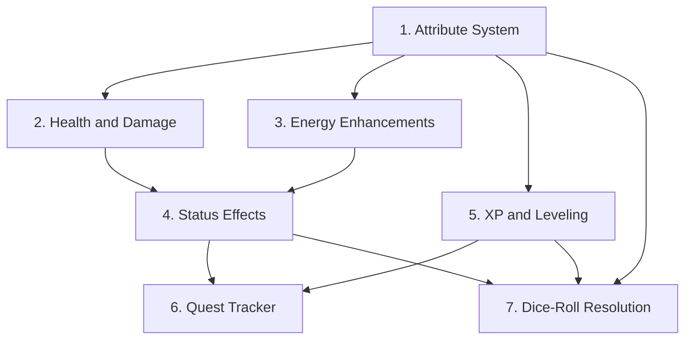

# RPG Mechanics Design — Revised

## Overview

This is the revised design for RPG mechanics to add to the lumiverse-bio-tracker extension, incorporating user feedback:

1. **Skill tree left blank** — structure exists but skills are designed later
2. **Leveling grants attribute points** (not skill points)
3. **All numbers carefully tuned** to prevent bars draining too fast from modifier stacking

## Critical Design Principle: Capped Additive Stacking

The biggest risk with multiple modifier sources (buffs, attributes, health states, status effects) is **runaway stacking** — where penalties accumulate and make bars drain at 2×, 3×, or worse.

### The Problem

Consider a character who is:
- Wounded (health 40%) → proposed -25% to physical actions
- Exhausted (stamina 15%) → proposed +25% indigestion gain
- Has a buff: EnergyDrain +20%
- Has a status effect: Bloated → +10% ClothingStress

If these stack **multiplicatively**, energy drain could become `1.25 × 1.25 × 1.20 = 1.875` — nearly double. With more effects, it gets worse.

### The Solution: Single Additive Pool, Hard Capped

**All modifiers for a given stat key are summed into one additive number, then clamped to `[-0.50, +0.50]`.**

```
finalMultiplier = clamp(
    buffModifier + attributeModifier + healthStateModifier + staminaStateModifier + statusEffectModifier,
    -0.50,
    +0.50
)
finalRate = baseRate * (1 + finalMultiplier)
```

This means:
- **Best case**: every positive modifier maxed out → rate is 1.5× base (never more)
- **Worst case**: every negative modifier maxed out → rate is 0.5× base (never less than half)
- **Typical case**: a few small modifiers → rate is 1.05× to 1.15× base (barely noticeable)

The existing `collectBuffs()` already produces additive modifiers (e.g., `BaseDigestionRate: +0.10`). The new systems simply **add their modifiers to the same sum** before clamping.

### Modifier Contribution Per Source

| Source | Typical Range | Notes |
|--------|--------------|-------|
| Buffs (existing) | ±5% to ±25% | From `<Skill>`/`<Trait>` `buffs` attr |
| Attributes | ±5% to ±25% | Modifier × 5% per point above/below 10 |
| Health state | 0% to -15% | Only when below 50% HP, specific stats only |
| Stamina state | 0% to -10% | Only when below 25% energy, specific stats only |
| Status effects | ±5% to ±20% | Per effect, but effects are rare and short-lived |

Even if ALL sources contribute their maximum simultaneously (extremely unlikely), the sum is clamped to ±50%.

---

## Existing Engine Numbers (Reference)

These are the current values the new systems must coexist with. All rates are **per hour of elapsed time** (`elapsed` variable).

### Energy (Pred) — 0 to 100

| Scenario | Drain/Recovery | Formula |
|----------|---------------|---------|
| Fighting prey, not suppressing | Drain | `fightingStruggle × 0.5 × (1 + energyDrainMult)` |
| Fighting prey, suppressing | Drain | above + `numFighting × 2 × elapsed × (1 + energyDrainMult)` |
| No fighting | Recovery | `+3 × elapsed` |
| No prey at all | Recovery | `+5 × elapsed` |
| Post-vomit | One-time | `-20` |

**Typical drain** (1 fighting prey, suppressing, no buffs): ~6.5/hour → ~15 hours to deplete from full.

### Prey Stamina — 0 to 100 (per prey)

| Scenario | Drain/Recovery | Formula |
|----------|---------------|---------|
| Fighting | Drain | `3 × elapsed × sizeFactor` |
| Not fighting | Recovery | `+5 × elapsed` |

**Typical drain** (sizeFactor 1.0): 3/hour → ~33 hours to deplete.

### Indigestion — 0 to 100

| Scenario | Change | Formula |
|----------|--------|---------|
| Any fighting | Gain | `Σ(prey.personalStruggle) × stomachResistanceFactor × suppressionFactor` |
| No fighting | Decay | `indigestionDecayRate(20) × elapsed × decayMult` |

**Typical gain** (1 fighting prey, base stats): ~9/hour → ~11 hours to reach 100 (vomit).

### Arousal — 0 to 100

| Scenario | Change | Formula |
|----------|--------|---------|
| Decay | Drop | `50 × (1 + ArousalDecayBuff) × elapsed` |
| LLM stimulus | Rise | LLM sets value, engine applies `× (1 + ArousalGainBuff)` |

**Typical decay**: 50/hour → arousal halves every hour without stimulus.

### Acid — 0 to 100

| Scenario | Change | Formula |
|----------|--------|---------|
| Items in stomach | Rise | `acidRiseRate(10) × elapsed` |
| Empty stomach | Drop | `acidRiseRate(10) × elapsed` |

**Typical rise**: 10/hour → 10 hours to reach 100% from 0.

### Key Takeaway

The existing system is **already well-tuned** with ~10-15 hour depletion times for most pools. The new RPG systems must not shorten these times significantly. The capped additive stacking (±50% max) ensures that even in the worst case, depletion times only drop to ~7-10 hours — still reasonable.

---

## Proposal 1: Attribute System (Foundation)

### Concept

Six classic RPG attributes: **STR, DEX, CON, INT, WIS, CHA**. Default value 10 (modifier 0). Range 3-20. Modifier = `(score - 10) / 2`, rounded down.

### XML Schema

```xml
<Attributes>
  <Attribute name="STR" value="10" />
  <Attribute name="DEX" value="10" />
  <Attribute name="CON" value="10" />
  <Attribute name="INT" value="10" />
  <Attribute name="WIS" value="10" />
  <Attribute name="CHA" value="10" />
</Attributes>
```

### Attribute Modifier → Engine Impact

Each attribute contributes its modifier × 5% to the relevant stat's additive multiplier sum (before clamping). This gives attributes a **meaningful** impact on gameplay — a high STR character genuinely feels stronger, a low WIS character genuinely struggles with indigestion recovery. The ±50% cap still prevents runaway stacking:

| Attribute | Affects | Modifier Contribution |
|-----------|---------|----------------------|
| STR | StomachResistance (as pred), personalStruggle (as prey) | `STR_mod × 0.05` |
| CON | AcidRiseRate, HealthRegen | `CON_mod × 0.05` |
| DEX | ArousalDecay, escape chance | `DEX_mod × 0.05` |
| INT | NutrientAbsorption | `INT_mod × 0.05` |
| WIS | IndigestionDecayRate, EnergyRegen | `WIS_mod × 0.05` |
| CHA | Suppression effectiveness | `CHA_mod × 0.05` |

### Example Calculations

**CON 14 (modifier +2)**:
- AcidRiseRate contribution: `+2 × 0.05 = +0.10` (10% faster acid)
- HealthRegen contribution: `+2 × 0.05 = +0.10` (10% faster health regen)
- Combined with no other modifiers: acid rises at `10 × 1.10 = 11/hour` instead of 10. Noticeable but not dramatic.

**STR 18 (modifier +4)**:
- StomachResistance contribution: `+4 × 0.05 = +0.20` (20% more resistance)
- Combined with a buff `StomachResistance: +0.15`: total = `0.20 + 0.15 = 0.35`, clamped to 0.35 (under 0.50 cap). StomachResistance = `1.0 × 1.35 = 1.35`. A strong character genuinely feels more resistant.

**DEX 8 (modifier -1)**:
- ArousalDecay contribution: `-1 × 0.05 = -0.05` (5% slower decay)
- Arousal decays at `50 × 0.95 = 47.5/hour` instead of 50. A low-DEX character stays aroused longer.

**STR 20 (modifier +5)**:
- StomachResistance contribution: `+5 × 0.05 = +0.25` (25% more resistance)
- Combined with a buff `StomachResistance: +0.20`: total = `0.25 + 0.20 = 0.45`, clamped to 0.45 (under 0.50 cap). A maxed-out STR character with a matching buff is significantly more resistant — attributes feel powerful.

### Why These Numbers Are Safe

- Maximum attribute (20) gives modifier +5 → contributes +25% to one stat — **meaningful impact**
- Even with a +25% buff on the same stat, total = 50% — exactly at the cap, never exceeding it
- Default attributes (all 10) contribute 0% — the system is a no-op until the user raises attributes
- The ±50% cap ensures that even a maxed attribute + max buff can't push any rate beyond 1.5× base
- **Drain rates are still safe**: worst case (all penalties maxed at -50%) means energy drains at `6.5 × 1.5 = 9.75/hour` → ~10 hours to deplete instead of ~15. Still reasonable.

### Engine Toggle

```typescript
attributeSystem: false
```

---

## Proposal 2: Health and Damage System

### Concept

A Health/HP pool (0-100 by default, max scales with CON). Health drains from specific damage events and regenerates slowly over time. Health states apply **small, specific** penalties — not broad "all physical multipliers" penalties.

### XML Schema

```xml
<Vitals>
  <Health current="100" max="100" />
</Vitals>
```

### Max HP Calculation

```
maxHP = 100 + (CON_mod × 10)
```

- CON 10 (mod 0): 100 HP
- CON 14 (mod +2): 120 HP
- CON 18 (mod +4): 140 HP
- CON 8 (mod -1): 90 HP

### Damage Sources (Revised — Much More Conservative)

| Source | Damage | Trigger Condition | Frequency |
|--------|--------|-------------------|-----------|
| Severe overeating | 0.5 HP/tick | Stomach contents > 120% capacity | Per tick while over |
| Indigestion crisis | 2 HP (one-time) | Indigestion crosses 90% threshold | Once per crisis |
| Struggle wound | 1 HP | Prey escape attempt rolls > 80% but < 90% (partial) | Per partial escape |
| Acid reflux | 0.25 HP/tick | Acid > 95% AND stomach full | Per tick while condition met |
| Clothing constriction | 0.25 HP/tick | Torso clothing condition = "Destroyed" | Per tick while destroyed |

### Damage Stacking Analysis

Worst realistic case: character has severe overeating + acid reflux + destroyed clothing all simultaneously:
- `0.5 + 0.25 + 0.25 = 1.0 HP/tick`
- At 100 HP: 100 ticks (hours) to deplete from full
- This is an extreme edge case — all three conditions at once is very unlikely

Typical case: character takes a 2 HP indigestion crisis hit occasionally:
- Maybe 2-4 HP lost per session
- Regen recovers this within a few hours

### Health Regeneration

```
regenRate = 0.5 HP/tick × (1 + HealthRegenBuff + CON_mod × 0.05)
```

- Base (CON 10, no buffs): 0.5 HP/hour → 200 hours to full from 0 (very slow, but damage is rare)
- CON 14 (+2 mod): 0.5 × 1.10 = 0.55 HP/hour
- With HealthRegen buff +0.20: 0.5 × 1.30 = 0.65 HP/hour
- With Regenerating status effect (Health < 25%): ×3 multiplier → 1.5+ HP/hour

**The regen is intentionally slow** because health damage is also rare. Health is not meant to be a bar that bounces up and down every tick — it's a long-term condition that creates narrative tension when it drops.

### Health States (Revised — Specific, Not Broad)

| HP Range | State | Specific Effects |
|----------|-------|-----------------|
| 100-75% | Healthy | None |
| 74-50% | Bruised | None (cosmetic/narrative only) |
| 49-25% | Wounded | -5% suppression effectiveness, -5% escape chance |
| 24-10% | Critical | -10% suppression, -10% escape, +5% indigestion gain |
| 9-0% | Incapacitated | Cannot suppress; digestion pauses; auto-regen ×3 |

### Stacking Check

At Critical health (24-10%):
- Suppression: -10% from health + (say) +20% from STR 18 + (say) +15% from buff = +25% net → still positive, suppression works fine
- Indigestion gain: +5% from health + (say) -20% from WIS 18 = -15% net → a wise character recovers from indigestion faster even when critically wounded
- These numbers create meaningful gameplay differences between characters while staying within safe bounds

### Engine Toggle

```typescript
healthSystem: false
```

---

## Proposal 3: Energy Enhancements (Not a New Stamina Pool)

### Concept

The existing **Energy** stat (0-100) already serves as the pred's stamina pool for struggle and suppression. **We do NOT add a parallel stamina pool** — that would double-dip and drain too fast. Instead, we enhance the existing energy system with:

1. **Energy state effects** — small modifiers when energy is low
2. **Attribute integration** — WIS affects energy regen, STR affects suppression efficiency
3. **Status effect integration** — certain status effects can boost or drain energy

### Energy States (Revised — Very Mild)

| Energy Range | State | Effect |
|--------------|-------|--------|
| 100-30% | Normal | No change |
| 29-10% | Tired | -5% suppression effectiveness |
| 9-1% | Exhausted | -10% suppression, +5% indigestion gain |
| 0% | Collapsed | Cannot suppress (already exists in engine) |

### Stacking Check

At Exhausted energy (9-1%):
- Suppression: -10% from energy + (say) +20% from STR + (say) +15% from buff = +25% net → suppression still works
- The existing engine already handles energy=0 (suppressionFactor = 1.0, meaning no suppression). The states just add minor gradation above 0.

### Why Not Add a New Stamina Pool

The existing energy drain formula produces ~6.5/hour drain during active suppression. If we added a separate stamina pool draining at 5/hour on top, total drain would be ~11.5/hour — depleting in ~9 hours instead of ~15. That's a 40% reduction in time-to-deplete, which the user correctly identified as annoying.

By enhancing the existing energy system instead, we add RPG depth without changing the drain rate at all. The states only apply small modifiers when energy is already low — by which point the character is already in trouble.

### Engine Toggle

No new toggle needed — this integrates with the existing `struggleEngine` toggle.

---

## Proposal 4: Status Effects and Conditions

### Concept

Time-limited modifiers that apply small buffs/debuffs to specific engine stats. Effects have a duration (in ticks/hours) and severity (1-3). They are added to the same additive modifier pool as everything else, subject to the ±50% cap.

### XML Schema

```xml
<StatusEffects>
  <Effect name="Nauseous" duration="3" severity="2" />
  <Effect name="Bloated" duration="2" severity="1" />
</StatusEffects>
```

### Status Effect Catalog (Revised — Smaller Modifiers)

| Effect | Trigger | Effect Per Severity | Max Duration |
|--------|---------|---------------------|--------------|
| Nauseous | Indigestion > 80% | -3% AcidRiseRate per severity | 3 ticks |
| Bloated | Stomach > 100% capacity | -5% NutrientAbsorption per severity | 2 ticks |
| Stunned | Critical struggle event | -5% all physical per severity | 1 tick |
| Charmed | Narrative (prey compliance) | -5% struggle effectiveness per severity | 4 ticks |
| Poisoned | Digesting toxic item | -0.5 HP/tick per severity | 5 ticks |
| Tipsy | Digesting alcohol | -2% DEX, +3% ArousalGain per severity | 3 ticks |
| Energized | Digesting stimulant | +5% EnergyRegen per severity | 2 ticks |
| Numb | Arousal > 95% for 3+ ticks | -5% ArousalGain per severity | 2 ticks |
| Regenerating | Health < 25% | +100% HealthRegen per severity (not percentage point) | Until health > 25% |
| Berserk | Health 25-40% + indigestion > 70% | +5% STR, -5% WIS per severity | 2 ticks |

### Severity Scaling

Severity 1 = mild, 2 = moderate, 3 = severe. The effect value is multiplied by severity:
- Nauseous severity 2: `-3% × 2 = -6%` to AcidRiseRate
- Bloated severity 1: `-5% × 1 = -5%` to NutrientAbsorption

### Stacking Check

Worst case: Nauseous(3) + Bloated(3) + Stunned(3) + Poisoned(3):
- AcidRiseRate: -9% (from Nauseous) → acid rises at 9.1/hour instead of 10. Fine.
- NutrientAbsorption: -15% (from Bloated) → nutrients absorbed at 85% rate. Fine.
- All physical: -15% (from Stunned) → suppression slightly less effective. Fine.
- HP: -1.5 HP/tick (from Poisoned) → manageable with regen.

All well under the 50% cap. Even if combined with attribute and buff modifiers, the cap prevents runaway.

### Duration and Decay

- Duration decrements by `elapsed` each tick (so a 3-duration effect lasts 3 hours)
- When duration reaches 0, effect is removed
- Same-effect refresh: takes the higher severity, extends duration
- Different effects stack independently (each contributes to the additive pool)

### Engine Toggle

```typescript
statusEffects: false
```

---

## Proposal 5: XP, Leveling, and Attribute Points

### Concept

A progression meta-layer. The character earns XP from digestion milestones, struggle outcomes, and survival events. XP accumulates toward levels. **Each level grants 1 attribute point** that the user can assign to any attribute via the frontend UI. The skill tree structure exists in the XML schema but is left blank for future design.

### XML Schema

```xml
<Progression>
  <Level value="1" />
  <XP current="0" next="100" />
  <AttributePoints available="0" />
</Progression>
```

### XP Curve

```
xpForLevel(n) = 100 × n × (n + 1) / 2
```

| Level | XP to Next | Cumulative XP |
|-------|-----------|---------------|
| 1 → 2 | 100 | 100 |
| 2 → 3 | 300 | 400 |
| 3 → 4 | 600 | 1,000 |
| 4 → 5 | 1,000 | 2,000 |
| 5 → 6 | 1,500 | 3,500 |
| 10 → 11 | 5,500 | 22,000 |
| 20 → 21 | 21,000 | 154,000 |

### XP Sources (Revised — Conservative)

| Action | XP | Notes |
|--------|-----|-------|
| Fully digest an item | 5-20 | Scales with item volume (5 base + 15 × sizeFactor) |
| Successful suppression round | 2 | Per tick where all prey fully suppressed |
| Successful escape (prey) | 25 | One-time per escape event |
| Survive a critical health event | 15 | When recovering from < 10% HP |
| Digest a prey (full digestion) | 30 | When a Prey item reaches 100% digestion |
| Vomit event (pred) | 10 | Learning experience |

### XP Rate Analysis

Typical session: character digests 2-3 items over several hours:
- 2 items fully digested: 2 × 10 (avg) = 20 XP
- 3 suppression rounds: 3 × 2 = 6 XP
- Total: ~26 XP per session

At this rate, reaching level 2 (100 XP) takes ~4 sessions. Level 3 (400 cumulative) takes ~15 sessions. This is intentionally slow — leveling should feel meaningful, not grindy.

### Level-Up Process

1. Extension detects `currentXP >= nextXP` during `runDigestionTick()`
2. Level increments by 1
3. `AttributePoints.available` increments by 1
4. XP carries over: `currentXP -= nextXP; nextXP = xpForLevel(newLevel)`
5. Toast notification: "Level Up! You are now level X. You have 1 attribute point to spend."
6. User opens frontend, goes to Attributes sub-tab, clicks + next to an attribute
7. Frontend sends message to backend, backend increments attribute value, decrements available points

### Attribute Point Spending

- Each attribute starts at 10
- Raising from 10 → 11 costs 1 point
- Raising from 15 → 16 costs 2 points
- Raising from 18 → 19 costs 3 points
- Formula: `cost = max(1, floor((currentScore - 10) / 5) + 1)` for scores above 10

| Current Score | Cost to Raise |
|--------------|--------------|
| 10 → 11 | 1 |
| 11 → 12 | 1 |
| 12 → 13 | 1 |
| 13 → 14 | 1 |
| 14 → 15 | 1 |
| 15 → 16 | 2 |
| 16 → 17 | 2 |
| 17 → 18 | 2 |
| 18 → 19 | 3 |
| 19 → 20 | 3 |

Max attribute score: 20 (modifier +5, contributing +25% to one stat — a genuinely powerful character).

### Skill Tree (Placeholder)

The XML schema includes a skill tree structure, but it is **intentionally left blank**:

```xml
<SkillTree>
  <!-- Skills to be designed and populated in a future update -->
</SkillTree>
```

The existing `<Skill>` and `<Trait>` tags with their `buffs` attributes continue to work as-is. The skill tree will be a future addition that provides a structured way to unlock and upgrade skills, but for now, leveling only grants attribute points.

### Engine Toggle

```typescript
progressionSystem: false
```

---

## Proposal 6: Quest and Objective Tracker

### Concept

A lightweight objective tracking system. The LLM creates quests via `<quest_create>` blocks, and the extension monitors for completion based on engine events. Quests grant XP as rewards, feeding into the progression system.

### XML Schema

```xml
<Quests>
  <Quest id="q1" name="The Hungry Patron" status="active" progress="2" target="3" rewardXP="150" />
  <Quest id="q2" name="Escape Artist" status="completed" progress="1" target="1" rewardXP="100" />
</Quests>
```

### Quest Lifecycle

1. **LLM creates quest** via `<quest_create name="..." target="N" type="digestion|escape|survival|collection" rewardXP="N" />` in `<sheet_update>`
2. **Extension tracks progress** — increments `progress` when matching engine events occur
3. **On completion** (`progress >= target`): status → "completed", XP awarded, toast notification
4. **LLM sees quest status** in injected `<CurrentCharacterSheet>` and narrates accordingly

### Quest Types and Progress Triggers

| Type | Progress Trigger | Example |
|------|-----------------|---------|
| digestion | Item fully digested | "Digest 3 challenging meals" |
| escape | Successful escape event | "Escape from 2 different predators" |
| survival | Ticks survived at < 25% HP | "Survive 5 hours at critical health" |
| collection | Specific item type digested | "Digest one prey of each willingness type" |
| suppression | Successful suppression rounds | "Fully suppress prey 5 times" |

### XP Rewards

Quest XP rewards are set by the LLM when creating the quest, but the extension validates them:
- Min: 10 XP
- Max: 500 XP (scaled by target count: `max 100 × target`)
- If LLM sets reward above max, extension clamps it

### Engine Toggle

```typescript
questSystem: false
```

---

## Proposal 7: Dice-Roll Action Resolution

### Concept

A D20-style dice roll system for resolving contested actions with uncertain outcomes. The extension rolls dice using attribute modifiers and reports results to the LLM. This prevents the LLM from simply narrating success or failure — the dice decide.

### XML Schema

```xml
<RollLog>
  <Roll id="r1" action="escape_attempt" roller="prey" attribute="DEX" modifier="+2" roll="14" total="16" dc="15" result="success" />
</RollLog>
```

### Roll Mechanics

- **D20 roll** (1-20, random)
- **+ Attribute modifier**: `(score - 10) / 2`, rounded down
- **+ Situational modifier**: from status effects, health state, etc. (typically ±1 to ±3)
- **vs Difficulty Class (DC)**: set by circumstance or opposing attribute

### Roll Triggers

The LLM sets `<action_roll>` blocks when it wants the extension to resolve an uncertain action:

```xml
<action_roll type="escape" attribute="DEX" dc="15" />
```

The extension:
1. Reads the roll request from the `<sheet_update>`
2. Rolls d20 + attribute modifier + situational modifiers
3. Compares total vs DC
4. Injects result into `<RollLog>` in the stored sheet
5. LLM sees the result in next `<CurrentCharacterSheet>` and narrates accordingly

### Critical Results

| Roll | Result | Effect |
|------|--------|--------|
| Natural 20 | Critical success | Double effect, +10 bonus XP |
| Natural 1 | Critical failure | Negative consequence, possible status effect |
| Total ≥ DC | Success | Action succeeds |
| Total < DC | Failure | Action fails |

### Roll Types

| Type | Default Attribute | Default DC | Effect on Success | Effect on Failure |
|------|------------------|-----------|-------------------|-------------------|
| escape | DEX | 15 | Prey moves toward escape threshold | Prey remains, +5 indigestion |
| suppress | CHA | 12 | Prey willingness shifts toward "reluctant" | Indigestion +3 |
| grapple | STR | 14 | Prey cannot struggle next tick | Pred takes 1 HP damage |
| resist | CON | 13 | Status effect resisted | Status effect applied |

### Integration with Existing Struggle Engine

The dice system **does not replace** the existing struggle engine math. It provides **narrative resolution** for specific contested moments. The existing indigestion/energy/suppression calculations continue to run every tick. The dice system adds dramatic moments:

- LLM describes prey making a desperate escape attempt → `<action_roll type="escape" />`
- Extension rolls → result injected into sheet
- LLM narrates the outcome based on the roll
- The existing engine continues processing the consequences

### Engine Toggle

```typescript
diceSystem: false
```

---

## Modifier Stacking: Full Worked Example

Let's trace through a worst-case scenario to prove the numbers are safe.

**Character state:**
- STR 16 (mod +3), CON 12 (mod +1), DEX 14 (mod +2), INT 10 (mod 0), WIS 8 (mod -1), CHA 14 (mod +2)
- Health: 35% (Wounded state)
- Energy: 15% (Exhausted state)
- Active status effects: Nauseous(2), Bloated(2)
- Active buff: StomachResistance +0.15

**StomachResistance multiplier calculation:**

| Source | Contribution |
|--------|-------------|
| Buff | +0.15 |
| STR attribute | +3 × 0.05 = +0.15 |
| Health state (Wounded) | 0 (Wounded doesn't affect StomachResistance) |
| Energy state (Exhausted) | 0 (Exhausted doesn't affect StomachResistance) |
| Status: Nauseous(2) | 0 (Nauseous affects AcidRiseRate, not StomachResistance) |
| **Total** | **+0.30** |
| **Clamped** | **+0.30** (under 0.50 cap) |

StomachResistance = `1.0 × 1.30 = 1.30` (30% more resistant than base). A strong character with a matching buff genuinely feels the difference — indigestion builds noticeably slower.

**AcidRiseRate multiplier calculation:**

| Source | Contribution |
|--------|-------------|
| Buff | 0 |
| CON attribute | +1 × 0.05 = +0.05 |
| Status: Nauseous(2) | -3% × 2 = -0.06 |
| **Total** | **-0.01** |
| **Clamped** | **-0.01** |

AcidRiseRate = `10 × 0.99 = 9.9/hour` instead of 10. In this particular combination the CON bonus and Nauseous penalty nearly cancel out — which is realistic (a hardy character fighting nausea).

**Suppression effectiveness calculation:**

| Source | Contribution |
|--------|-------------|
| CHA attribute | +2 × 0.05 = +0.10 |
| Health state (Wounded) | -0.05 |
| Energy state (Exhausted) | -0.10 |
| **Total** | **-0.05** |
| **Clamped** | **-0.05** |

Suppression is 5% less effective. The CHA bonus partially offsets the health and energy penalties — a charismatic character holds up better under pressure. In the existing engine, suppressionFactor ranges from 0.3 (full suppression) to 1.0 (no suppression). A 5% reduction means suppressionFactor goes from 0.3 to ~0.315 — a small but noticeable difference.

**Conclusion: Attributes now have meaningful impact (±5% to ±25% per stat). The ±50% hard cap ensures that even with a maxed attribute (+25%) and a max buff (+25%) on the same stat, the total never exceeds 50%. Drain rates remain safe — worst-case stacking shortens depletion times from ~15 hours to ~10 hours, which is dramatic but not punishing.**

---

## Implementation Order



1. **Attribute System** — foundation, no dependencies
2. **Health and Damage** — depends on attributes (CON for max HP, regen)
3. **Energy Enhancements** — depends on attributes (WIS, STR), modifies existing energy system
4. **Status Effects** — depends on health and energy states for trigger conditions
5. **XP and Leveling** — depends on attributes (grants points to spend on attributes)
6. **Quest Tracker** — depends on progression system (XP rewards)
7. **Dice-Roll Resolution** — depends on attributes (modifiers) and status effects (situational mods)

Each system is independently toggleable and can be implemented/tested in isolation.

---

## Architecture Integration

All new systems slot into `runDigestionTick()` alongside existing engines:

```
runDigestionTick()
  ├── collectBuffs()                    [EXISTING]
  ├── processAttributes()               [NEW - Proposal 1]
  │     → adds attribute modifiers to buff sum
  ├── applyModifierCap()                [NEW - clamps sum to ±50%]
  │
  ├── processHealth()                   [NEW - Proposal 2]
  │     → applies damage, regen, sets health state
  │     → health state modifiers added to buff sum
  │
  ├── [existing energy states applied]  [NEW - Proposal 3]
  │     → energy state modifiers added to buff sum
  │
  ├── processStatusEffects()            [NEW - Proposal 4]
  │     → decrements durations, applies effect modifiers
  │     → effect modifiers added to buff sum
  │
  ├── digestItemsInContent()            [EXISTING - uses final clamped multipliers]
  ├── processClothingStress()           [EXISTING - uses final clamped multipliers]
  ├── processStruggle()                 [EXISTING - uses final clamped multipliers]
  │
  ├── processProgression()              [NEW - Proposal 5]
  │     → awards XP, checks level-up, grants attribute points
  │
  ├── processQuests()                   [NEW - Proposal 6]
  │     → checks quest progress, awards XP on completion
  │
  ├── processActionRolls()              [NEW - Proposal 7]
  │     → processes <action_roll> blocks, injects results
  │
  └── buildSheetPrompt()                [EXISTING - extended with new sections]
```

### Key Implementation Detail: Modifier Sum Order

The modifier sum is computed **once** at the start of the tick, after all systems have contributed their modifiers:

```typescript
// Pseudocode for the modifier pipeline
let modifiers = { ...collectBuffs(oldXml) }  // existing buffs

if (engineToggles.attributeSystem) {
    const attrMods = processAttributes(oldXml)  // { StomachResistance: +0.15, AcidRiseRate: +0.05, ... }
    for (const [key, val] of Object.entries(attrMods)) {
        modifiers[key] = (modifiers[key] || 0) + val
    }
}

if (engineToggles.healthSystem) {
    const healthState = getHealthState(oldXml)  // { suppressionEfficiency: -0.05, ... }
    for (const [key, val] of Object.entries(healthState)) {
        modifiers[key] = (modifiers[key] || 0) + val
    }
}

if (engineToggles.statusEffects) {
    const effectMods = processStatusEffects(oldXml)  // { AcidRiseRate: -0.06, ... }
    for (const [key, val] of Object.entries(effectMods)) {
        modifiers[key] = (modifiers[key] || 0) + val
    }
}

// Clamp all modifiers to ±50%
for (const key of Object.keys(modifiers)) {
    modifiers[key] = Math.max(-0.50, Math.min(0.50, modifiers[key]))
}

// Now pass `modifiers` to all existing engine functions
// instead of the raw `buffs` object
```

This ensures the existing engine functions (`processStruggle`, `processClothingStress`, etc.) receive a single, clamped modifier object and don't need to be aware of where the modifiers came from.

---

## Frontend Changes Summary

### Character Tab — New Sub-Tab: Attributes

- 6 attribute input fields (STR, DEX, CON, INT, WIS, CHA)
- Display current modifier next to each attribute
- "+" button next to each attribute (enabled when `AttributePoints.available > 0`)
- Shows available attribute points
- Shows derived stats (Max HP, modifier contributions)

### Character Tab — New Sub-Tab: Progression

- Level display
- XP bar (current / next)
- Attribute points available
- Skill tree placeholder (empty, "Coming Soon" message)

### State Tab — New Sections

- **Health bar**: color-coded (green/yellow/orange/red), shows current/max and state name
- **Status effects list**: icon + name + duration countdown + severity indicator
- **Active quests list**: name + progress bar + reward XP

### State Tab — New Section: Roll Log

- Collapsible section showing recent dice rolls
- Each roll shows: action, roller, attribute, roll result, total, DC, success/failure

### Settings Tab — New Engine Toggles

- Attribute System
- Health System
- Status Effects
- Progression System
- Quest System
- Dice System

(Energy enhancements don't need a separate toggle — they're part of the existing struggle engine.)
