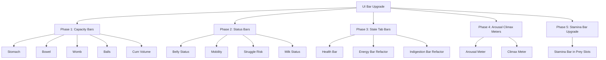

# UI Bar Upgrade Plan

> **Goal:** Add visual fill bars with text labels across the Metabolism and State tabs, upgrading text-only status indicators into labeled bar components that show both a visual fill level and the precise text value simultaneously.

> **Constraint:** The design must remain intuitive on mobile. Bars are additive — they enhance text, never replace it.

---

## Design Pattern: Labeled Fill Bar

A reusable visual component used throughout. Structure:

```
┌─────────────────────────────────────────────┐
│ Label          ████████████░░░░░  45.2/115L │
│ Status text                        Energetic │
└─────────────────────────────────────────────┘
```

- **Left:** Label text (e.g. "Stomach", "Energy", "Milk")
- **Center:** Horizontal fill bar — width = fill%, color = tier-based or gradient
- **Right:** Numeric value text (e.g. "45.2 / 115.2 L")
- **Below or inline:** Status label text (e.g. "Bloated", "Energetic", "Leaking")

The bar and text coexist. The bar gives at-a-glance fill level; the text gives the exact number and semantic label.

### CSS Structure

```css
.bt-fillbar { display: flex; align-items: center; gap: 8px; margin-bottom: 8px; }
.bt-fillbar-label { font-size: var(--bt-font-sm); color: var(--bt-text-dim); min-width: 70px; flex-shrink: 0; }
.bt-fillbar-track { flex: 1; height: 16px; background: var(--bt-input-bg); border: 1px solid var(--bt-border); border-radius: 8px; overflow: hidden; position: relative; }
.bt-fillbar-fill { height: 100%; width: 0%; border-radius: 7px; transition: width 0.3s ease, background 0.3s ease; }
.bt-fillbar-text { font-size: var(--bt-font-xs); color: var(--bt-text-dim2); min-width: 90px; text-align: right; flex-shrink: 0; }
.bt-fillbar-status { font-size: var(--bt-font-xs); font-weight: bold; min-width: 65px; text-align: right; flex-shrink: 0; }
```

The fill color is set via inline style or a data attribute + CSS class, driven by JS.

### Color Tiers

Reuse the existing semantic tokens. Fill bars use a 5-tier color scale:

| Tier | Range | Color | Token |
|------|-------|-------|-------|
| Safe | 0–25% | Green | `--bt-success` |
| Mild | 25–50% | Yellow | `#ffeb3b` (existing) |
| Warn | 50–75% | Orange | `--bt-warning` |
| High | 75–95% | Deep orange | `#ff5722` (existing) |
| Critical | 95%+ | Red | `--bt-danger` |

For capacity bars, the tier is based on fill %. For status bars (belly/mobility/struggle), the tier maps to the existing severity levels already coded in JS.

---

## Phase 1: Capacity Fill Bars (Metabolism Tab)

Add labeled fill bars for all 4 body zone capacities. Each shows the zone name, a fill bar proportional to current/max, and the numeric values.

### 1.1 Stomach Capacity Bar

**Current:** Two text rows — "Max Capacity: 115.20 L" and "Current Fill: 0.00 L"

**New:** One labeled fill bar:
```
Stomach  ████████░░░░░░░░░░░  45.2 / 115.2 L
```

- HTML: Replace the two `.bt-row` lines with a `.bt-fillbar` element
- `bt-stom-max-disp` and `bt-stom-fill` text spans move into the bar's text area
- Fill % = stomTotal / baseStomMax * 100
- Color tier based on fill %
- JS: Update `updateCapacities()` to set bar width and color

### 1.2 Bowel Capacity Bar

**Current:** Two text rows — "Max Capacity: 40.32 L" and "Current Fill: 0.00 L"

**New:** Same pattern as stomach. Fill % = bowelTotal / baseBowelMax * 100.

### 1.3 Womb Capacity Bar

**Current:** Two text rows — "Max Capacity: 0.00 L" and "Current Fill: 0.00 L"

**New:** Same pattern. Fill % = wombTotal / wombMax * 100. Uses `--bt-womb` tint for the bar border.

### 1.4 Balls Capacity Bar

**Current:** Two text rows — "Max Capacity: 0.00 L" and "Current Fill: 0.00 L"

**New:** Same pattern. Fill % = ballsTotal / ballsMax * 100. Uses `--bt-balls` tint for the bar border.

### 1.5 Cum Volume Bar (Balls section)

**Current:** "Cum Volume: 0 ml" — plain text

**New:** Labeled fill bar showing cum volume relative to balls max (if > 0). If balls max is 0, show text only without bar.

---

## Phase 2: Status Bar Indicators (Metabolism Tab)

Convert text-only status indicators into labeled bar indicators. These use a thin segmented bar where the colored portion represents severity, plus the text label.

### 2.1 Belly Status Bar

**Current:** "Belly Status: Flat" — colored text

**New:**
```
Belly  ░░░░░░░░░░░░░░░░░░░░  Bloated
```
- Thin bar (8px height) with fill = stomPct clamped to 100% (can overflow visually with a different color beyond 100%)
- Color matches existing belly status color tiers (Flat=gray, Potbelly=white, Bloated=yellow, etc.)
- Text label "Bloated" shown to the right

### 2.2 Mobility Bar

**Current:** "Mobility: Agile / Normal" — colored text

**New:** Same pattern. Fill = overCapPct clamped to 200% (scale: 0-100% = full bar = agile, 100-200% = overflow into red zone). Color matches existing mobility tiers.

### 2.3 Struggle Risk Bar

**Current:** "Struggle Risk: None" + detail text — colored text

**New:** Thin bar with risk score mapped to fill (0-100 = full bar). Color matches existing risk tiers. Detail text remains below the bar.

### 2.4 Milk Status Bar

**Current:** "Current Milk: [input] Empty" — colored text status

**New:** Labeled fill bar showing milkVol / milkCapacity. Color matches existing milk status tiers (Empty=gray, Filling=green, Full=yellow, Leaking=red). The milk input remains — the bar is placed below or beside it.

---

## Phase 3: State Tab Bars

### 3.1 Health Bar

**Current:** "Health: [number input]" — no visual at all

**New:** Labeled fill bar below the input. Fill = health value (assume max 100, or use a max field). Color: green > 50%, yellow 25-50%, red < 25%. The number input remains for editing; the bar is read-only visual feedback.

### 3.2 Energy Bar Upgrade

**Current:** Energy has a bar already (`bt-energy-bar`), but it's a basic fill with hardcoded colors set via inline JS style.

**New:** Refactor to use the `.bt-fillbar` pattern. Keep the existing 5-tier color logic but route through CSS classes/tokens instead of hardcoded hex. Add the numeric value text ("75 / 100") next to the bar. The existing status text ("Energetic") remains.

### 3.3 Indigestion Bar Upgrade

**Current:** Has a gradient bar already (`bt-indigestion-fill`).

**New:** Refactor to use `.bt-fillbar` pattern for consistency. Keep the gradient fill. Add "X%" text inside or beside the bar (already exists as separate span — integrate into the bar layout).

---

## Phase 4: Arousal / Climax Visual Meters

### 4.1 Arousal Meter

**Current:** Plain `<input type="range">` with accent-color styling.

**New:** Custom visual meter:
- Gradient track (transparent → `--bt-arousal` at high values)
- Value text displayed above or beside ("45%")
- Subtle glow/pulse animation when arousal > 80% (CSS `@keyframes` pulse on the fill)
- The range input remains functional but is visually restyled

### 4.2 Climax Meter

**Current:** Plain `<input type="range">` with accent-color styling.

**New:** Same pattern as arousal but using `--bt-climax` color. Glow/pulse when climax > 90%.

---

## Phase 5: Stamina Bar Upgrade (Prey Slots)

### 5.1 Stamina Bar in Vital Slots

**Current:** Tiny 10px bar (`bt-bar-track` / `bt-bar-fill`) with single green color, max-width 80px.

**New:** Slightly taller (14px), color tiers based on stamina % (green > 50%, yellow 25-50%, red < 25%), value text shown beside it. Uses the `.bt-fillbar` pattern at reduced size.

---

## Implementation Approach

### Files to modify:

1. **`src/frontend/styles.ts`** — Add `.bt-fillbar` CSS classes and arousal/climax meter styles
2. **`src/frontend.ts`** — Modify HTML template (replace text rows with bar elements), update `updateCapacities()`, `updateEnergyDisplay()`, and vital slot rendering to drive bar fills
3. **`src/frontend/components.ts`** — Update vital slot template to use new stamina bar pattern

### Key principles:

- **No new dependencies** — pure CSS + existing JS
- **Text stays** — every bar has adjacent or overlaid text showing the value and/or status
- **Token-driven colors** — use `--bt-*` tokens, no hardcoded hex in styles.ts
- **JS sets width %** — CSS handles all visual styling via classes
- **Mobile-first** — bars are full-width flex, text is readable, touch targets unchanged
- **Light mode compatible** — bar tracks use `--bt-input-bg`, fills use semantic tokens that work in both modes

### Execution order:

1. Add `.bt-fillbar` CSS classes to styles.ts
2. Add arousal/climax meter CSS to styles.ts
3. Update HTML template in frontend.ts — replace capacity text rows with fillbar elements
4. Update HTML template — replace status text rows with fillbar elements
5. Update `updateCapacities()` to drive capacity bar fills + colors
6. Update `updateEnergyDisplay()` to use fillbar pattern
7. Update belly/mobility/struggle/milk status code to drive fillbar fills + colors
8. Add health bar to State tab + JS to drive it
9. Update vital slot stamina bar in components.ts
10. Add arousal/climax meter styling and JS
11. Build + verify + push

---

## Mermaid: Bar Upgrade Coverage


