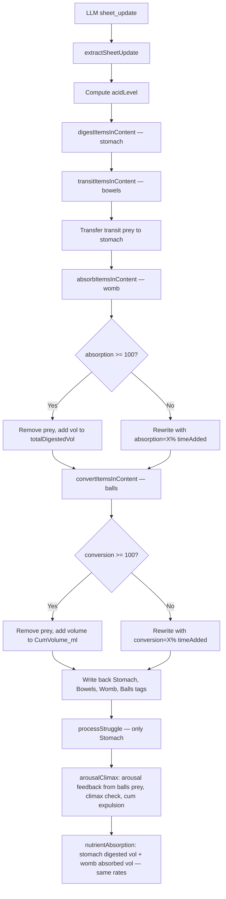

# Unbirth & Cock Vore System — Architectural Design

## Objective

Add two new vore pathways to the metabolism system:

1. **Unbirth (Womb)** — prey are taken into the womb and slowly **absorbed** into the predator's body. At 100% absorption, the prey is fully unmade and their mass is converted into nutrient absorption — identical to stomach digestion (same growth rates, same stats including penis). The womb is a gentle, non-acidic environment — no struggle, no acid, just slow assimilation.

2. **Cock Vore (Balls)** — prey are taken into the testes and **converted** into cum. At 100% conversion, the prey is gone and their volume is added to a `CumVolume_ml` counter. When the predator climaxes (existing arousal/climax system), the accumulated cum is expelled. Conversion rate is **arousal-dependent** — higher arousal means faster churning. Having prey in the balls also **raises arousal** over time, creating a feedback loop.

Both systems reuse the existing absolute-timestamp model (`timeAdded` + `clockDelta`), anti-rollback clamp, and self-healing architecture. They follow the exact pattern established by the bowels transit system.

---

## Current Architecture

### DigestiveTract XML Structure

```xml
<DigestiveTract>
  <Status belly="Flat" mobility="Agile / Normal" />
  <Stomach current="0.00 L" max="115.20 L" suppressing="false" indigestion="0" stomachFatigue="0">
    <Item type="Prey" name="Alice" volume_L="65" digestion="42.50%" timeAdded="14:30" willingness="reluctant" stamina="80" struggle="+1.25">
      <Appearance>...</Appearance>
      <Description>...</Description>
      <BoundGear>...</BoundGear>
    </Item>
  </Stomach>
  <Bowels current="0.00 L">
    <Item type="Prey" name="Bob" volume_L="70" transit="35.00%" timeAdded="13:00" willingness="willing" stamina="100">...</Item>
    <Remains volume_L="12.5">Digestive Waste</Remains>
  </Bowels>
</DigestiveTract>
```

### Digestion Tick Flow (interceptor.ts `runDigestionTick`, lines 54-564)

```
LLM sheet_update
  ↓
extractSheetUpdate → updatedXml
  ↓
acidLevel computed from <FirstItemTime> / <StomachEmptyTime>
  ↓
digestItemsInContent(stomContent, ...)   ← stomach digestion
transitItemsInContent(bowContent, ...)   ← bowels transit (2× rate, no acid)
  ↓
Transfer transit-complete prey → stomContent (fresh timeAdded, digestion=0%)
Append stomach remains/waste → bowContent
  ↓
Write back <Stomach> and <Bowels> tags
  ↓
processStruggle (only reads <Stomach>)
  ↓
arousalClimax processing (arousal decay, climax meter, penis scaling)
  ↓
nutrientAbsorption (body growth from totalDigestedVol)
```

### Key Existing Functions

| Function | File | Purpose |
|---|---|---|
| `digestItemsInContent` | engine.ts:494 | Stomach digestion — acid-based, produces remains + waste |
| `transitItemsInContent` | engine.ts:646 | Bowels transit — no acid, 2× rate, transfers to stomach at 100% |
| `processStruggle` | struggle.ts:6 | Only reads `<Stomach>` — computes indigestion, stamina drain |
| `buildSheetPrompt` | engine.ts:733 | LLM instruction prompt (includes BOWELS TRANSIT SYSTEM section at line 962) |
| `runDigestionTick` | interceptor.ts:54 | Main tick orchestrator |
| `updateCapacities` | frontend.ts:565 | Computes stomach/bowel capacity from height/weight |
| `createStomachItem` | components.ts:58 | UI builder for stomach/bowels items |
| `createRemainsItem` | components.ts:134 | UI builder for waste remains |

### Engine Toggles (state.ts)

```typescript
export let engineToggles: Record<string, boolean> = {
  digestionEngine: true, clothingStress: true, nutrientAbsorption: true, arousalClimax: true,
  struggleEngine: true, buffSystem: true, attributeSystem: false, diceSystem: false,
}
```

### Arousal/Climax System (interceptor.ts:429-483)

- Arousal 0-100, decays 50%/hour (modified by `ArousalDecay` buff)
- Climax rises +25/turn when arousal ≥ 95, falls -25/turn otherwise
- At climax 100: orgasm triggered, `pendingOrgasmReset` flag set, reset next turn
- Penis scales 30%-100% based on arousal

### Nutrient Absorption (interceptor.ts:485-499)

- Triggered when `totalDigestedVol > 0`
- Growth: height +0.035×vol, weight +0.035×vol, breast +1.0×vol, hips +0.035×vol, penisL +0.014×vol, penisG +0.004×vol
- Anti-shrink clamp: `Math.max(llmValue, oldValue + growth)`

---

## Key Design Decisions

### Decision 1: New XML tags — `<Womb>` and `<Balls>` inside `<DigestiveTract>`

Both new tags sit alongside `<Stomach>` and `<Bowels>`:

```xml
<DigestiveTract>
  <Status ... />
  <Stomach ...>...</Stomach>
  <Bowels ...>...</Bowels>
  <Womb current="0.00 L" max="80.64 L">
    <Item type="Prey" name="Alice" volume_L="65" absorption="28.13%" timeAdded="14:30" willingness="willing" stamina="60">...</Item>
  </Womb>
  <Balls current="0.00 L" max="30.00 L" cumVolume="0">
    <Item type="Prey" name="Bob" volume_L="70" conversion="45.00%" timeAdded="15:00" willingness="reluctant" stamina="40">...</Item>
  </Balls>
</DigestiveTract>
```

**Rationale:** Keeps all vore pathways in one XML section. The frontend already parses `<DigestiveTract>` children — adding new child tags is a natural extension.

### Decision 2: New meter attributes — `absorption` and `conversion`

| Tag | Meter Attribute | Replaces | Rate Base |
|---|---|---|---|
| `<Stomach>` | `digestion="X%"` | — | `baseDigRate` × acidMult × speedMult |
| `<Bowels>` | `transit="X%"` | `digestion` | `baseDigRate` × 2 × speedMult |
| `<Womb>` | `absorption="X%"` | — | `baseDigRate` × 0.5 × speedMult |
| `<Balls>` | `conversion="X%"` | — | `baseDigRate` × arousalFactor × speedMult |

Both reuse the `timeAdded` absolute-timestamp model. The anti-rollback clamp (`Math.max(newVal, oldVal)`) applies identically.

### Decision 3: Womb absorption — slow, gentle, same nutrient outcome as stomach

**Rate:** `baseDigRate × 0.5 × speedMult` — half the speed of stomach digestion. The womb is a slow, gentle environment.

**No acid, no struggle.** The womb does not produce acid and is not part of the struggle engine. Prey in the womb do not trigger indigestion.

**Stamina regression:** Prey stamina drains slowly while in the womb — `-5%/hour` of elapsed time (representing the unmaking process). This is a simple linear drain, not the complex struggle calculation. At 100% absorption, stamina reaches 0.

**At 100% absorption:** The prey is removed from `<Womb>`. Their volume triggers **the exact same nutrient absorption as stomach digestion** — same growth rates, same stats (including penis), same anti-shrink clamp. The absorbed volume is simply added to `totalDigestedVol` and processed by the existing `nutrientAbsorption` block.

| Stat | Rate (same as stomach) |
|---|---|
| Height_cm | 0.035 × vol |
| Weight_kg | 0.035 × vol |
| BreastVolume_ml | 1.0 × vol |
| Hips_cm | 0.035 × vol |
| PenisLength_cm | 0.014 × vol |
| PenisGirth_cm | 0.004 × vol |

**Rationale:** Keep it simple — the womb does exactly what the stomach does, just slower. No special feminine boost, no excluded stats. If a special outcome is desired later, it can be added as a toggle or modifier without changing the base design.

**Rebirth option:** The LLM can manually remove a prey from `<Womb>` before 100% absorption (narrating a "birth"). The prey exits with stamina reduced proportional to absorption progress. The extension does NOT auto-remove on rebirth — the LLM simply stops including the item in `<Womb>`.

### Decision 4: Balls conversion — arousal-coupled, cum-producing

**Rate:** `baseDigRate × arousalFactor × speedMult` where `arousalFactor = 0.3 + 0.7 × (arousal / 100)`. At 0% arousal, conversion is 30% speed. At 100% arousal, conversion is 100% speed (same as stomach). This ties conversion speed to how aroused the predator is.

**No acid, no struggle.** The balls are not part of the struggle engine. However, prey stamina drains faster — `-10%/hour` (the churning is more aggressive than the womb).

**Arousal feedback loop:** Having prey in the balls raises the predator's arousal by `+3 × preyCount` per turn (before the arousal decay calculation). This means:
- More prey → faster arousal rise → faster conversion → climax sooner
- The loop naturally resolves: prey convert → fewer prey → arousal decays → slower conversion

**At 100% conversion:** The prey is removed from `<Balls>`. Their volume is added to `CumVolume_ml` (a new stat on the character sheet). The conversion is 1:1 — 1 L of prey = 1000 ml of cum.

**Climax expulsion:** When the existing climax system triggers an orgasm (climax ≥ 100), the accumulated `CumVolume_ml` is expelled:
- A toast notification is emitted: `💦 Climax expelled X ml of cum!`
- `CumVolume_ml` is reset to 0
- The LLM is instructed to narrate the expulsion

**Size-dependent speed:** Larger prey convert slower — `speedMult *= Math.min(1, 50 / volume_L)`. A 50L prey converts at full speed; a 100L prey converts at half speed. This prevents instant conversion of huge prey.

### Decision 5: Separate engine toggles

Add two new toggles to `engineToggles`:

```typescript
export let engineToggles: Record<string, boolean> = {
  digestionEngine: true, clothingStress: true, nutrientAbsorption: true, arousalClimax: true,
  struggleEngine: true, buffSystem: true, attributeSystem: false, diceSystem: false,
  unbirthEngine: false,    // NEW — womb absorption system
  cockVoreEngine: false,   // NEW — balls conversion system
}
```

**Default: off.** These are niche features that should be opt-in. When off, the womb/balls tags are ignored by the engine (items sit inert, no meters computed). The frontend still renders them if present in the XML.

**Note:** `unbirthEngine` requires `nutrientAbsorption` to be on for the nutrient boost at 100% absorption. `cockVoreEngine` requires `arousalClimax` to be on for the climax expulsion mechanic. If the dependency is off, the prey is still absorbed/converted (removed at 100%) but the bonus effect is skipped.

### Decision 6: New buff targets

Add two new buff targets for skills/traits:

| Buff Target | Effect |
|---|---|
| `WombAbsorptionRate` | Womb absorption speed (+ = faster, - = slower) |
| `BallsConversionRate` | Balls conversion speed (+ = faster, - = slower) |

These are added to the `VALID BUFF TARGETS` list in `buildSheetPrompt` and to the modifier collection in `interceptor.ts`.

### Decision 7: Capacity calculations

| Organ | Capacity Formula | Based On |
|---|---|---|
| Stomach | `height × weight × 0.012 × capMult` (existing) | Height, Weight |
| Bowels | `stomachMax × 0.35` (existing) | Stomach max |
| Womb | `height × weight × 0.012 × wombCapMult × 0.7` | Height, Weight (70% of stomach) |
| Balls | `penisLength × penisGirth × 0.05 × ballsCapMult` | Penis dimensions |

**New stats:** `WombCapacityMultiplier` (default 1.0) and `BallsCapacityMultiplier` (default 1.0) — separate multipliers just like the existing `CapacityMultiplier` for the stomach. These appear as scrape-able inputs in the metabolism tab.

**Rationale:** Womb capacity is calculated the same way as stomach (`height × weight × 0.012`) but 30% smaller (× 0.7), with its own multiplier for user customization. Balls capacity scales with penis size, also with its own multiplier. Having separate multipliers lets users tune each organ independently — e.g. a character with a small stomach but accommodating womb.

---

## Mermaid — Tick Flow with Womb & Balls



---

## Proposed Changes by File

### 1. `src/backend/engine.ts` — New `absorbItemsInContent` function

Add after `transitItemsInContent` (~line 731). Mirrors the transit function shape:

```typescript
export function absorbItemsInContent(
  content: string,
  ctx: {
    baseAbsorptionRate: number
    currentClock: number
    oldClock: number
    oldAbsorptionMap: Map<string, number>
    oldTimeAddedMap: Map<string, number>
    oldStaminaMap: Map<string, number>
  },
): {
  content: string
  absorbedPrey: { name: string; volume: number }[]
  absorptionCount: number
} {
  const absorbedPrey: { name: string; volume: number }[] = []
  let absorptionCount = 0

  const absorbItem = (attrs: string, inner: string | null, isSelfClosing: boolean): string => {
    const type = getAttrFromString(attrs, 'type') || 'Food'
    if (type !== 'Prey') return isSelfClosing ? `<Item ${attrs} />` : `<Item ${attrs}>${inner}</Item>`

    const name = getAttrFromString(attrs, 'name')
    const vol = parseFloat(getAttrFromString(attrs, 'volume_L') || '0') || 0
    absorptionCount++

    let speedMult = 1
    const willingness = (getAttrFromString(attrs, 'willingness') || 'reluctant').toLowerCase()
    if (willingness === 'willing') speedMult *= 1.25
    else if (willingness === 'fighting') speedMult *= 0.5

    // Absolute absorption — same timestamp model
    let timeAdded = ctx.oldTimeAddedMap.get(name) ?? NaN
    let oldAbsorptionNum = ctx.oldAbsorptionMap.get(name) ?? 0

    if (isNaN(timeAdded) || timeAdded <= 0) {
      timeAdded = clockToDecimal(getAttrFromString(attrs, 'timeAdded'))
    }
    if (isNaN(timeAdded) || timeAdded <= 0) {
      if (oldAbsorptionNum > 0) {
        timeAdded = ctx.currentClock - oldAbsorptionNum / (ctx.baseAbsorptionRate * speedMult)
        if (timeAdded < 0) timeAdded += 24
      } else if (ctx.oldAbsorptionMap.has(name)) {
        timeAdded = ctx.oldClock
      } else {
        timeAdded = ctx.currentClock
      }
    }

    const elapsed = clockDelta(ctx.currentClock, timeAdded)
    let absorptionNum = Math.min(100, ctx.baseAbsorptionRate * speedMult * elapsed)
    absorptionNum = Math.max(absorptionNum, oldAbsorptionNum)

    if (absorptionNum >= 100) {
      // Fully absorbed — removed from womb, volume added to nutrient pool
      absorbedPrey.push({ name, volume: vol })
      return ''
    }

    // Stamina regression: -5%/hour
    const oldStamina = ctx.oldStaminaMap.get(name) ?? parseFloat(getAttrFromString(attrs, 'stamina') || '100') || 100
    const newStamina = Math.max(0, Math.min(100, oldStamina - 5 * elapsed))

    const preyAttrs = ` willingness="${willingness === 'willing' || willingness === 'fighting' ? willingness : 'reluctant'}" stamina="${Math.round(newStamina)}"`
    const tsAttr = ` timeAdded="${decimalToClock(timeAdded)}"`
    const absorptionAttr = ` absorption="${absorptionNum.toFixed(2)}%"`
    if (isSelfClosing) {
      return `<Item type="Prey" name="${name}" volume_L="${vol}"${absorptionAttr}${tsAttr}${preyAttrs} />`
    }
    return `<Item type="Prey" name="${name}" volume_L="${vol}"${absorptionAttr}${tsAttr}${preyAttrs}>${inner}</Item>`
  }

  content = content.replace(
    /<Item\s+([^>]*[^>\/])\s*>([\s\S]*?)<\/Item>/gi,
    (match, attrs, inner) => absorbItem(attrs, inner, false),
  )
  content = content.replace(
    /<Item\s+([^>]+?)\s*\/>/gi,
    (match, attrs) => absorbItem(attrs, null, true),
  )

  return { content, absorbedPrey, absorptionCount }
}
```

### 2. `src/backend/engine.ts` — New `convertItemsInContent` function

Add after `absorbItemsInContent`:

```typescript
export function convertItemsInContent(
  content: string,
  ctx: {
    baseConversionRate: number
    arousal: number
    currentClock: number
    oldClock: number
    oldConversionMap: Map<string, number>
    oldTimeAddedMap: Map<string, number>
    oldStaminaMap: Map<string, number>
  },
): {
  content: string
  convertedPrey: { name: string; volume: number }[]
  conversionCount: number
} {
  const convertedPrey: { name: string; volume: number }[] = []
  let conversionCount = 0

  // Arousal factor: 0.3 at 0% arousal → 1.0 at 100% arousal
  const arousalFactor = 0.3 + 0.7 * (ctx.arousal / 100)

  const convertItem = (attrs: string, inner: string | null, isSelfClosing: boolean): string => {
    const type = getAttrFromString(attrs, 'type') || 'Food'
    if (type !== 'Prey') return isSelfClosing ? `<Item ${attrs} />` : `<Item ${attrs}>${inner}</Item>`

    const name = getAttrFromString(attrs, 'name')
    const vol = parseFloat(getAttrFromString(attrs, 'volume_L') || '0') || 0
    conversionCount++

    let speedMult = arousalFactor
    const willingness = (getAttrFromString(attrs, 'willingness') || 'reluctant').toLowerCase()
    if (willingness === 'willing') speedMult *= 1.25
    else if (willingness === 'fighting') speedMult *= 0.5

    // Size-dependent speed: larger prey convert slower
    speedMult *= Math.min(1, 50 / Math.max(1, vol))

    // Absolute conversion — same timestamp model
    let timeAdded = ctx.oldTimeAddedMap.get(name) ?? NaN
    let oldConversionNum = ctx.oldConversionMap.get(name) ?? 0

    if (isNaN(timeAdded) || timeAdded <= 0) {
      timeAdded = clockToDecimal(getAttrFromString(attrs, 'timeAdded'))
    }
    if (isNaN(timeAdded) || timeAdded <= 0) {
      if (oldConversionNum > 0) {
        timeAdded = ctx.currentClock - oldConversionNum / (ctx.baseConversionRate * speedMult)
        if (timeAdded < 0) timeAdded += 24
      } else if (ctx.oldConversionMap.has(name)) {
        timeAdded = ctx.oldClock
      } else {
        timeAdded = ctx.currentClock
      }
    }

    const elapsed = clockDelta(ctx.currentClock, timeAdded)
    let conversionNum = Math.min(100, ctx.baseConversionRate * speedMult * elapsed)
    conversionNum = Math.max(conversionNum, oldConversionNum)

    if (conversionNum >= 100) {
      // Fully converted — removed from balls, volume added to cum
      convertedPrey.push({ name, volume: vol })
      return ''
    }

    // Stamina drain: -10%/hour (churning is aggressive)
    const oldStamina = ctx.oldStaminaMap.get(name) ?? parseFloat(getAttrFromString(attrs, 'stamina') || '100') || 100
    const newStamina = Math.max(0, Math.min(100, oldStamina - 10 * elapsed))

    const preyAttrs = ` willingness="${willingness === 'willing' || willingness === 'fighting' ? willingness : 'reluctant'}" stamina="${Math.round(newStamina)}"`
    const tsAttr = ` timeAdded="${decimalToClock(timeAdded)}"`
    const conversionAttr = ` conversion="${conversionNum.toFixed(2)}%"`
    if (isSelfClosing) {
      return `<Item type="Prey" name="${name}" volume_L="${vol}"${conversionAttr}${tsAttr}${preyAttrs} />`
    }
    return `<Item type="Prey" name="${name}" volume_L="${vol}"${conversionAttr}${tsAttr}${preyAttrs}>${inner}</Item>`
  }

  content = content.replace(
    /<Item\s+([^>]*[^>\/])\s*>([\s\S]*?)<\/Item>/gi,
    (match, attrs, inner) => convertItem(attrs, inner, false),
  )
  content = content.replace(
    /<Item\s+([^>]+?)\s*\/>/gi,
    (match, attrs) => convertItem(attrs, null, true),
  )

  return { content, convertedPrey, conversionCount }
}
```

### 3. `src/backend/engine.ts` — `buildSheetPrompt` updates

Add two new sections after the BOWELS TRANSIT SYSTEM section (line 971):

```
─── WOMB ABSORPTION SYSTEM ───
Prey placed into the Womb (unbirth) do NOT digest. Instead they are slowly ABSORBED — a gentle assimilation process represented by the absorption="X%" attribute. When absorption reaches 100%, the extension AUTOMATICALLY removes the prey and converts their mass into body growth — the exact same nutrient absorption as stomach digestion (same stats, same rates). The extension handles the removal and growth — you just narrate it.

Rules for womb prey:
- Womb prey use absorption="X%" NOT digestion="X%". The extension computes absorption automatically from timeAdded — copy it exactly, just like digestion.
- Only type="Prey" items absorb. Food/Liquid in the Womb are inert.
- Absorption is SLOW (half the speed of stomach digestion). Willing prey absorb faster; fighting prey absorb slower.
- Prey stamina slowly drains while in the womb (the unmaking process). The extension handles this automatically.
- The struggle/indigestion system does NOT affect prey in the Womb.
- When absorption reaches 100%, the prey vanishes from <Womb> in the next sheet. Narrate the prey being fully absorbed into the predator's body.
- The LLM may choose to "birth" a prey out before 100% absorption — simply remove the item from <Womb> and narrate the rebirth. The prey exits with reduced stamina.

─── BALLS CONVERSION SYSTEM ───
Prey placed into the Balls (cock vore) do NOT digest. Instead they are CONVERTED into cum — a churning process represented by the conversion="X%" attribute. When conversion reaches 100%, the extension AUTOMATICALLY removes the prey and adds their volume to CumVolume_ml. When the predator climaxes, the accumulated cum is expelled.

Rules for balls prey:
- Balls prey use conversion="X%" NOT digestion="X%". The extension computes conversion automatically from timeAdded — copy it exactly.
- Only type="Prey" items convert. Food/Liquid in the Balls are inert.
- Conversion speed depends on AROUSAL — higher arousal means faster conversion. Having prey in the balls also raises arousal over time, creating a feedback loop.
- Larger prey convert slower (more mass to process).
- Prey stamina drains faster in the balls (aggressive churning). The extension handles this automatically.
- The struggle/indigestion system does NOT affect prey in the Balls.
- When conversion reaches 100%, the prey vanishes from <Balls> in the next sheet and their volume is added to CumVolume_ml. Narrate the prey being fully converted.
- When the predator climaxes (orgasm), CumVolume_ml is expelled and reset to 0. Narrate the expulsion.
```

Also update the item placement rules (around line 677) to mention `<Womb>` and `<Balls>` as valid locations for prey.

Add `WombAbsorptionRate` and `BallsConversionRate` to the VALID BUFF TARGETS list (line 944-952).

### 4. `src/backend/interceptor.ts` — `runDigestionTick` integration

After the bowels transit block (line ~387, inside the `digestionEngine` block), add womb and balls processing:

```typescript
// ── WOMB ABSORPTION ──
if (engineToggles.unbirthEngine) {
  const wombMatch = updatedXml.match(/<Womb[^>]*>([\s\S]*?)<\/Womb>/i)
  let wombContent = wombMatch ? wombMatch[1].trim() : ''

  if (wombContent) {
    const baseAbsorptionRate = baseDigRate * 0.5 // half digestion speed

    // Build oldAbsorptionMap from old womb prey
    const oldAbsorptionMap = new Map<string, number>()
    const oldWombMatch = oldXml.match(/<Womb[^>]*>([\s\S]*?)<\/Womb>/i)
    if (oldWombMatch) {
      const oldWombRegex = /<Item\s+([^>]+?)[\s/]*>/gi
      let m: RegExpExecArray | null
      while ((m = oldWombRegex.exec(oldWombMatch[1])) !== null) {
        const a = m[1]
        if ((getAttrFromString(a, 'type') || 'Food') === 'Prey') {
          const n = getAttrFromString(a, 'name')
          if (n) {
            const absStr = getAttrFromString(a, 'absorption')
            oldAbsorptionMap.set(n, absStr ? parseFloat(absStr.replace('%', '')) || 0 : 0)
          }
        }
      }
    }

    // Build oldStaminaMap from old womb prey
    const oldStaminaMap = new Map<string, number>()
    if (oldWombMatch) {
      const oldStamRegex = /<Item\s+([^>]+?)[\s/]*>/gi
      let m2: RegExpExecArray | null
      while ((m2 = oldStamRegex.exec(oldWombMatch[1])) !== null) {
        if ((getAttrFromString(m2[1], 'type') || 'Food') === 'Prey') {
          const n = getAttrFromString(m2[1], 'name')
          if (n) oldStaminaMap.set(n, parseFloat(getAttrFromString(m2[1], 'stamina') || '100') || 100)
        }
      }
    }

    const wombResult = absorbItemsInContent(wombContent, {
      baseAbsorptionRate,
      currentClock: newClock,
      oldClock,
      oldAbsorptionMap,
      oldTimeAddedMap,
      oldStaminaMap,
    })
    wombContent = wombResult.content

    // Queue absorbed prey for nutrient absorption (same as stomach)
    if (wombResult.absorbedPrey.length > 0) {
      for (const prey of wombResult.absorbedPrey) {
        wombAbsorbedVol += prey.volume
      }
      maybeToast('digestionTicks', 'success', `🌸 ${wombResult.absorbedPrey.length} prey fully absorbed in the womb.`)
      spindle.log.info(`[runDigestionTick] WOMB: ${wombResult.absorbedPrey.length} prey absorbed, +${wombAbsorbedVol}L to nutrient pool`)
    }

    wombContent = wombContent.replace(/^\s*\n/gm, '').trim()
    updatedXml = updatedXml.replace(
      /<Womb([^>]*)>[\s\S]*?<\/Womb>/i,
      (match, attrs) => `<Womb${attrs}>\n${wombContent}\n    </Womb>`,
    )
  }
} // end unbirthEngine

// ── BALLS CONVERSION ──
if (engineToggles.cockVoreEngine) {
  const ballsMatch = updatedXml.match(/<Balls[^>]*>([\s\S]*?)<\/Balls>/i)
  let ballsContent = ballsMatch ? ballsMatch[1].trim() : ''

  if (ballsContent) {
    const baseConversionRate = baseDigRate // same base as digestion, arousal modifies
    const currentArousal = getStat(updatedXml, 'Arousal') || 0

    // Build oldConversionMap from old balls prey
    const oldConversionMap = new Map<string, number>()
    const oldBallsMatch = oldXml.match(/<Balls[^>]*>([\s\S]*?)<\/Balls>/i)
    if (oldBallsMatch) {
      const oldBallsRegex = /<Item\s+([^>]+?)[\s/]*>/gi
      let m: RegExpExecArray | null
      while ((m = oldBallsRegex.exec(oldBallsMatch[1])) !== null) {
        const a = m[1]
        if ((getAttrFromString(a, 'type') || 'Food') === 'Prey') {
          const n = getAttrFromString(a, 'name')
          if (n) {
            const convStr = getAttrFromString(a, 'conversion')
            oldConversionMap.set(n, convStr ? parseFloat(convStr.replace('%', '')) || 0 : 0)
          }
        }
      }
    }

    // Build oldStaminaMap from old balls prey
    const oldBallsStaminaMap = new Map<string, number>()
    if (oldBallsMatch) {
      const oldStamRegex = /<Item\s+([^>]+?)[\s/]*>/gi
      let m2: RegExpExecArray | null
      while ((m2 = oldStamRegex.exec(oldBallsMatch[1])) !== null) {
        if ((getAttrFromString(m2[1], 'type') || 'Food') === 'Prey') {
          const n = getAttrFromString(m2[1], 'name')
          if (n) oldBallsStaminaMap.set(n, parseFloat(getAttrFromString(m2[1], 'stamina') || '100') || 100)
        }
      }
    }

    const ballsResult = convertItemsInContent(ballsContent, {
      baseConversionRate,
      arousal: currentArousal,
      currentClock: newClock,
      oldClock,
      oldConversionMap,
      oldTimeAddedMap,
      oldStaminaMap: oldBallsStaminaMap,
    })
    ballsContent = ballsResult.content

    // Add converted prey volume to CumVolume_ml
    if (ballsResult.convertedPrey.length > 0) {
      let convertedVol = 0
      for (const prey of ballsResult.convertedPrey) {
        convertedVol += prey.volume * 1000 // L → ml
      }
      const oldCumVol = getStat(updatedXml, 'CumVolume_ml') || 0
      updatedXml = setStat(updatedXml, 'CumVolume_ml', oldCumVol + convertedVol)
      maybeToast('digestionTicks', 'info', `💧 ${ballsResult.convertedPrey.length} prey converted in the balls.`)
      spindle.log.info(`[runDigestionTick] BALLS: ${ballsResult.convertedPrey.length} prey converted, +${convertedVol}ml cum`)
    }

    ballsContent = ballsContent.replace(/^\s*\n/gm, '').trim()
    updatedXml = updatedXml.replace(
      /<Balls([^>]*)>[\s\S]*?<\/Balls>/i,
      (match, attrs) => `<Balls${attrs}>\n${ballsContent}\n    </Balls>`,
    )
  }
} // end cockVoreEngine
```

**Arousal feedback from balls prey** — add inside the `arousalClimax` block, before the arousal decay calculation (line ~434):

```typescript
// Arousal feedback: prey in balls raise arousal
if (engineToggles.cockVoreEngine) {
  const ballsMatch = updatedXml.match(/<Balls[^>]*>([\s\S]*?)<\/Balls>/i)
  if (ballsMatch) {
    const ballsPreyCount = (ballsMatch[1].match(/<Item\s+[^>]*type="Prey"[^>]*>/gi) || []).length
    if (ballsPreyCount > 0) {
      const arousalBoost = 3 * ballsPreyCount // +3 per prey per turn
      newArousal = Math.min(100, newArousal + arousalBoost)
      spindle.log.info(`[runDigestionTick] Arousal feedback: +${arousalBoost} from ${ballsPreyCount} balls prey`)
    }
  }
}
```

**Cum expulsion on climax** — add inside the `arousalClimax` block, when climax ≥ 100 (line ~461):

```typescript
if (finalClimax >= 100) {
  finalClimax = 100
  await spindle.variables.chat.set(chatId, 'pendingOrgasmReset', 'true')

  // Expel cum on climax
  if (engineToggles.cockVoreEngine) {
    const cumVol = getStat(updatedXml, 'CumVolume_ml') || 0
    if (cumVol > 0) {
      maybeToast('climaxEvents', 'success', `💦 Climax expelled ${cumVol.toFixed(0)} ml of cum!`)
      spindle.log.info(`[runDigestionTick] Climax expelled ${cumVol}ml cum`)
      updatedXml = setStat(updatedXml, 'CumVolume_ml', 0)
    }
  }

  maybeToast('climaxEvents', 'success', '🔥 Climax reached! Resetting next turn.')
  spindle.log.info('Climax event triggered.')
}
```

**Womb nutrient absorption** — add to the `nutrientAbsorption` block (line ~485). The womb absorbed volume is simply added to `totalDigestedVol` so it goes through the exact same growth calculation as stomach digestion:

```typescript
// Womb absorption — same nutrient absorption as stomach
if (engineToggles.unbirthEngine && wombAbsorbedVol > 0) {
  totalDigestedVol += wombAbsorbedVol
  maybeToast('digestionTicks', 'success', `🌸 Womb absorbed ${wombAbsorbedVol.toFixed(1)}L — added to nutrient absorption.`)
}
```

No special rates, no excluded stats. The existing `nutrientAbsorption` block already handles `totalDigestedVol` with the standard growth rates and anti-shrink clamp. Womb absorption just feeds into it.

### 5. `src/backend/types.ts` — New interfaces

```typescript
export interface AbsorptionResult {
  content: string
  absorbedPrey: { name: string; volume: number }[]
  absorptionCount: number
}

export interface ConversionResult {
  content: string
  convertedPrey: { name: string; volume: number }[]
  conversionCount: number
}
```

### 6. `src/backend/state.ts` — New engine toggles

```typescript
export let engineToggles: Record<string, boolean> = {
  digestionEngine: true, clothingStress: true, nutrientAbsorption: true, arousalClimax: true,
  struggleEngine: true, buffSystem: true, attributeSystem: false, diceSystem: false,
  unbirthEngine: false,
  cockVoreEngine: false,
}
```

### 7. `src/frontend/components.ts` — New UI component functions

**`createWombItem()`** — similar to `createStomachItem()` but with:
- Label "Absorption %" instead of "Dig %"
- CSS class `is-womb` for styling (pink/rose color scheme)
- Volume input class `womb-vol` for capacity calculations
- No struggle display (womb has no struggle)
- Stamina bar with slow-drain indicator

**`createBallsItem()`** — similar to `createStomachItem()` but with:
- Label "Conversion %" instead of "Dig %"
- CSS class `is-balls` for styling (blue/purple color scheme)
- Volume input class `balls-vol` for capacity calculations
- No struggle display (balls have no struggle)
- Stamina bar with fast-drain indicator

Both reuse the same structure as `createStomachItem()` — type select, name, volume, willingness, stamina bar, appearance/description/gear textareas. The only differences are the meter label and CSS classes.

### 8. `src/frontend.ts` — Metabolism tab HTML

Add two new sections after the Bowel Pipeline section (line 287), before the sync buttons:

```html
<hr style="border-color: #333; margin: 15px 0;">
<div class="bt-section-title" style="display:flex; justify-content:space-between; align-items:center;">
  <span>WOMB</span>
  <button class="bt-add-btn" style="background: #4a2a3a; color: #d2b4c8; border-color:#8b4a6a;" id="add-womb-btn">+ Add Prey</button>
</div>
<div class="bt-row"><span>Womb Capacity Multiplier:</span> <input type="number" class="bt-input bt-scrape" data-id="WombCapacityMultiplier" id="bt-womb-cap-mult" step="0.1" value="1.0"></div>
<div class="bt-row"><span>Max Capacity:</span> <span class="bt-value" id="bt-womb-max-disp">0.00 L</span></div>
<div class="bt-row"><span>Current Fill:</span> <span class="bt-value" id="bt-womb-fill">0.00 L</span></div>
<div id="womb-container" style="margin-top: 10px;"></div>
<hr style="border-color: #333; margin: 15px 0;">
<div class="bt-section-title" style="display:flex; justify-content:space-between; align-items:center;">
  <span>BALLS</span>
  <button class="bt-add-btn" style="background: #2a3a4a; color: #b4c8d2; border-color:#4a6a8b;" id="add-balls-btn">+ Add Prey</button>
</div>
<div class="bt-row"><span>Balls Capacity Multiplier:</span> <input type="number" class="bt-input bt-scrape" data-id="BallsCapacityMultiplier" id="bt-balls-cap-mult" step="0.1" value="1.0"></div>
<div class="bt-row"><span>Max Capacity:</span> <span class="bt-value" id="bt-balls-max-disp">0.00 L</span></div>
<div class="bt-row"><span>Current Fill:</span> <span class="bt-value" id="bt-balls-fill">0.00 L</span></div>
<div class="bt-row"><span>Cum Volume:</span> <span class="bt-value" id="bt-cum-vol">0 ml</span></div>
<div id="balls-container" style="margin-top: 10px;"></div>
```

The `bt-scrape` class with `data-id` ensures these multipliers are saved to and loaded from the character sheet XML, just like the existing `CapacityMultiplier` input.

### 9. `src/frontend.ts` — `updateCapacities()` updates

Add womb and balls capacity calculations. Womb uses the same formula as stomach but 30% smaller, with its own multiplier. Balls uses penis dimensions with its own multiplier:

```typescript
// Womb capacity: same formula as stomach but 70% (30% smaller), with own multiplier
const wombMultEl = document.getElementById('bt-womb-cap-mult') as HTMLInputElement
const wombMult = parseFloat(wombMultEl?.value || '1.0') || 1.0
const wombMax = height * weight * 0.012 * wombMult * 0.7
const wombMaxDisp = document.getElementById('bt-womb-max-disp')
if (wombMaxDisp) wombMaxDisp.innerText = wombMax.toFixed(2) + ' L'

let wombTotal = 0
document.querySelectorAll('.womb-vol').forEach((el) => {
  wombTotal += parseFloat((el as HTMLInputElement).value) || 0
})
const wombFillEl = document.getElementById('bt-womb-fill')
if (wombFillEl) wombFillEl.innerText = wombTotal.toFixed(2) + ' L'

// Balls capacity: based on penis dimensions, with own multiplier
const ballsMultEl = document.getElementById('bt-balls-cap-mult') as HTMLInputElement
const ballsMult = parseFloat(ballsMultEl?.value || '1.0') || 1.0
const penisL = parseFloat((document.getElementById('bt-penis-len') as HTMLInputElement)?.value || '0') || 0
const penisG = parseFloat((document.getElementById('bt-penis-girth') as HTMLInputElement)?.value || '0') || 0
const ballsMax = penisL * penisG * 0.05 * ballsMult
const ballsMaxDisp = document.getElementById('bt-balls-max-disp')
if (ballsMaxDisp) ballsMaxDisp.innerText = ballsMax.toFixed(2) + ' L'

let ballsTotal = 0
document.querySelectorAll('.balls-vol').forEach((el) => {
  ballsTotal += parseFloat((el as HTMLInputElement).value) || 0
})
const ballsFillEl = document.getElementById('bt-balls-fill')
if (ballsFillEl) ballsFillEl.innerText = ballsTotal.toFixed(2) + ' L'
```

Also add event listeners for the new multiplier inputs and penis inputs to trigger `updateCapacities()`:

```typescript
document.getElementById('bt-womb-cap-mult')?.addEventListener('input', updateCapacities)
document.getElementById('bt-balls-cap-mult')?.addEventListener('input', updateCapacities)
document.getElementById('bt-penis-len')?.addEventListener('input', updateCapacities)  // may already exist
document.getElementById('bt-penis-girth')?.addEventListener('input', updateCapacities)  // may already exist
```

### 10. `src/frontend.ts` — `buildCurrentXml()` updates

Add womb and balls XML generation after the Bowels section (line 1215):

```typescript
// Womb
const wombFill = document.getElementById('bt-womb-fill')?.innerText || '0 L'
xml += `    <Womb current="${wombFill}">\n`
document.querySelectorAll('#womb-container .vital-slot').forEach((el) => {
  const name = (el.querySelector('.v-name') as HTMLInputElement)?.value.trim() || 'Unknown'
  const vol = (el.querySelector('.v-vol') as HTMLInputElement)?.value.trim() || '0'
  const abs = (el.querySelector('.v-dig') as HTMLInputElement)?.value.trim() || '0'
  const type = (el.querySelector('.v-type') as HTMLSelectElement)?.value || 'Food'
  const appearance = (el.querySelector('.v-appearance') as HTMLTextAreaElement)?.value.trim()
  const flavor = (el.querySelector('.v-flavor') as HTMLTextAreaElement)?.value.trim()
  const gear = (el.querySelector('.v-gear') as HTMLTextAreaElement)?.value.trim()

  let itemAttrs = `type="${type}" name="${name}" volume_L="${vol}" absorption="${abs}%"`
  if (type === 'Prey') {
    const willingness = (el.querySelector('.v-willingness') as HTMLSelectElement)?.value || 'reluctant'
    const staminaText = (el.querySelector('.v-stamina-val') as HTMLElement)?.textContent || '100%'
    const stamina = parseFloat(staminaText.replace('%', '')) || 100
    itemAttrs += ` willingness="${willingness}" stamina="${stamina}"`
  }
  xml += `      <Item ${itemAttrs}>\n`
  if (appearance) xml += `        <Appearance>${appearance}</Appearance>\n`
  if (flavor) xml += `        <Description>${flavor}</Description>\n`
  if (type === 'Prey' && gear) xml += `        <BoundGear>${gear}</BoundGear>\n`
  xml += `      </Item>\n`
})
xml += `    </Womb>\n`

// Balls
const ballsFill = document.getElementById('bt-balls-fill')?.innerText || '0 L'
const cumVol = parseFloat((document.getElementById('bt-cum-vol') as HTMLElement)?.textContent?.replace(/[^\d.]/g, '') || '0') || 0
xml += `    <Balls current="${ballsFill}" cumVolume="${cumVol}">\n`
document.querySelectorAll('#balls-container .vital-slot').forEach((el) => {
  // Same pattern as womb, but with conversion="X%" instead of absorption
  // ...
})
xml += `    </Balls>\n  </DigestiveTract>\n`
```

### 11. `src/frontend.ts` — `populateFormFromXml()` updates

Add parsing for `<Womb>` and `<Balls>` tags (after the Bowels parsing at line ~1804):

```typescript
// Parse Womb
const wombNode = doc.querySelector('Womb')
if (wombNode) {
  wombNode.querySelectorAll('Item').forEach((itemNode) => {
    const div = createWombItem()
    document.getElementById('womb-container')?.appendChild(div)
    // Populate fields — same pattern as stomach, but read absorption instead of digestion
    ;(div.querySelector('.v-dig') as HTMLInputElement).value = (getAttr(itemNode, 'absorption') || '').replace('%', '')
    // ... name, vol, type, willingness, stamina, appearance, description, gear
  })
}

// Parse Balls
const ballsNode = doc.querySelector('Balls')
if (ballsNode) {
  // Read cumVolume attribute
  const cumVol = parseFloat(ballsNode.getAttribute('cumVolume') || '0') || 0
  const cumVolEl = document.getElementById('bt-cum-vol')
  if (cumVolEl) cumVolEl.textContent = `${cumVol.toFixed(0)} ml`

  ballsNode.querySelectorAll('Item').forEach((itemNode) => {
    const div = createBallsItem()
    document.getElementById('balls-container')?.appendChild(div)
    // Populate fields — same pattern as stomach, but read conversion instead of digestion
    ;(div.querySelector('.v-dig') as HTMLInputElement).value = (getAttr(itemNode, 'conversion') || '').replace('%', '')
    // ... name, vol, type, willingness, stamina, appearance, description, gear
  })
}
```

Also update the cleanup selector (line 1491-1493) to include `#womb-container .vital-slot, #balls-container .vital-slot`.

### 12. `src/frontend.ts` — Add button event listeners

```typescript
document.getElementById('add-womb-btn')?.addEventListener('click', () => {
  document.getElementById('womb-container')?.appendChild(createWombItem())
})
document.getElementById('add-balls-btn')?.addEventListener('click', () => {
  document.getElementById('balls-container')?.appendChild(createBallsItem())
})
```

Also update the remove handler (line 819) to handle `remove-womb` and `remove-balls` actions.

### 13. `src/frontend/types.ts` — Engine toggle updates

```typescript
export interface EngineToggles {
  digestionEngine: boolean
  clothingStress: boolean
  nutrientAbsorption: boolean
  arousalClimax: boolean
  struggleEngine: boolean
  buffSystem: boolean
  attributeSystem: boolean
  diceSystem: boolean
  unbirthEngine: boolean    // NEW
  cockVoreEngine: boolean   // NEW
}
```

### 14. `src/frontend/styles.ts` — New CSS

```css
.vital-slot.is-womb { border-color: #8b4a6a; }
.vital-slot.is-balls { border-color: #4a6a8b; }
```

### 15. `src/frontend.ts` — Settings tab toggle rows

Add toggle rows for `unbirthEngine` and `cockVoreEngine` in the settings tab, using the existing `buildToggleRow` pattern from components.ts.

---

## Edge Cases & Safety

| Edge Case | Handling |
|---|---|
| Prey in womb when `unbirthEngine` is off | Item sits inert — no absorption computed, no meter update. Frontend still renders it. |
| Prey in balls when `cockVoreEngine` is off | Item sits inert — no conversion computed, no meter update. Frontend still renders it. |
| Prey in womb when `nutrientAbsorption` is off | Absorption still runs (prey removed at 100%), but no nutrient absorption. Prey simply vanishes. |
| Prey in balls when `arousalClimax` is off | Conversion still runs (prey removed at 100%, cum volume tracked), but no climax expulsion. Cum volume accumulates indefinitely. |
| Midnight wraparound | `clockDelta` handles it — same as digestion and transit. |
| Rollback / skipped ticks | Anti-rollback clamp: `absorptionNum = max(absorptionNum, oldAbsorptionNum)` and `conversionNum = max(conversionNum, oldConversionNum)`. |
| Food/Liquid in womb or balls | `absorbItem`/`convertItem` returns the item unchanged (only `type="Prey"` processes). |
| Multiple prey in womb/balls | Each processes independently based on own `timeAdded`. Each reaches 100% on its own timeline. |
| LLM manually moves prey between organs | Safe — each organ's function resolves `timeAdded` from `oldTimeAddedMap` → LLM attr → back-calculated → `currentClock` fallback. |
| Womb prey "birthed" out by LLM | LLM simply removes the item from `<Womb>`. No extension action needed. Prey is gone from the sheet. |
| Balls prey expelled before 100% | LLM removes item from `<Balls>`. Partial cum volume is NOT added — only fully converted prey contribute. |
| CumVolume_ml not on character sheet | `getStat` returns 0, `setStat` creates the tag. Safe. |
| Very large prey in balls (100L+) | `speedMult *= min(1, 50/vol)` slows conversion. A 100L prey converts at 0.5× speed. |
| Arousal feedback with 0 prey in balls | `ballsPreyCount = 0` → no arousal boost. Safe. |

---

## Implementation Order (for Code mode)

1. **state.ts**: Add `unbirthEngine` and `cockVoreEngine` toggles (default false).
2. **types.ts**: Add `AbsorptionResult` and `ConversionResult` interfaces.
3. **engine.ts**: Add `absorbItemsInContent` function.
4. **engine.ts**: Add `convertItemsInContent` function.
5. **engine.ts**: Update `buildSheetPrompt` with WOMB ABSORPTION SYSTEM and BALLS CONVERSION SYSTEM sections + new buff targets.
6. **interceptor.ts**: Add womb absorption block in `runDigestionTick` (after bowels transit).
7. **interceptor.ts**: Add balls conversion block in `runDigestionTick` (after womb).
8. **interceptor.ts**: Add arousal feedback from balls prey (inside `arousalClimax` block).
9. **interceptor.ts**: Add cum expulsion on climax (inside `arousalClimax` block).
10. **interceptor.ts**: Add womb absorbed volume to `totalDigestedVol` (inside `nutrientAbsorption` block — same rates as stomach).
11. **frontend/types.ts**: Add `unbirthEngine` and `cockVoreEngine` to `EngineToggles`.
12. **frontend/components.ts**: Add `createWombItem()` and `createBallsItem()` functions.
13. **frontend/styles.ts**: Add `.is-womb` and `.is-balls` CSS classes.
14. **frontend.ts**: Add Womb and Balls HTML sections to metabolism tab.
15. **frontend.ts**: Update `updateCapacities()` with womb and balls capacity formulas.
16. **frontend.ts**: Update `buildCurrentXml()` to generate `<Womb>` and `<Balls>` XML.
17. **frontend.ts**: Update `populateFormFromXml()` to parse `<Womb>` and `<Balls>` tags.
18. **frontend.ts**: Add button event listeners for `add-womb-btn` and `add-balls-btn`.
19. **frontend.ts**: Update cleanup selector to include womb and balls containers.
20. **frontend.ts**: Add toggle rows in settings tab for the new engine toggles.
21. Test: place a `type="Prey"` item in `<Womb>`, advance time, verify absorption progresses → at 100% prey removed and body stats grow (same rates as stomach digestion).
22. Test: place a `type="Prey"` item in `<Balls>`, advance time with high arousal, verify conversion progresses → at 100% prey removed and `CumVolume_ml` increases → trigger climax → cum expelled and reset.

---

## Resolved Design Decisions

1. **Absorption rate**: `baseDigRate × 0.5` — half the speed of stomach digestion. The womb is gentle and slow.
2. **Conversion rate**: `baseDigRate × arousalFactor × sizeFactor` — same base as digestion, modified by arousal (0.3× to 1.0×) and prey size (smaller = faster).
3. **Willingness modifiers**: Same as digestion/transit — `willing` 1.25×, `fighting` 0.5×. Applied to both womb and balls.
4. **Stamina drain**: Womb = -5%/hour (gentle), Balls = -10%/hour (aggressive churning). Simple linear drain, not the complex struggle calculation.
5. **Womb nutrient absorption**: Same as stomach — absorbed volume is added to `totalDigestedVol` and processed by the existing `nutrientAbsorption` block. Same growth rates, same stats (including penis), same anti-shrink clamp. No special feminine boost. Only triggers when `nutrientAbsorption` is on.
6. **Balls cum volume**: 1 L prey = 1000 ml cum. Stored in `CumVolume_ml` stat. Expelled on climax, reset to 0.
7. **Arousal feedback**: +3 per balls prey per turn, applied before decay calculation. Creates a natural feedback loop.
8. **Engine toggles default off**: Both `unbirthEngine` and `cockVoreEngine` default to `false`. Users opt in via settings.
9. **No struggle for womb/balls**: The struggle engine only reads `<Stomach>`. Womb and balls prey do not trigger indigestion or struggle events.
10. **Capacity formulas**: Womb = `height × weight × 0.012 × wombCapMult × 0.7` (same as stomach but 30% smaller, own multiplier). Balls = `penisLength × penisGirth × 0.05 × ballsCapMult` (own multiplier). New stats: `WombCapacityMultiplier` (default 1.0) and `BallsCapacityMultiplier` (default 1.0).

---

## Legacy Chat Migration

When the new systems are used in an existing chat, the stored sheet will not have `<Womb>` or `<Balls>` tags. The migration is seamless:

### Scenario: Old sheet has no `<Womb>` or `<Balls>` tags

**On the first tick with the new code:**
1. `updatedXml.match(/<Womb[^>]*>.../)` returns `null` — the womb block is skipped entirely.
2. `updatedXml.match(/<Balls[^>]*>.../)` returns `null` — the balls block is skipped entirely.
3. No errors, no changes to the sheet. The features simply don't activate until the LLM adds prey to `<Womb>` or `<Balls>`.

**Result:** Zero impact on existing chats. The new tags only appear when the LLM decides to use unbirth or cock vore, at which point the engine picks them up.

### Scenario: LLM adds prey to `<Womb>` for the first time

1. The LLM writes `<Womb><Item type="Prey" name="Alice" volume_L="65" absorption="0%" timeAdded="14:30" willingness="willing" stamina="100">...</Item></Womb>`.
2. On the next tick, `wombMatch` finds the content, `oldWombMatch` finds nothing (old sheet had no womb).
3. `oldAbsorptionMap` is empty, `oldTimeAddedMap` has the entry (built from all `<Item>` tags in the sheet).
4. `absorbItemsInContent` resolves `timeAdded` from `oldTimeAddedMap` → computes absorption from scratch.
5. The prey begins absorbing. **No data loss, no crash, no manual intervention.**

### Scenario: `CumVolume_ml` stat doesn't exist yet

1. `getStat(updatedXml, 'CumVolume_ml')` returns `0` (stat not found → default).
2. When prey converts, `setStat(updatedXml, 'CumVolume_ml', 0 + convertedVol)` creates the tag.
3. On climax, the stat is read, cum expelled, stat set to 0. **Safe.**

### Migration Summary

| Old State | New Behavior on First Tick |
|---|---|
| No `<Womb>` tag | Womb block skipped entirely. No impact. |
| No `<Balls>` tag | Balls block skipped entirely. No impact. |
| LLM adds `<Womb>` prey | Absorption computed from `timeAdded`. Works immediately. |
| LLM adds `<Balls>` prey | Conversion computed from `timeAdded`. Works immediately. |
| No `CumVolume_ml` stat | Defaults to 0. Created on first conversion. |
| `unbirthEngine` toggle off | Womb prey sit inert (no absorption). No impact. |
| `cockVoreEngine` toggle off | Balls prey sit inert (no conversion). No impact. |

**No migration script or one-time conversion is needed.** The timestamp-based absolute calculation model and the optional nature of the new tags make the transition seamless.
