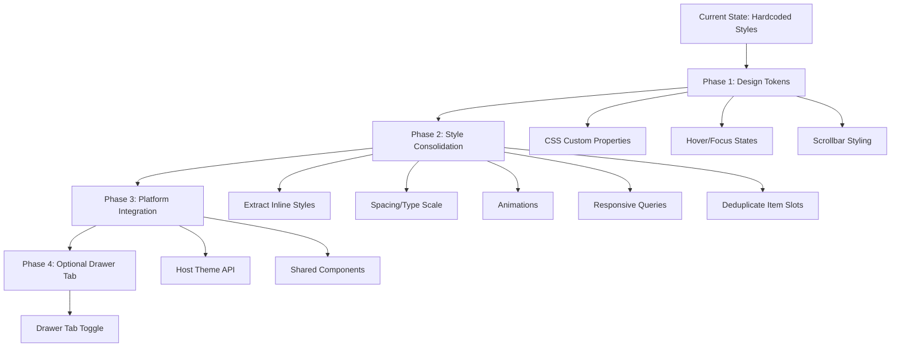

# Bio Tracker — Visual Improvement Plan

> **Goal:** Improve the visual quality, consistency, and platform integration of the Bio Tracker frontend without changing its functional behavior.

> **Hard Constraint:** The current design is **intuitive on mobile** — this is its primary platform. No proposed change may regress touch usability, glanceability, or the quick-open / quick-close interaction model. Visual polish must enhance, not disrupt, the mobile experience.

> **What's working well (preserve):** The slide-out panel with floating button is a fast, glanceable pattern on mobile. The tab system is compact and finger-friendly. The toggle switches are large touch targets. The dashed-border item cards are visually distinct and easy to scan. These interaction patterns should not be fundamentally changed.

---

## Current State Summary

| Aspect | Current | Issue |
| :--- | :--- | :--- |
| Color system | ~30 hardcoded hex literals scattered across [`styles.ts`](src/frontend/styles.ts:1), [`components.ts`](src/frontend/components.ts:1), [`frontend.ts`](src/frontend.ts:1) | No design tokens; impossible to retheme; dark-only |
| Inline styles | Pervasive in [`components.ts`](src/frontend/components.ts:58) and [`frontend.ts`](src/frontend.ts:60) | Duplicate and sometimes conflict with the central stylesheet |
| Form controls | Hand-rolled `<input>`, `<select>`, toggle divs | No focus rings, inconsistent sizing, no native a11y |
| Layout | Fixed `position: fixed` slide-out panel, 350px | Not responsive; custom floating button duplicates host navigation |
| Interactions | Minimal hover/focus states | Only `:active` on a few buttons; no `:focus-visible` anywhere |
| Scrollbar | Unstyled | Jarring default scrollbar on dark background |
| Animations | `right 0.3s`, `opacity 0.2s`, `background 0.2s` | No entrance/exit animations for dynamic items |
| Spacing | Ad-hoc per element (`margin-bottom: 8px`, `10px`, `12px`…) | No scale; visually inconsistent rhythm |
| Item slots | Three near-identical creators (stomach/womb/balls) | Duplicated HTML + inline styles; hard to restyle uniformly |
| Theme integration | None | Ignores [`spindle.theme`](docs/backend/theme.md:1) API entirely |
| Component reuse | None | Ignores [`ctx.components.*`](docs/frontend/shared-components.md:1) shared components |

---

## Improvement Areas

### 1. Introduce CSS Custom Properties (Design Tokens)

**Problem:** Every color is a hardcoded hex literal. Changing the accent from red to blue means find-replace across three files. The extension cannot adapt to light mode.

**Solution:** Define a token layer at the top of [`bioTrackerStylesheet`](src/frontend/styles.ts:8) using `:root`-scoped custom properties, then reference them everywhere.

```css
#bio-tracker-panel {
  --bt-bg: #1a1a1a;
  --bt-bg-elevated: #222;
  --bt-bg-input: #111;
  --bt-border: #333;
  --bt-border-soft: #2a2a2a;
  --bt-text: #e0e0e0;
  --bt-text-muted: #888;
  --bt-text-dim: #666;
  --bt-accent: #ff4444;
  --bt-accent-soft: rgba(255, 68, 68, 0.15);
  --bt-success: #4CAF50;
  --bt-warning: #ff9800;
  --bt-danger: #ff4444;
  --bt-radius: 6px;
  --bt-radius-sm: 4px;
  --bt-gap: 10px;
  --bt-transition: 0.2s ease;
}
```

Every rule then uses `var(--bt-bg)` instead of `#1a1a1a`, `var(--bt-accent)` instead of `#ff4444`, etc. This single change makes the entire panel rethemable by swapping token values.

**Files affected:** [`styles.ts`](src/frontend/styles.ts:8), [`components.ts`](src/frontend/components.ts:58), [`frontend.ts`](src/frontend.ts:60)

---

### 2. Leverage the Host Theme API

**Problem:** The extension hardcodes a dark theme and ignores the user's Lumiverse theme. If the user is in light mode, the panel is a jarring dark island.

**Solution:** Use [`spindle.theme.getCurrent()`](docs/backend/theme.md:39) at setup time to read the user's active theme, then map Lumiverse CSS variables (e.g. `--lumiverse-bg`, `--lumiverse-bg-elevated`, `--lumiverse-primary`, `--lumiverse-text`) to the `--bt-*` tokens defined above.

```typescript
const theme = await spindle.theme.getCurrent()
// Map host tokens → bt tokens
panel.style.setProperty('--bt-bg', theme.mode === 'dark' ? '#1a1a1a' : '#fff')
panel.style.setProperty('--bt-accent', `hsl(${theme.accent.h}, ${theme.accent.s}%, ${theme.accent.l}%)`)
// ...or read --lumiverse-* computed values and alias them
```

For a lighter touch, the extension can call [`spindle.theme.apply()`](docs/backend/theme.md:33) with `variablesByMode` to push its own overrides that adapt to both dark and light. This is the platform-sanctioned way to stay visually consistent.

**Effort:** Medium — requires reading theme at setup and mapping tokens. No structural UI change.

---

### 3. Consolidate Inline Styles into the Stylesheet

**Problem:** [`components.ts`](src/frontend/components.ts:58) and [`frontend.ts`](src/frontend.ts:60) contain dozens of inline `style="..."` and `style.cssText` assignments that duplicate or conflict with the central stylesheet. Example — the stamina bar inline style is repeated in three item creators:

```
style="flex:1; height:10px; background:#1a1a1a; border:1px solid #333; border-radius:5px; overflow:hidden; margin-left:4px; max-width:80px;"
```

**Solution:** Extract every inline style into a named CSS class in [`styles.ts`](src/frontend/styles.ts:8). Add classes like `.bt-bar-track`, `.bt-bar-fill`, `.bt-item-field`, `.bt-item-row`, etc. Components then add classes instead of inline styles.

**Benefit:** Single source of truth for visual rules; theming via tokens propagates everywhere; smaller DOM; easier to maintain.

**Files affected:** [`components.ts`](src/frontend/components.ts:58), [`frontend.ts`](src/frontend.ts:60), [`styles.ts`](src/frontend/styles.ts:8)

---

### 4. Deduplicate Item-Slot Components

**Problem:** [`createStomachItem()`](src/frontend/components.ts:58), [`createWombItem()`](src/frontend/components.ts:142), and [`createBallsItem()`](src/frontend/components.ts:215) are ~70 lines each of near-identical HTML. They differ only in: which type-select options are shown, a few field labels, and the stamina bar presence.

**Solution:** Create a single `createVitalItem(config: VitalItemConfig)` function parameterized by:
- `slotType: 'stomach' | 'womb' | 'balls'`
- `typeOptions: {value, label}[]`
- `showStaminaBar: boolean`
- `capacityLabel: string`

The three public functions become thin wrappers. This cuts ~150 lines of duplicated HTML and makes visual changes apply to all slot types at once.

**Files affected:** [`components.ts`](src/frontend/components.ts:58)

---

### 5. Add Hover, Focus, and Active States

**Problem:** Interactive elements lack visual feedback. Buttons, inputs, selects, and toggle rows have no `:hover` or `:focus-visible` states. On mobile this is less critical, but keyboard/pointer users get no feedback.

**Solution:** Add to [`styles.ts`](src/frontend/styles.ts:8):

```css
.bt-action-btn:hover { background: var(--bt-accent); color: #fff; }
.bt-input:focus, .bt-select:focus, .bt-textarea:focus {
  outline: none;
  border-color: var(--bt-accent);
  box-shadow: 0 0 0 2px var(--bt-accent-soft);
}
.bt-tab-btn:hover { color: var(--bt-text); background: var(--bt-bg-elevated); }
.bt-switch:hover { opacity: 0.9; }
.bt-add-btn:hover { background: var(--bt-success); color: #fff; }
```

Add `:focus-visible` (not `:focus`) so mouse clicks don't show rings but keyboard navigation does.

**Files affected:** [`styles.ts`](src/frontend/styles.ts:8)

---

### 6. Style Scrollbars

**Problem:** The `.bt-content` scroll area uses the browser default scrollbar — a bright, chunky bar on a dark panel.

**Solution:**

```css
.bt-content::-webkit-scrollbar { width: 6px; }
.bt-content::-webkit-scrollbar-track { background: var(--bt-bg); }
.bt-content::-webkit-scrollbar-thumb { background: var(--bt-border); border-radius: 3px; }
.bt-content::-webkit-scrollbar-thumb:hover { background: var(--bt-text-dim); }
.bt-content { scrollbar-width: thin; scrollbar-color: var(--bt-border) var(--bt-bg); }
```

**Files affected:** [`styles.ts`](src/frontend/styles.ts:8)

---

### 7. Establish a Spacing and Typography Scale

**Problem:** Margins and paddings are ad-hoc: `8px`, `10px`, `12px`, `15px`, `20px` appear inconsistently. Font sizes similarly: `11px`, `12px`, `13px`, `14px`, `18px` with no clear hierarchy.

**Solution:** Define spacing and font tokens:

```css
--bt-space-xs: 4px;
--bt-space-sm: 8px;
--bt-space-md: 12px;
--bt-space-lg: 16px;
--bt-space-xl: 24px;
--bt-font-xs: 11px;
--bt-font-sm: 12px;
--bt-font-md: 13px;
--bt-font-lg: 16px;
--bt-font-xl: 20px;
```

Replace ad-hoc values with the nearest token. This creates visual rhythm and makes the panel feel more polished.

**Files affected:** [`styles.ts`](src/frontend/styles.ts:8), [`components.ts`](src/frontend/components.ts:58), [`frontend.ts`](src/frontend.ts:60)

---

### 8. Add Entrance/Exit Animations for Dynamic Items

**Problem:** When a user clicks "Add Stomach Item" or "Add Skill", the new card appears instantly with no animation. Removing one just vanishes.

**Solution:** Add keyframe animations:

```css
@keyframes bt-slide-in {
  from { opacity: 0; transform: translateY(-8px); }
  to { opacity: 1; transform: translateY(0); }
}
.bt-dynamic-item, .vital-slot, .dyn-skill, .dyn-trait, .dyn-inv {
  animation: bt-slide-in 0.2s ease-out;
}
```

For removal, add a `.removing` class that triggers a fade-out before the element is removed from the DOM.

**Files affected:** [`styles.ts`](src/frontend/styles.ts:8), [`components.ts`](src/frontend/components.ts:58), [`frontend.ts`](src/frontend.ts:60)

---

### 9. Improve Responsive Behavior

**Problem:** The panel is `width: 350px; max-width: 100vw`. On a 360px phone, it nearly fills the screen but the tab bar and sub-tabs can overflow. The floating button position is persisted in pixels with no clamping to viewport bounds.

**Solution:**
- Add a media query for narrow viewports:

```css
@media (max-width: 480px) {
  #bio-tracker-panel { width: 100vw; }
  .bt-tab-btn { padding: 10px 4px; font-size: 11px; }
  .bt-header { padding: 12px 14px; font-size: 16px; }
}
```

- Clamp the floating button position in the drag handler: `Math.max(0, Math.min(window.innerWidth - 40, x))`.

**Files affected:** [`styles.ts`](src/frontend/styles.ts:8), [`frontend.ts`](src/frontend.ts:519)

---

### 10. Consider Shared Components for Form Controls

**Problem:** All inputs, selects, toggles, and sliders are hand-rolled HTML. They don't inherit the host theme, lack accessible focus management, and require manual styling.

**Solution:** The platform exposes [`ctx.components.mountSwitch()`](docs/frontend/shared-components.md:34), `mountTextInput()`, `mountTextArea()`, `mountNumericInput()`, `mountRangeSlider()`, `mountSelect()`, `mountCollapsibleSection()`, `mountBadge()`, etc. These automatically inherit the active Lumiverse theme.

**Trade-off:** This is the largest refactor. The shared components are React-mounted into target DOM nodes — they require restructuring the panel template from a single `innerHTML` string to incremental DOM construction. The payoff is automatic theming, accessibility, and visual consistency with the host app.

**Mobile risk:** React-mounted components may have different touch behavior, latency, and hit-area sizing than the current hand-rolled controls. The existing `.bt-switch` toggle is a proven 40×22px touch target — replacing it with a shared component must be validated to feel equally responsive on mobile. Any shared component adoption must be tested on a real phone before committing.

**Recommendation:** Start with the **lowest-risk** components that don't affect touch interaction:
- `mountCollapsibleSection` for section headers (replaces `.bt-section-title` — non-interactive, purely visual)
- `mountBadge` for condition/status badges (non-interactive, purely visual)

**Defer** until mobile-tested:
- `mountSwitch` for toggle rows — current custom toggle is proven on mobile
- `mountRangeSlider` for sliders — current sliders work well with touch
- `mountSelect` for type dropdowns — native `<select>` is well-optimized on mobile

**Files affected:** [`frontend.ts`](src/frontend.ts:60), [`components.ts`](src/frontend/components.ts:20)

---

### 11. Consider Drawer Tab Integration

**Problem:** The extension uses a custom floating button + slide-out panel. This duplicates navigation that the host already provides (sidebar, command palette). The floating button can overlap host UI and is a non-standard interaction pattern.

**Solution:** Register a drawer tab via [`ctx.ui.registerDrawerTab()`](docs/frontend/ui-placement.md:14). The panel content renders into `tab.root`. Benefits:
- Native sidebar integration — no custom floating button needed
- Command palette (Ctrl+K) support for free
- Automatic theming and responsive behavior from the host
- Badge support (`tab.setBadge('3')`) for notification counts

**Trade-off:** This changes the interaction model. The current slide-out panel allows quick glance-and-close without leaving the chat view — this is the **core mobile UX advantage** and must not be removed. A drawer tab requires switching context, which is slower for quick lookups.

**Recommendation:** **Do not replace** the floating panel. If drawer-tab integration is desired at all, offer it as an **opt-in settings toggle** — let the user choose between "floating panel" (default, current) and "drawer tab" (for users who prefer native navigation). The floating panel remains the default to preserve the proven mobile interaction model.

**Files affected:** [`frontend.ts`](src/frontend.ts:40), [`styles.ts`](src/frontend/styles.ts:8)

---

## Priority Matrix

| # | Improvement | Visual Impact | Effort | Priority |
| :--- | :--- | :--- | :--- | :--- |
| 1 | CSS Custom Properties (design tokens) | High | Low | **P0** |
| 5 | Hover / focus / active states | High | Low | **P0** |
| 6 | Scrollbar styling | Medium | Low | **P0** |
| 3 | Consolidate inline styles | High | Medium | **P1** |
| 7 | Spacing & typography scale | Medium | Low | **P1** |
| 8 | Entrance/exit animations | Medium | Low | **P1** |
| 9 | Responsive behavior | Medium | Low | **P1** |
| 4 | Deduplicate item-slot components | Medium | Medium | **P1** |
| 2 | Host Theme API integration | High | Medium | **P2** |
| 10 | Shared components for form controls | High | High | **P2** |
| 11 | Drawer tab integration | Medium | High | **P3** |

---

## Recommended Implementation Phases

### Phase 1 — Foundation (P0 items)
- Add CSS custom properties to [`styles.ts`](src/frontend/styles.ts:8)
- Replace all hardcoded hex colors with `var(--bt-*)` references across all three files
- Add hover/focus/active states
- Style scrollbars

### Phase 2 — Polish (P1 items)
- Extract all inline styles from [`components.ts`](src/frontend/components.ts:58) and [`frontend.ts`](src/frontend.ts:60) into stylesheet classes
- Add spacing and typography tokens; replace ad-hoc values
- Add entrance animations for dynamic items
- Add responsive media queries; clamp floating button position
- Deduplicate the three item-slot creators into one parameterized function

### Phase 3 — Platform Integration (P2 items)
- Read host theme at setup; map `--lumiverse-*` variables to `--bt-*` tokens
- Incrementally replace hand-rolled form controls with [`ctx.components.*`](docs/frontend/shared-components.md:1) shared components

### Phase 4 — Optional (P3)
- Add a settings toggle for drawer-tab mode vs floating-panel mode
- Register a drawer tab via [`ctx.ui.registerDrawerTab()`](docs/frontend/ui-placement.md:14)

---

## Architecture Diagram



---

## Key Constraints

- **Mobile-first, mobile-intuitive:** The extension is used on mobile phones and the current design is already intuitive. All visual changes must **preserve** the current touch interaction patterns: large tap targets, quick-open/quick-close panel, compact tab bar, glanceable item cards. Visual polish is welcome; interaction-model changes are not unless opt-in.
- **Touch feedback priority:** Since `:hover` doesn't fire on touch devices, `:active` states are the primary tactile feedback. Every interactive element must have a visible `:active` state. `:hover`/`:focus-visible` are secondary enhancements for pointer/keyboard users.
- **No logging:** Ordinary log implementation is useless on mobile. Visual debugging must rely on the UI itself.
- **No `dist/` or `build/` edits:** All source changes go in `src/`.
- **Backward compatible:** Visual changes must not break the XML sync, populate, or any existing data flow.
- **No interaction regression:** The floating button, slide-out panel, tab navigation, and toggle switches work well on mobile today. These patterns are preserved as the default; alternative approaches (drawer tab, shared components) are opt-in or deferred until mobile-validated.
